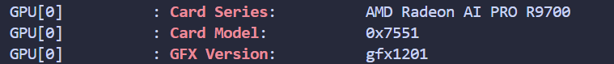
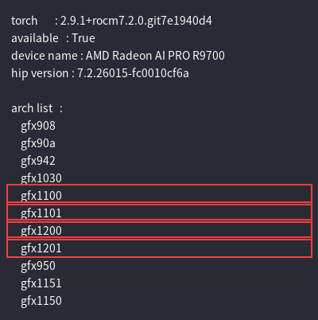
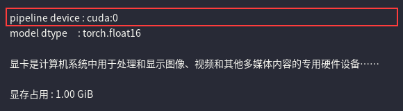
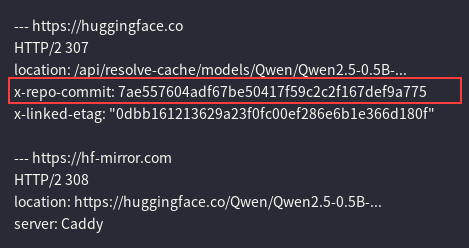
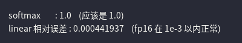

# 手把手教你用 AMD 显卡基于 HuggingFace 运行大模型

- **平台**：知乎
- **类型**：基础内容（第 1 篇）
- **来源**：ROCm / PyTorch / HuggingFace 官方文档整理 + 本机实测
- **数据依据**：ROCm 7.2.0 本机实测（gfx1201 / RDNA4，2026-07-31）+ ROCm 7.14.0 官方安装页与 release notes（同日查证）
- **配图**：`images/` 下 5 张实测输出图，已插入正文对应位置

---

## 标题

**手把手教你用 AMD 显卡基于 HuggingFace 运行大模型**

## 正文

面向第一次在 Linux 上用 AMD GPU 跑 HuggingFace 模型的读者。内容包括 gfx 号确认、ROCm 7.14 PyTorch 安装、Qwen2.5-0.5B-Instruct 推理、模型下载和运行异常排查，不涉及训练、多卡、量化和性能测试。

HuggingFace 的示例代码通常用 `device='cuda'` 把模型放到 GPU 上。ROCm 版 PyTorch 沿用了 `torch.cuda` 接口，所以换成 AMD GPU 后不需要改成 `hip` 或 `rocm`。查出显卡的 gfx 号并装上对应的 PyTorch wheel 后，就可以运行 Qwen2.5-0.5B-Instruct。

我用来实测的环境是 ROCm 7.2.0 / gfx1201（RDNA4）/ PyTorch 2.9.1 / transformers 5.14.1，测试日期 2026-07-31。

### 一、确认 GPU 和 gfx 号

运行：

```bash
rocm-smi -d 0 --showproductname | grep -E "Card Series|Card Model|GFX Version"
```



输出中的 `GFX Version` 是安装 PyTorch 时需要的架构编号。也可以用下面的命令查询：

```bash
rocminfo | grep gfx
```

常见型号对应关系：

| 架构 | gfx 号 | 代表型号 |
|---|---|---|
| RDNA4 | gfx1201 | RX 9070 XT / 9070 GRE / 9070、Radeon AI PRO R9700 |
| RDNA4 | gfx1200 | RX 9060 XT / 9060 |
| RDNA3 | gfx1100 | RX 7900 XTX / 7900 XT / 7900 GRE、PRO W7900 / W7800 |
| RDNA3 | gfx1101 | RX 7800 XT / 7700 XT、PRO W7700 |
| RDNA3 | gfx1102 | RX 7600 |
| RDNA3.5 | gfx1151 | Ryzen AI Max+ 395 / 392 / 388 |
| RDNA2 | gfx1030 | PRO W6800 / V620 |

更加详细的 AMD 显卡架构代号映射关系见 [一文讲清AMD GPU 显卡型号及其代号gfx(建议收藏)](https://zhuanlan.zhihu.com/p/2067663713826612548)。

上表中的 gfx1030 只对应官方支持列表里的 PRO W6800 和 V620，不包含 RX 6900 XT / 6800 XT。

ROCm 7.14.0 验证的系统范围：

- Radeon：Ubuntu 26.04 / 24.04.4 / 22.04.5、RHEL 10.2 / 9.8、Windows 11 25H2
- Ryzen AI Max：Ubuntu 26.04 / 24.04.4、Windows 11 25H2

RHEL 10.1 和 9.7 已被 ROCm 7.14.0 替换。

### 二、安装 PyTorch

ROCm 7.14 使用 multi-arch 索引，通过 `device-gfxXXXX` 选择架构。下面是 gfx1100 的官方安装命令：

```bash
python -m pip install --index-url https://repo.amd.com/rocm/whl-multi-arch/ \
  "torch[device-gfx1100]==2.12.0+rocm7.14.0" \
  "torchvision[device-gfx1100]==0.27.0+rocm7.14.0" \
  "torchaudio==2.11.0+rocm7.14.0"
```

根据第一节查到的 gfx 号替换参数：

| GPU | 参数 |
|---|---|
| RX 9070 XT / 9070 / R9700 | `device-gfx1201` |
| RX 9060 XT / 9060 | `device-gfx1200` |
| RX 7900 XTX / XT / GRE | `device-gfx1100` |
| RX 7800 XT / 7700 XT | `device-gfx1101` |
| Ryzen AI Max+ 395 | `device-gfx1151` |
| 不确定架构 | `device-all` |

如使用 Docker，可选择带完整版本号的官方镜像：

```bash
docker run -it --device=/dev/kfd --device=/dev/dri \
  --group-add video --ipc=host --shm-size 8G \
  --security-opt seccomp=unconfined \
  rocm/pytorch:rocm7.14_ubuntu24.04_py3.12_pytorch_release_2.12.0
```

不要使用 `rocm/pytorch:latest`。截至 2026-07-31，该 tag 仍停留在 ROCm 7.2.4。

安装完成后运行：

```python
import torch

print(torch.__version__)
print(torch.cuda.is_available())
print(torch.cuda.get_device_name(0))
print(torch.cuda.get_arch_list())
```

我在这台 R9700 上得到的输出如下：

```text
2.9.1+rocm7.2.0.git7e1940d4
True
AMD Radeon AI PRO R9700
['gfx908', 'gfx90a', 'gfx942', 'gfx1030', 'gfx1100', 'gfx1101',
 'gfx1200', 'gfx1201', 'gfx950', 'gfx1151', 'gfx1150']
```



成功标准：

- `torch.cuda.is_available()` 返回 `True`
- 设备名与实际显卡一致
- 显卡的 gfx 号出现在 `torch.cuda.get_arch_list()` 中

gfx 号已经出现在列表中时，不要设置 `HSA_OVERRIDE_GFX_VERSION`。AMD 的排障文档只建议在真实 gfx 没有对应 wheel、且存在相近架构时使用该变量。

### 三、运行 HuggingFace 模型

安装：

```bash
python -m pip install transformers accelerate
```

运行 Qwen2.5-0.5B-Instruct：

```python
import torch
from transformers import pipeline

pipe = pipeline(
    "text-generation",
    model="Qwen/Qwen2.5-0.5B-Instruct",
    dtype=torch.float16,
    device="cuda",
)

print(pipe.model.device)

out = pipe(
    [{"role": "user", "content": "用一句话说明什么是显卡。"}],
    max_new_tokens=64,
    do_sample=False,
)
print(out[0]["generated_text"][-1]["content"])
```



我这里下载和加载模型用了 19.3 秒，生成 64 个 token 用了 1.84 秒，显存占用 1.00 GiB。`pipeline device` 显示为 `cuda:0`，说明模型已经在 AMD GPU 上运行。

transformers 5.x 使用 `dtype=`。旧代码里的 `torch_dtype=` 目前仍可运行，但会显示弃用提示。

### 四、模型下载失败

无法直连 HuggingFace 时，可以设置镜像：

```bash
export HF_ENDPOINT=https://hf-mirror.com
export HF_HUB_DISABLE_XET=1
```

如果出现下面的错误：

```text
huggingface_hub.errors.FileMetadataError:
Distant resource does not seem to be on huggingface.co.
```

检查镜像返回的响应头：

```bash
curl -sI \
  https://hf-mirror.com/Qwen/Qwen2.5-0.5B-Instruct/resolve/main/config.json
```

`huggingface_hub` 1.26.0 会检查 `x-repo-commit` 和 `x-linked-etag`。我测试时，官方站返回了这些字段，镜像只返回 308 跳转。



如果响应头里没有 `x-repo-commit`，可以：

1. 更换镜像 endpoint
2. 使用 ModelScope 的 `snapshot_download` 下载到本地
3. 使用 `hf` 命令先下载，再把本地路径传给 `from_pretrained()`

镜像是否返回完整元数据与网络环境有关。对无法直连 HuggingFace 的网络，镜像仍可能正常工作。

### 五、运行异常排查

#### 1. `rocminfo` 能识别显卡，但 PyTorch 不能

先检查系统里是否混装了两套 ROCm：

```bash
dpkg -l | grep -E "libamdhip64|libhsa-runtime"
```

ROCm #6110 中，Ubuntu 仓库的 5.7.1 运行库覆盖了官方安装的 ROCm 7.2.1。卸载冲突包后恢复正常。此类问题不需要设置 gfx override。

同时检查 `LD_LIBRARY_PATH`。如果它指向 `/opt/rocm/lib`，可能会覆盖 wheel 自带的 HIP 运行库。

#### 2. RX 7900 XTX 批量生成卡住

在 ROCm 7.2 上，左填充并使用 KV cache 的批量生成可能出现 GPU 满载但 `model.generate()` 不返回。关闭两个 SDPA 后端：

```python
torch.backends.cuda.enable_flash_sdp(False)
torch.backends.cuda.enable_mem_efficient_sdp(False)
```

该问题截至 2026-07-31 仍处于 open 状态。

#### 3. 数值自检

更换 PyTorch 或 ROCm 版本后运行：

```python
import torch
import torch.nn.functional as F

x = torch.randn(1, 1000, device="cuda")
print("softmax:", torch.softmax(x, dim=-1).sum().item())

a = torch.randn(8, 4096, dtype=torch.float16)
w = torch.randn(4096, 4096, dtype=torch.float16)
ref = F.linear(a.float(), w.float())
got = F.linear(a.cuda(), w.cuda()).float().cpu()
error = ((got - ref).abs().max() / ref.abs().max()).item()
print("linear 相对误差:", error)
```



softmax 的结果应为 1.0。fp16 的 linear 相对误差应在 `1e-3` 以内。我在 gfx1201 / ROCm 7.2.0 上得到的结果分别是 1.0 和 0.000441937。

#### 4. gfx1201 不要开启 expandable segments

下面的设置会在 gfx1201 上触发 `hipErrorIllegalAddress`：

```bash
export PYTORCH_CUDA_ALLOC_CONF=expandable_segments:True
```

对应的 PyTorch issue 在 2026-07-16 以 `not_planned` 关闭，关闭原因不是问题已经修复。

### 六、环境变量

| 变量 | 用法 |
|---|---|
| `TORCH_BLAS_PREFER_HIPBLASLT=1` | RX 7900 系列 / 7800 XT / Ryzen AI MAX 使用 PyTorch 2.14 以前版本，运行 vLLM FP16 decode 且 batch ≥ 8 时设置 |
| `HSA_OVERRIDE_GFX_VERSION` | gfx 不在 wheel 的 arch list 中时才考虑 |
| `PYTORCH_ROCM_ARCH` | 编译期变量，对预编译 wheel 的运行时无效 |
| `HIP_VISIBLE_DEVICES` | 核显和独显共存时选择设备 |
| `LD_LIBRARY_PATH` | 避免系统 ROCm 库覆盖 wheel 自带运行库 |

本文实测数据来自 ROCm 7.2.0，安装命令来自 ROCm 7.14.0 官方文档。两个版本的结果分别标注，不代表同一次验证。

#AMD #ROCm #HuggingFace #PyTorch #显卡 #深度学习 #大模型 #Radeon #人工智能

## 首评

参考资料：

- [PyTorch on ROCm 安装页](https://rocm.docs.amd.com/projects/ai-ecosystem/en/latest/frameworks/pytorch/install.html)
- [ROCm 7.14.0 release notes](https://rocm.docs.amd.com/en/latest/about/release-notes.html)
- [HuggingFace 文档](https://huggingface.co/docs/transformers/en/kernel_doc/loading_kernels)
- [AMD rocm-doctor 排障文档](https://github.com/amd/skills/blob/main/staging/rocm-doctor/reference.md)
