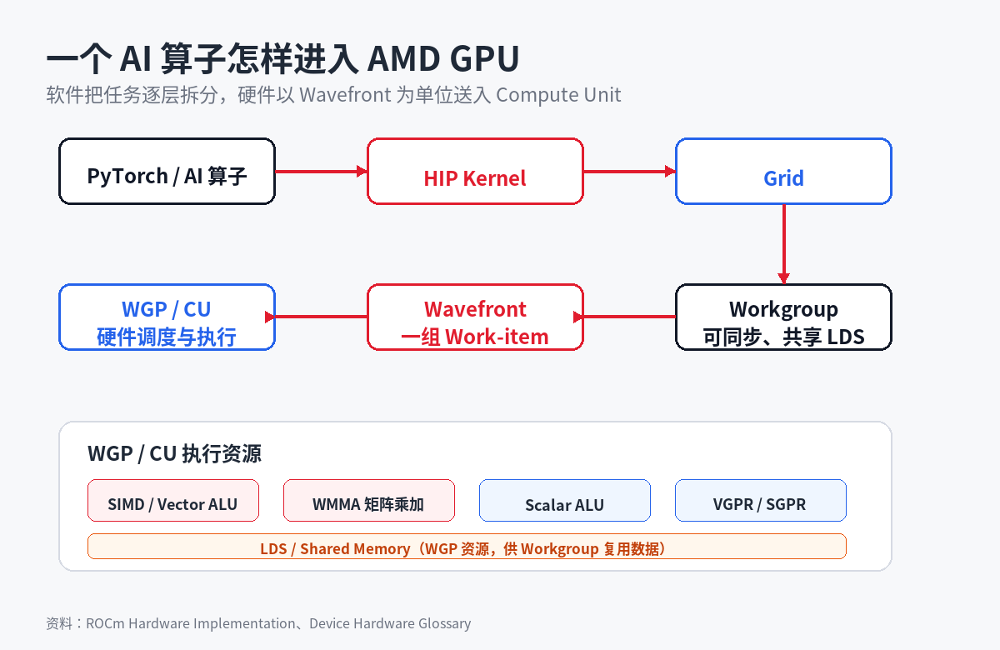
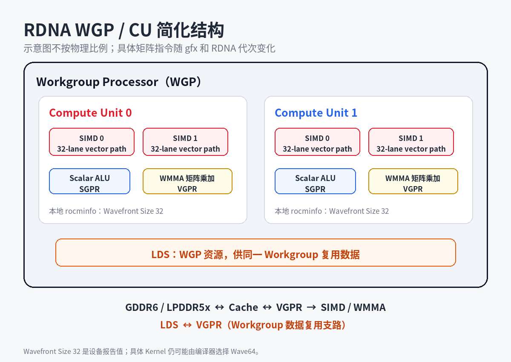
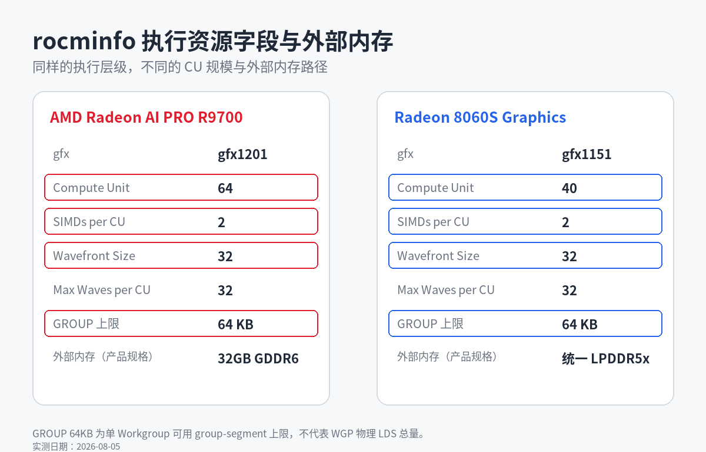

# AMD GPU/APU AI 架构入门：CU、Vector Core 和 Shared Memory 怎么工作

- **平台**：知乎
- **类型**：基础内容（第 2 篇）
- **来源**：ROCm Certification Level 1、AMD RDNA 文档、HIP 7.14 文档与本地实测
- **数据依据**：R9700 / gfx1201 与 Ryzen AI Max+ 395 / gfx1151 的 `rocminfo` 输出，2026-08-05
- **配图**：`images/` 下 3 张架构图与实测输出图

---

## 标题

**AMD GPU/APU AI 架构入门：CU、Vector Core 和 Shared Memory 怎么工作**

## 正文

用 PyTorch 跑一个矩阵乘法，底层发生了什么？

在 AMD GPU 上，这个操作不是交给某个核心从头算到尾的。它会经过一条从软件到硬件的路径：PyTorch 算子 → GPU Kernel → 成百上千个线程被分组调度到硬件单元上并行执行。

这篇文章以 rocminfo 的实测输出为线索，逐层拆解这条路径上的关键硬件结构——Compute Unit、Vector Core、Shared Memory——它们分别是什么、怎么配合完成计算。用到的数据来自 Radeon AI PRO R9700 和 Radeon 8060S。

### 一、一个 AI 算子怎么进入 GPU

底层 Kernel 会把任务拆成大量 Work-item，每个 Work-item 负责一部分数据。

Grid 是一次 Kernel 启动的全部工作，Grid 再分成多个 Workgroup。一个 Workgroup 内的 Work-item 可以同步，也可以通过 LDS 交换数据。

Work-item 到达硬件后不会逐个调度。GPU 把它们组成 Wavefront，让一组线程执行同一条指令、处理各自的数据。这种方式称为 SIMT。



### 二、Compute Unit 里面有什么

Compute Unit，简称 CU，是 AMD GPU 组织计算资源的核心单元。RDNA 还会把两个 CU 及其相关资源组成一个 Workgroup Processor，简称 WGP。

从 `rocminfo` 看，两款 GPU 的每个 CU 都包含 2 个 SIMD。下面这张表列出 CU / WGP 内的主要资源和它们在 AI 计算中的角色。

| CU / WGP 资源 | 主要工作 | 与 AI 的关系 |
|---|---|---|
| SIMD / Vector ALU | 对一组数据执行向量算术 | 激活函数、归一化、逐元素运算等会使用向量计算 |
| WMMA 矩阵乘加 | 让一个 Wavefront 协作计算矩阵 tile | GEMM、MLP 和 Attention 中有大量矩阵乘加 |
| Scalar ALU | 处理一个 Wavefront 共享的标量和控制信息 | 地址、循环和分支中相同的部分不必每线程重复计算 |
| VGPR / SGPR | 保存线程和 Wavefront 正在使用的数据 | 寄存器占用会影响一个 CU 能同时驻留多少个 Wavefront |
| WGP 中的 LDS | 同一 Workgroup 可共享的片上存储 | 复用矩阵 tile，减少反复读取外部内存 |

(PS: AMD 文档中SIMD这条路径也叫 Vector ALU，本文简称 Vector Core。)



R9700 使用 RDNA 4。AMD GPUOpen 资料显示，RDNA 4 的 WMMA 会让整个 Wavefront 协作完成矩阵乘加，并支持 FP16 / BF16、FP8 / BF8、INT8 / INT4 等 AI 常用数据类型。

Ryzen AI Max+ 395 的 Radeon 8060S 使用 RDNA 3.5。它同样以 CU、SIMD 和 Wavefront 组织计算，但具体指令由 gfx1151 对应的机器码决定，不能把 RDNA 4 的 WMMA 参数直接套过来。

### 三、Wavefront 怎样隐藏等待时间

RDNA 主要使用 Wave32，也支持 Wave64。我测试的 R9700 和 Radeon 8060S 都报告 Wavefront Size 32、每个 CU 最多驻留 32 个 Wavefront。

Wave32 表示 32 个 Work-item 组成一个 Wavefront。它们共享一条指令流，但各自拥有数据和寄存器。

当一条 Wavefront 等待内存数据时，CU 可以调度另一条已经就绪的 Wavefront。GPU 不一定让单个线程更快，而是用大量驻留任务覆盖等待时间，这就是 latency hiding。

由此可以得到两个直接结果：

- 同一 Wavefront 内出现不同分支时，硬件需要分别执行不同路径，部分 lane 暂时不工作。
- Kernel 占用太多寄存器或 LDS 时，CU 能同时容纳的 Wavefront 会减少，隐藏延迟的空间也会变小。

### 四、Shared Memory 在 AMD GPU 里是什么

GPU 编程中的 Shared Memory 与 APU 的统一内存不是同一个概念。

HIP 代码中的 `__shared__` 在 AMD 硬件上对应 Local Data Share，简称 LDS。它位于片上，容量比显存小得多，但延迟更低，同一 Workgroup 内的 Work-item 可以共同访问。

矩阵乘法 Kernel 常把全局内存中的 tile 暂存到 LDS，再读入 VGPR 供 SIMD / WMMA 使用。同一块数据如果会被重复使用，放入 LDS 可以减少对外部内存的读取。这种 tiling 也常见于部分卷积和归约 Kernel。

`rocminfo` 把每个 Workgroup 可用的 group-segment 上限显示为 GROUP Memory。我测试的两套环境都显示 64KB：

```text
Segment:  GROUP
Size:     64 KB
```

这里的 64KB 是单个 Workgroup 可申请的 group-segment 上限，不等于 WGP 物理 LDS 的总容量。

APU 的统一内存则位于片外。Ryzen AI Max+ 395 的 CPU 与 Radeon 8060S 共享 LPDDR5x 物理内存；BIOS 还可以从中专门划出一部分给 GPU，称为 carve-out。GTT 决定用户进程可以映射给 GPU 使用的系统内存上限。

它们都可能被简称为共享内存，但所在层级和用途不同。

### 五、消费级独显和 APU 差在哪

R9700 和 Ryzen AI Max+ 395 都使用 RDNA 架构，也都能运行 AI Kernel。两者最明显的差别在计算资源规模和外部内存路径。

| 本地环境 | R9700 | Ryzen AI Max+ 395 |
|---|---|---|
| GPU | Radeon AI PRO R9700 | Radeon 8060S |
| 架构 / gfx | RDNA 4 / gfx1201 | RDNA 3.5 / gfx1151 |
| Compute Unit | 64 | 40 |
| SIMD per CU | 2 | 2 |
| Wavefront Size | 32 | 32 |
| GROUP Memory | 64KB | 64KB |
| 外部内存 | 32GB 独立 GDDR6 | CPU / GPU 共享 LPDDR5x |

R9700 有独立显存，CPU 数据通常需要经过 PCIe 进入 GPU 显存。Ryzen AI Max+ 395 没有另一套独立 GDDR 显存芯片，Radeon 8060S 通过 GPUVM 使用共享 LPDDR5x；用户态 AI 分配可以通过 GTT 动态映射，BIOS carve-out 则是另行预留的区域。

统一内存改变的是 CPU / GPU 的物理内存关系与映射方式，不会把 40 个 CU 变成 64 个 CU，也不代表 APU 一定比独显快。反过来，独显的 32GB 固定显存也不能单独说明某个模型的实际速度。

### 六、用 rocminfo 看本机架构

运行：

```bash
rocminfo | grep -E \
'Marketing Name|Compute Unit|SIMDs per CU|Wavefront Size|Max Waves Per CU'
rocminfo | grep -A 2 'Segment:.*GROUP'
```



我在两台机器上的输出如图。Compute Unit、SIMDs per CU、Wavefront Size 和 GROUP Memory 分别对应文章里的 CU、向量执行单元、Wavefront 和 LDS。完整型号、gfx 与 ROCm 支持关系可参考 [一文讲清AMD GPU 显卡型号及其代号gfx](https://zhuanlan.zhihu.com/p/2067663713826612548)。（PS：架构资料核对至 2026-08-05）

理解了这些硬件结构之后，下一步可以关注 Kernel 层面的 occupancy 和 tiling 策略。

#AMD #ROCm #GPU架构 #RDNA #APU #ComputeUnit #人工智能

参考资料：

- [ROCm Device hardware glossary](https://rocm.docs.amd.com/en/latest/reference/glossary/device-hardware.html)
- [HIP Hardware implementation](https://rocm.docs.amd.com/projects/HIP/en/latest/understand/hardware_implementation.html)
- [AMD GPUOpen：Occupancy explained](https://gpuopen.com/learn/occupancy-explained/)
- [AMD GPUOpen：Accelerating Generative AI on AMD Radeon GPUs](https://gpuopen.com/learn/accelerating_generative_ai_on_amd_radeon_gpus/)
- [AMD GPUOpen：Using Matrix Cores of RDNA 4](https://gpuopen.com/learn/using_matrix_core_amd_rdna4/)
- [AMD Radeon AI PRO R9700 产品页](https://www.amd.com/en/products/graphics/workstations/radeon-ai-pro/ai-9000-series/amd-radeon-ai-pro-r9700.html)
- [AMD Ryzen AI Max+ 395 产品页](https://www.amd.com/en/products/processors/laptop/ryzen/ai-300-series/amd-ryzen-ai-max-plus-395.html)
