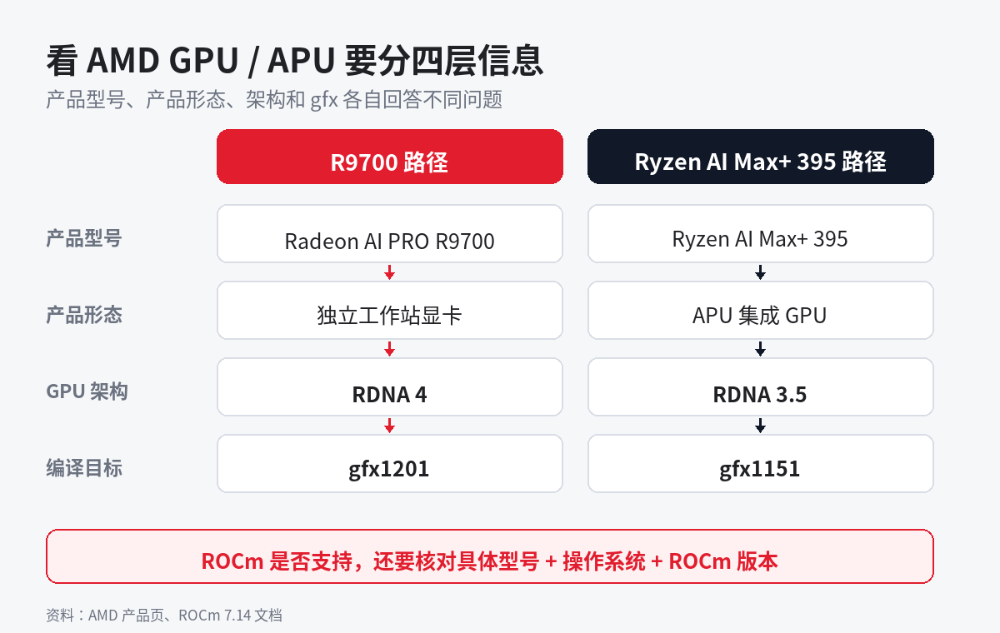
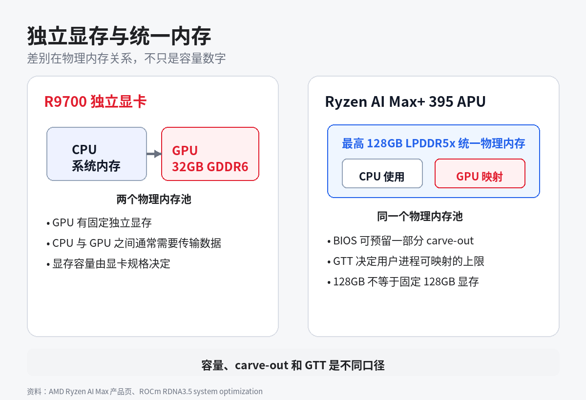

# AMD GPU 硬件入门：RDNA、CDNA、独显和 APU 有什么区别

- **平台**：知乎
- **类型**：基础内容（第 2 篇）
- **来源**：AMD 产品页、AMD 架构页、ROCm 7.14 文档与本地机器环境
- **数据依据**：R9700 / gfx1201 与 Ryzen AI Max+ 395 / gfx1151 本地环境记录，2026-08-05 核对官方资料
- **配图**：`images/` 下 2 张概念图，已插入正文

---

## 标题

**AMD GPU 硬件入门：RDNA、CDNA、独显和 APU 有什么区别**

## 正文

第一次接触 AMD GPU，R9700、RDNA 4、gfx1201 和 ROCm 7.14 很容易被当成一串型号。它们处在不同层级：R9700 是产品型号，RDNA 4 是 GPU 架构，gfx1201 是编译目标，ROCm 7.14 是软件版本。

刚开始用 AMD GPU 跑 AI，先要分清 RDNA 与 CDNA、独显与 APU、独立显存与统一内存，以及架构和 ROCm 支持的关系。这些概念用于核对硬件与支持组合，不用于性能对比或购买推荐。

### 一、从产品名到 gfx 是四层

我手边有两种搭载 AMD GPU 的硬件形态：

- Radeon AI PRO R9700：独立工作站显卡，RDNA 4 架构，gfx1201。
- Ryzen AI Max+ 395：带 Radeon 8060S 集成 GPU 的 APU，RDNA 3.5 架构，gfx1151。

四个层级分别回答不同问题：

| 层级 | 回答的问题 | 例子 |
|---|---|---|
| 产品型号 | 手里的具体产品是什么 | R9700、Ryzen AI Max+ 395 |
| 产品形态 | GPU 在独立显卡还是处理器中 | 工作站独显、APU 集成 GPU |
| GPU 架构 | GPU 内部采用哪一代设计 | RDNA 4、RDNA 3.5、CDNA 3 |
| gfx / LLVM Target | 编译器为哪种 GPU 生成代码 | gfx1201、gfx1151、gfx942 |

完整的产品型号与 gfx 映射，可查看 [一文讲清AMD GPU 显卡型号及其代号gfx](https://zhuanlan.zhihu.com/p/2067663713826612548)。这里不再重复整张对照表。

### 二、RDNA 与 CDNA 对应不同产品线

AMD 官方把 CDNA 称为面向 GPU 计算的专用架构，用在 AMD Instinct 产品中，目标包括 AI 和高性能计算。

RDNA 主要用在 Radeon RX、Radeon PRO，以及 Ryzen APU 的集成 GPU 中。它的主要设计目标包括游戏、创作和专业图形应用；新一代 RDNA 同时带有 AI 加速单元。

| | RDNA | CDNA |
|---|---|---|
| 常见产品 | Radeon RX、Radeon PRO、Ryzen APU 集成 GPU | AMD Instinct |
| 官方主要定位 | 游戏、创作与专业图形 | 数据中心 AI 与高性能计算 |
| 本文实例 | R9700、Radeon 8060S | 不展开具体 MI 型号 |

RDNA 不等于只能做图形。我在上一篇 HuggingFace 实测中使用的 R9700 就是 RDNA 4，PyTorch 和 Transformers 可以直接调用。CDNA 也不能简化成只做训练，具体能力仍取决于产品和软件栈。

### 三、独显有自己的显存，APU 与 CPU 共享物理内存

R9700 是独立显卡。AMD 产品页列出的规格是 32GB GDDR6 独立显存。它和 CPU 使用的系统内存是两个物理内存池。

Ryzen AI Max+ 395 是 APU。CPU 与 Radeon 8060S 集成 GPU 使用同一套 LPDDR5x 物理内存，产品最高支持 128GB 统一内存。

统一内存不等于固定 128GB 显存。几个数字代表不同口径：

| 数字或术语 | 含义 |
|---|---|
| 最高 128GB | 产品支持的最大统一系统内存 |
| 最多 112GB 可由 GPU 分配 | AMD 技术文章给出的 GPU 可分配上限 |
| 最多 96GB Variable Graphics Memory | BIOS 可以预留成 VRAM carve-out 的上限 |
| GTT | 用户进程可以映射给 GPU 使用的系统内存范围 |

我测试的 Ryzen AI Max+ 395 在 Linux 中显示约 124GiB 物理内存，当前显示 2GB VRAM carve-out，GTT 映射上限为 120GB。这不代表它有 122GB 独立显存，而是 GPU 可以通过不同方式使用同一个物理内存池。

我测试的 R9700 则显示固定 32GB 独立显存。两种内存方式的物理关系不同，不能只看容量数字判断性能。

### 四、知道架构和 gfx，仍不能直接推出 ROCm 支持

ROCm 文档把 gfx 称为 LLVM Target。它告诉编译器应该为哪一种 GPU 架构生成代码。

相同 gfx 只说明编译目标相同，不代表所有产品与操作系统组合都受到同样支持。实际使用时还要同时核对：

1. 完整 GPU 或 APU 型号。
2. Linux、Windows 或 WSL 版本。
3. ROCm 版本。
4. PyTorch、vLLM 等上层框架的支持范围。

相同 gfx 不代表 WSL 支持状态相同，仍须按具体型号查询对应 ROCm 版本的兼容性矩阵。

### 五、跑 AI 前先核对这五项

| 检查项 | 要确认什么 |
|---|---|
| 完整产品型号 | 不只看 Radeon、RX 7000 或 Ryzen AI |
| 产品形态 | 独立显卡还是 APU 集成 GPU |
| 内存方式 | 固定独立显存，还是统一内存加 carve-out / GTT |
| gfx 号 | 安装包和代码编译需要哪个目标 |
| 支持组合 | 具体型号 + OS + ROCm + 框架是否匹配 |

把这五项分开后，查文档会清楚很多：产品型号决定查哪一行，gfx 决定代码和 wheel 面向哪个架构，兼容性矩阵决定当前系统组合是否在官方支持范围内。

以上官方资料核对于 2026-08-05。ROCm 支持范围会随版本变化，安装前应再次查看当前版本的兼容性矩阵。

#AMD #ROCm #GPU #显卡 #RDNA #CDNA #统一内存 #人工智能

## 首评

参考资料：

- [AMD RDNA Architecture](https://www.amd.com/en/technologies/rdna.html)
- [AMD CDNA Architecture](https://www.amd.com/en/technologies/cdna.html)
- [AMD Radeon AI PRO R9700 产品页](https://www.amd.com/en/products/graphics/workstations/radeon-ai-pro/ai-9000-series/amd-radeon-ai-pro-r9700.html)
- [AMD Ryzen AI Max+ 395 产品页](https://www.amd.com/en/products/processors/laptop/ryzen/ai-300-series/amd-ryzen-ai-max-plus-395.html)
- [AMD Ryzen AI Max+ 395 统一内存技术文章](https://www.amd.com/en/developer/resources/technical-articles/2025/amd-ryzen-ai-max-395--a-leap-forward-in-generative-ai-performanc.html)
- [AMD Variable Graphics Memory FAQ](https://www.amd.com/en/blogs/2025/faqs-amd-variable-graphics-memory-vram-ai-model-sizes-quantization-mcp-more.html)
- [ROCm 7.14 RDNA3.5 system optimization](https://rocm.docs.amd.com/en/docs-7.14.0/reference/system-optimization/rdna3-5.html)
- [ROCm 7.14 Compatibility matrix](https://rocm.docs.amd.com/en/docs-7.14.0/compatibility/compatibility-matrix.html)
- [ROCm 7.14 hardware support](https://rocm.docs.amd.com/en/docs-7.14.0/about/release-notes.html#amd-hardware-support)
