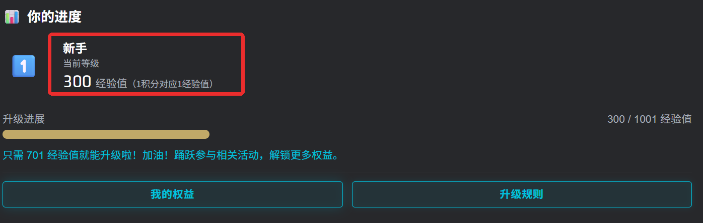
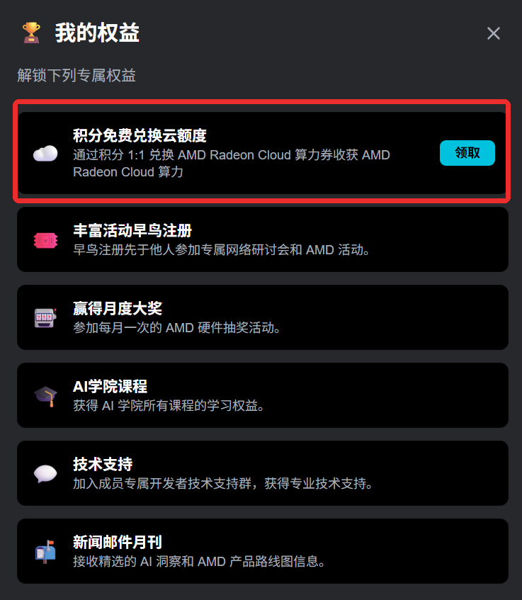
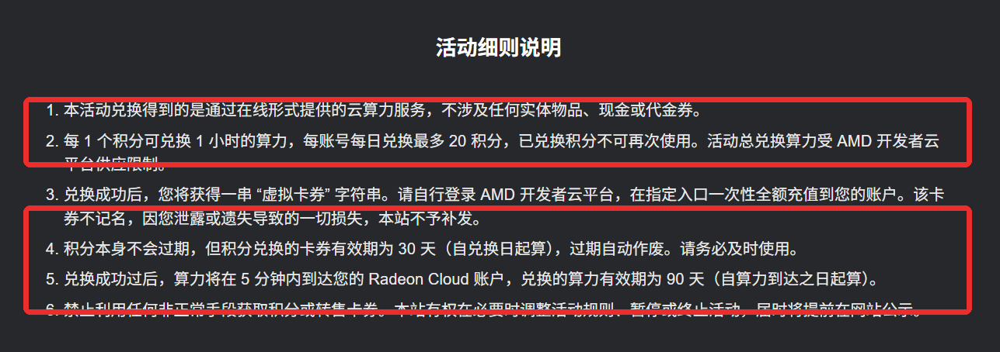
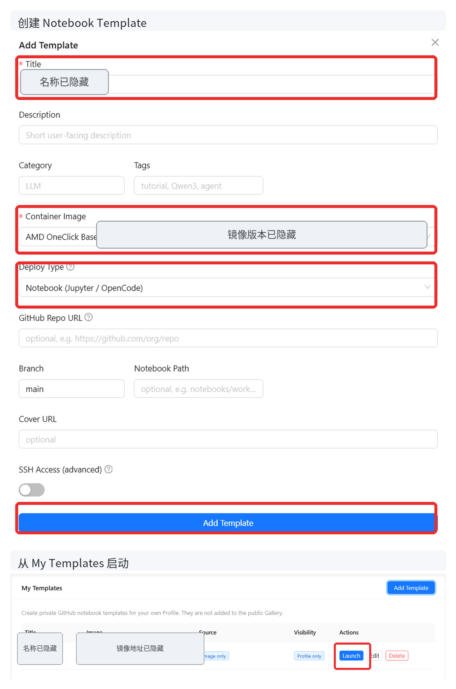
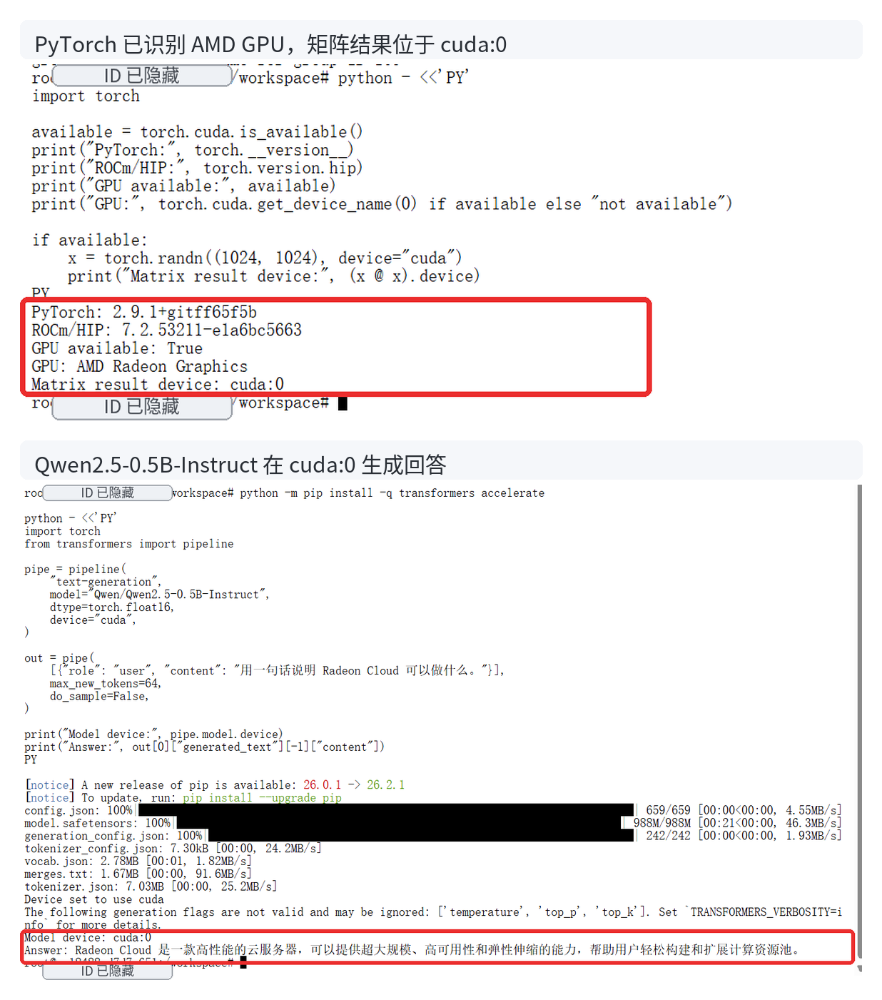
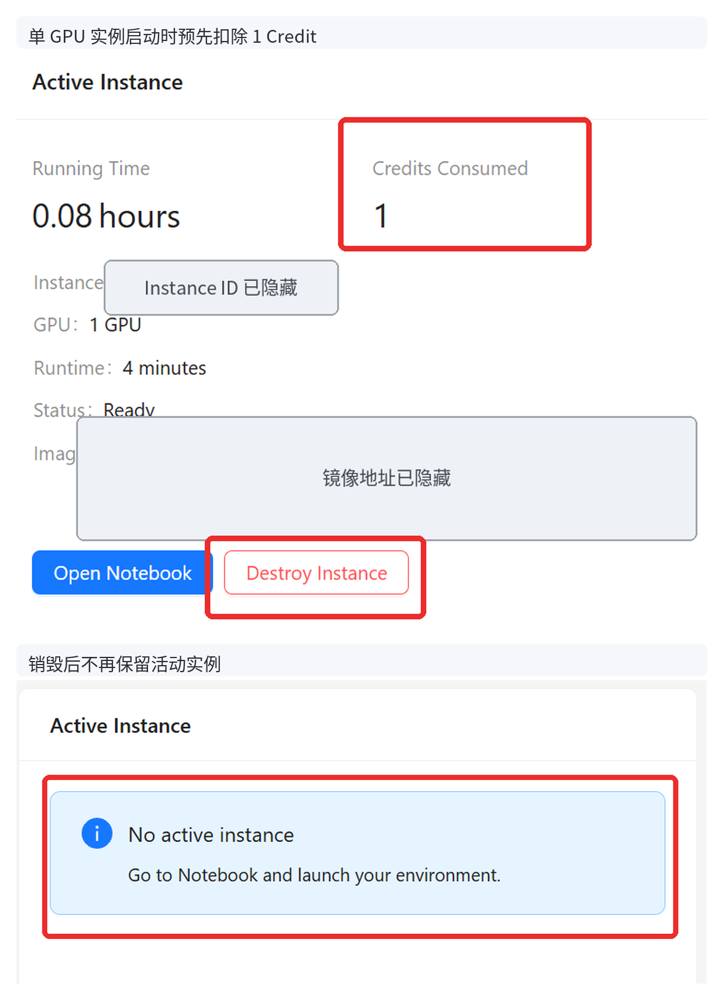

# 没有本地 AMD GPU，也能跑模型：Radeon Cloud 云算力领取与使用指南

<!--
内部状态：
- 平台：知乎
- 状态：draft-r1，已按 2026-08-13 完整实测重写
- 实测链路：ADP 经验值 → 云算力券 → Radeon Cloud Credits → My Templates → 单 GPU Notebook → Qwen2.5-0.5B-Instruct → 销毁实例
- 不展开：全球站、SSH、Tunnel、Token Factory
-->

想体验 ROCm、运行 PyTorch，或者临时找一块 AMD GPU 跑模型，不一定要先准备本地显卡和完整的软件环境。Radeon Cloud 可以直接从浏览器启动 AMD GPU Notebook，在云端安装依赖、执行代码和运行模型。

我这次从 AMD AI 开发者计划兑换了 1 小时云算力，创建了一个 Notebook，在其中确认 PyTorch 已识别 AMD GPU，并用 Qwen2.5-0.5B-Instruct 完成了一次推理。整个过程真正需要弄清楚的是三个名称：ADP 经验值、云算力券和 Radeon Cloud Credits。

### 先分清经验值、云算力券和 Credits

AMD AI 开发者计划（ADP）首页显示的是“经验值”，旁边注明“1 积分对应 1 经验值”。因此，页面其他位置所说的积分，对应的就是这里看到的经验值。



进入“我的权益”，可以看到“积分免费兑换云额度”：积分先兑换成云算力券，再用云算力券向 Radeon Cloud 充值 Credits。



2026 年 8 月 13 日页面显示的活动规则是：

- 1 积分兑换 1 小时 Radeon Cloud 算力；
- 每个账号每天最多兑换 20 积分；
- ADP 积分本身不过期；
- 兑换得到的云算力券有效期为 30 天；
- 云算力充值到 Radeon Cloud 后，有效期为 90 天。



云算力券是一串“虚拟卡券”字符串，进入 Radeon Cloud 后会作为 `Coupon Code` 使用。它还不是可以启动 GPU 的余额。只有兑换成功、Profile 中的 `Credits Available` 增加后，算力才真正进入 Radeon Cloud 账号。

### 用 ADP 积分领取云算力券

登录 AMD AI 开发者计划后，打开[积分兑换页面](https://developer.amd.com.cn/points/redeem)，点击“立即兑换”。输入希望兑换的小时数，再确认积分消耗。

我这次填写 1 小时，页面对应扣除 1 积分。提交后，兑换历史先提示“算力券将在 5 分钟内到账”；大约 5 分钟后，右侧出现“查看云算力券”。


点击“查看云算力券”后，页面会显示一段很长的兑换链接。点击“复制链接”保存它，再前往 AMD 开发者云。


这段链接对应不记名虚拟卡券，遗失后不会补发。不要把完整链接放进文章、截图或公开聊天记录中。

### 把云算力券兑换成 Radeon Cloud Credits

打开 [Radeon Cloud 中国站](https://developer.amd.com.cn/radeon/)，点击右上角 `Login`，选择 `Login with AMDAI`。登录后进入 `Profile`。

兑换前，我的 `Credits Available` 为 0。点击 `Redeem Credits`，把刚才复制的链接粘贴到 `Coupon Code` 输入框，再点击 `Redeem`。页面提示兑换成功后，余额增加为 1 Credit。


Profile 同时写明：每块 GPU 每小时消耗 1 Credit，每个账号只能保留一个活动实例。

### 创建 Notebook，在云端跑一个模型

获得 Credits 后，在 Profile 的 `My Templates` 区域点击 `Add Template`。第一次创建空白开发环境时，主要填写三个位置：

- `Title`：填写一个方便自己识别的名称；
- `Container Image`：这次使用当前提供的 `AMD OneClick Base`；
- `Deploy Type`：选择 `Notebook (Jupyter / OpenCode)`。

其余 GitHub Repo、Notebook Path 和 SSH 等字段可以先留空。点击 `Add Template` 后，新模板会出现在 `My Templates`，再点击该行的 `Launch`。



启动前，页面会先进行图像验证，再向 ADP 账号邮箱发送一次性 6 位验证码。验证完成后，平台开始准备工作空间；进度到达 Ready 后，点击 `Open Notebook` 进入 JupyterLab。

进入 Terminal 后，我先确认 PyTorch 是否真的看到了 AMD GPU：

```python
import torch

available = torch.cuda.is_available()
print("PyTorch:", torch.__version__)
print("ROCm/HIP:", torch.version.hip)
print("GPU available:", available)
print("GPU:", torch.cuda.get_device_name(0) if available else "not available")

if available:
    x = torch.randn((1024, 1024), device="cuda")
    print("Matrix result device:", (x @ x).device)
```

本次环境返回 PyTorch 2.9.1、ROCm/HIP 7.2，`GPU available` 为 `True`，矩阵结果位于 `cuda:0`。

接着安装 Transformers，并运行 Qwen2.5-0.5B-Instruct：

```bash
python -m pip install -q transformers accelerate
```

```python
import torch
from transformers import pipeline

pipe = pipeline(
    "text-generation",
    model="Qwen/Qwen2.5-0.5B-Instruct",
    dtype=torch.float16,
    device="cuda",
)

out = pipe(
    [{"role": "user", "content": "用一句话说明 Radeon Cloud 可以做什么。"}],
    max_new_tokens=64,
    do_sample=False,
)

print("Model device:", pipe.model.device)
print("Answer:", out[0]["generated_text"][-1]["content"])
```

输出中的 `Model device` 为 `cuda:0`，模型也正常返回了回答。从领取算力到在云端 AMD GPU 上跑起模型，这条链路就完成了。



### 1 Credit 会在启动实例时预先扣除

Radeon Cloud 的计费不是等实例运行满一小时后再扣款。启动一个单 GPU 实例时，系统会先扣除 1 Credit，获得最多 1 小时的本次使用时间。

这次实例实际运行约 4 分钟，Profile 已经显示 `Credits Consumed` 为 1。提前销毁实例后，未使用的分钟不会退回。我随后又充值了 10 Credits 并再次验证，启动并销毁一个单 GPU 实例后，余额从 10 变为 9。

因此，点击 `Launch` 之前最好先准备好要执行的 Notebook、代码和模型，不要为了浏览页面反复启动实例。

关闭 JupyterLab 标签页或退出浏览器不会销毁云端实例。使用结束后，先保存需要保留的文件，再回到 Profile 点击 `Destroy Instance`。页面显示 `No active instance` 后，实例才真正停止。



通过 ADP 经验值领取一张云算力券，再把它兑换成 Radeon Cloud Credits，就可以在没有本地 AMD GPU 的情况下获得一个可运行 PyTorch 和模型的云端环境。除了普通 Notebook，平台还提供不同的 Container Image 和部署类型；后续文章会继续介绍 Token Factory 中的模型 API，以及怎样从应用中直接调用这些模型。

#AMD #RadeonCloud #ROCm #PyTorch #云算力 #GPU #大模型 #人工智能
