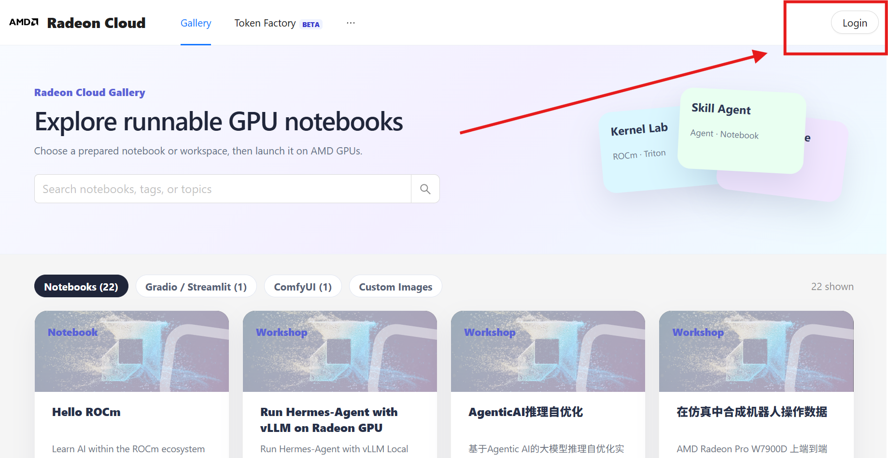
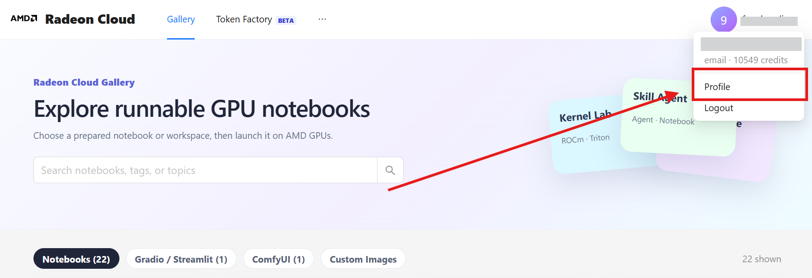
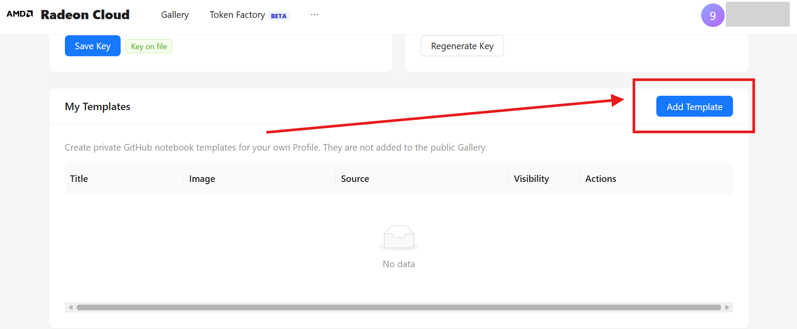
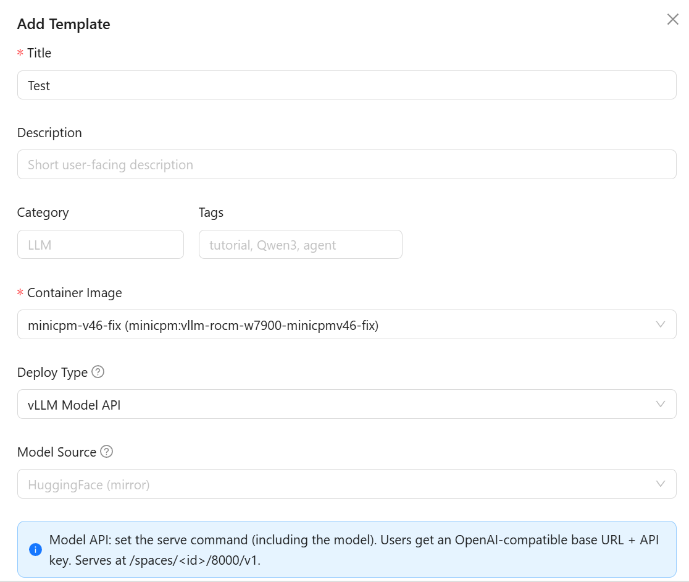
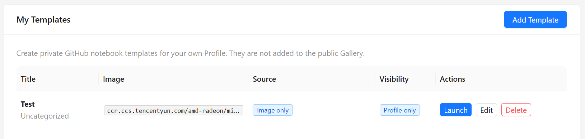
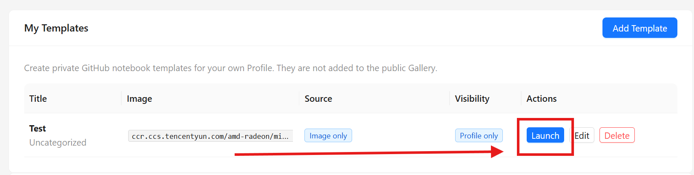
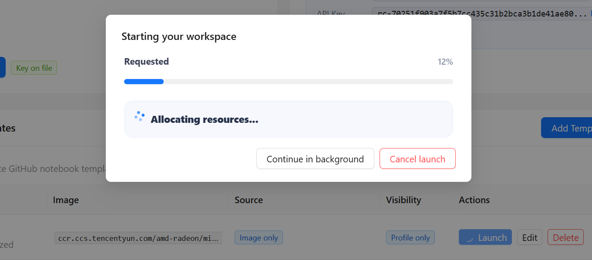
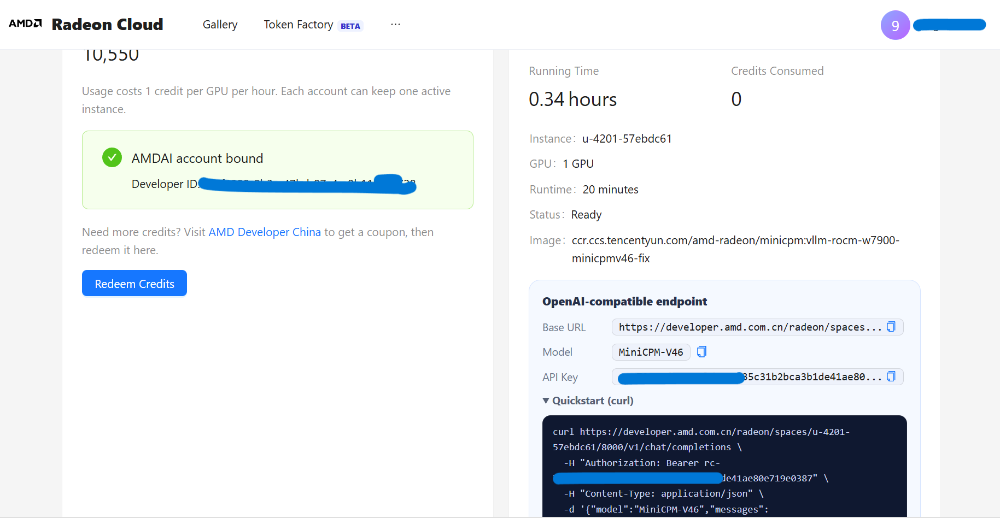
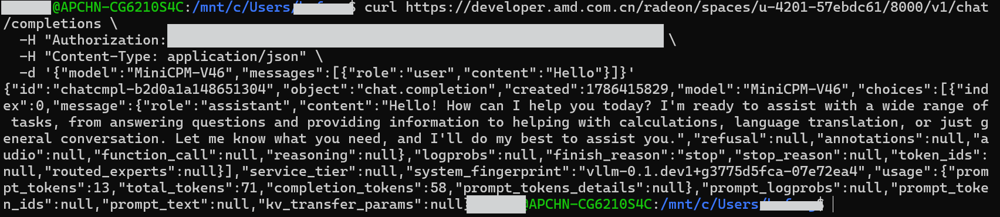

# 在 Radeon Cloud 上部署 MiniCPM-V：用 vLLM 起一个 OpenAI 兼容的多模态服务

<!--
内部交付元数据：
- **平台**：知乎
- **类型**：云端部署实操（第 4 篇）
- **来源**：AMD AI Developer Program / Radeon Cloud 页面操作与 vLLM OpenAI API 调用示例整理
- **范围**：使用 Radeon Cloud Template 部署 MiniCPM-V-4.6，并通过 OpenAI 兼容接口发起图片问答请求
-->

在 AMD GPU 上把多模态模型起成服务，客户端这一侧不需要改任何代码。vLLM 在 ROCm 上加载模型后暴露的就是标准的 `/v1/chat/completions`，`openai` SDK 和 `curl` 都能直接接上去。

这篇文章在一台 Radeon Cloud 的 Radeon PRO W7900 实例上把这件事走一遍：从建 Template 开始，部署 MiniCPM-V-4.6，最后发一张图片问一句话。用到的命令都可以照抄。

跑通之后可以直接复用的一套配置：

| 配置项 | 值 |
|---|---|
| Container Image | `minicpm:vllm-rocm-w7900-minicpmv46-fix` |
| Deploy Type | `vLLM` |
| 模型 | `openbmb/MiniCPM-V-4.6` |
| 对外模型名 | `MiniCPM-V46` |
| 端口 | `8000` |
| 精度 | `bfloat16` |
| 请求地址 | `http://<服务地址>:8000/v1/chat/completions` |

MiniCPM-V 是 OpenBMB 开源的轻量级视觉语言模型（VLM），可以同时接收文字和图片。这里选它是因为体积小、加载快，适合先把镜像、ROCm、vLLM、模型加载、OpenAI 接口这条链路整体验证一遍。换更大的多模态模型时，改的只是启动命令里的模型名和几个显存参数，流程本身不变。



### 一、环境与前提

- GPU：Radeon Cloud 上的 Radeon PRO W7900 实例，48GB 显存。
- 账号：已注册 AMD AI Developer Program（ADP），并且开通了容器和 GPU 权限。
- 推理框架：vLLM，由平台镜像提供，不需要自己装 ROCm 和 vLLM。
- 客户端：任意一台能联网的机器。

本地没有 AMD GPU 时，可以先用 ADP 里的资源。ADP 提供两类东西：模型 API credits 和 Radeon Cloud 云端 GPU 环境。只想调 API 用 Fireworks AI credits，要验证模型在 AMD GPU 上怎么部署就用 Radeon Cloud。

客户端只需要装一个包：

```bash
python -m pip install openai
```

### 二、进入 Profile 页面

打开 Radeon Cloud 并登录，进入 Profile 页面。创建 Template、启动实例、查看 QuickStart 都在这个页面附近完成。



账号的容器和 GPU 权限需要提前开通。没开通时 Template 仍然能正常保存，但后面 Launch 会一直卡住，页面上看不出原因。

### 三、创建 Template

Template 是一份可复用的启动配置，镜像、部署方式和启动命令都存在里面，重开实例时不用重新填。保存 Template 本身不占 GPU，只有 Launch 才会按这份配置创建实例。

在 Profile 页面点击 Add Template：



需要填四项：

| 配置项 | 填写内容 |
|---|---|
| Template 名称 | 一个便于识别的名称 |
| Container Image | `minicpm-v46-fix`，对应镜像 `minicpm:vllm-rocm-w7900-minicpmv46-fix` |
| Deploy Type | `vLLM` |
| Server Command | 见下面的启动命令 |

镜像里已经准备好运行 MiniCPM-V 所需的基础环境，真正决定模型怎么起的是 Server Command：

```bash
/usr/local/bin/vllm serve openbmb/MiniCPM-V-4.6 \
  --served-model-name MiniCPM-V46 \
  --trust-remote-code \
  --dtype bfloat16 \
  --max-model-len 262144 \
  --max-num-seqs 64 \
  --gpu-memory-utilization 0.9 \
  --host 0.0.0.0 \
  --port 8000
```

其中几项值得单独说一下：

`vllm serve openbmb/MiniCPM-V-4.6` 让 vLLM 从 HuggingFace 加载模型并启动 OpenAI 兼容服务。`--served-model-name MiniCPM-V46` 决定对外暴露的模型名，客户端请求里的 `model` 字段要和它完全一致。MiniCPM-V 的仓库里带自定义模型代码，缺少 `--trust-remote-code` 时模型在加载阶段就会失败。`--host 0.0.0.0 --port 8000` 让服务监听 8000 端口，QuickStart 给出的地址指向的就是它。

另外四个参数和显存直接相关，OOM 时从这里往下调：

| 参数 | 作用 | 什么时候调整 |
|---|---|---|
| `--max-model-len 262144` | 最大上下文长度 | 显存不足时优先降低 |
| `--max-num-seqs 64` | 最大并发请求数 | 降低可以减少显存峰值 |
| `--gpu-memory-utilization 0.9` | vLLM 可使用的 GPU 显存比例 | OOM 时先降到 `0.8` |
| `--dtype bfloat16` | 推理精度 | W7900 保持 BF16 |



填完点击 Add Template 保存：



### 四、启动实例

回到 Template 列表，在目标 Template 右侧点击 Launch：





多模态模型第一次拉起要经过镜像准备、模型加载和服务初始化三个阶段，耗时明显长于后续启动。页面状态变成 ready 之前，请求只会拿到连接错误。

### 五、获取请求命令

实例 ready 之后打开 QuickStart。里面的请求命令已经填好服务地址、端口和模型名，原样跑一遍就能确认服务是否正常。



到这一步，这个实例就可以当成一台已经起好 vLLM 的远程 AMD GPU 机器。后面的事情和接任何一个 OpenAI 兼容服务没有区别。

### 六、调用服务

服务地址是：

```text
http://<服务地址>:8000/v1/chat/completions
```

Python 里用 `openai` 客户端：

```python
from openai import OpenAI

client = OpenAI(
    base_url="http://<服务地址>:8000/v1",
    api_key="EMPTY",
)

resp = client.chat.completions.create(
    model="MiniCPM-V46",
    messages=[
        {
            "role": "user",
            "content": [
                {"type": "text", "text": "图里有什么？"},
                {
                    "type": "image_url",
                    "image_url": {"url": "https://example.com/test.jpg"},
                },
            ],
        }
    ],
    stream=True,
)

for chunk in resp:
    print(chunk.choices[0].delta.content or "", end="")
```

`api_key="EMPTY"` 只是为了满足 OpenAI SDK 的参数格式，vLLM 默认不校验这个值。`stream=True` 让模型边生成边返回，在命令行里可以直接区分服务已经开始输出和卡在服务端两种情况。

等价的 `curl` 写法：

```bash
curl http://<服务地址>:8000/v1/chat/completions \
  -H "Content-Type: application/json" \
  -d '{
    "model": "MiniCPM-V46",
    "messages": [{
      "role": "user",
      "content": [
        {"type": "text", "text": "请描述这张图片的主要内容。"},
        {"type": "image_url", "image_url": {"url": "https://example.com/test.jpg"}}
      ]
    }]
  }'
```

请求体只看两块：`model` 写 `MiniCPM-V46`，`messages` 的 `content` 是一个数组，文本和图片各占一项。图片可以传公网 URL，也可以按 QuickStart 示例传 Base64。

返回里能看到和图片内容相关的回答，整条链路就通了：请求从客户端发到 Radeon Cloud 实例，vLLM 接收 OpenAI 格式的消息，再把图片和文本交给 MiniCPM-V 处理。



### 七、发不通的时候按这个顺序查

带图请求同时依赖实例状态、模型名和图片本身，一上来就发很难判断是哪一层的问题。下面三步逐层缩小范围。

第一步确认服务在、模型名对：

```bash
curl http://<服务地址>:8000/v1/models
# 返回的 data 里会包含 "id": "MiniCPM-V46"
```

第二步发一次纯文本请求，把图片这条链路排除掉：

```bash
curl http://<服务地址>:8000/v1/chat/completions \
  -H "Content-Type: application/json" \
  -d '{"model":"MiniCPM-V46","messages":[{"role":"user","content":"你好"}]}'
```

前两步都能过，剩下的问题就集中在图片这一层：URL 能不能被服务端拉到、图片尺寸和上下文长度是否超了。用小图和短问题测这一步，返回快，干扰项也少。

### 八、几个容易踩的地方

- 模型名大小写。请求里的 `model` 要和 `--served-model-name` 完全一致，写成 `minicpm-v46` 会直接返回模型不存在。
- 首次请求偏慢。第一次推理带 warmup 开销，耗时明显高于后续请求，不代表稳定状态下的表现。
- 图片是服务端去拉的。`image_url` 由 vLLM 服务端下载，不是客户端上传，内网地址和需要登录的链接都会失败，这类图片只能走 Base64。
- OOM 的调整顺序。`--max-model-len` 影响最大，其次是 `--max-num-seqs`，最后才是 `--gpu-memory-utilization`。
- `api_key` 不能留空。OpenAI SDK 要求这个参数非空，vLLM 不校验它的值，填 `EMPTY` 即可。

### 九、实例和 Template 的清理

实例处于运行状态就会一直占用 GPU 配额，停止或删除都在实例管理页面操作。

Template 本身不占资源，保留下来下次可以直接 Launch。上下文长度、并发数和显存比例这类参数改动，另存成一个新的 Template 就能和原配置横向对比。

这篇只做到链路验证为止，没有涉及吞吐和延迟。链路稳定之后，往上压 `--max-num-seqs` 看并发、拉高 `--max-model-len` 看长上下文，或者换量化权重降低显存压力，都可以在同一个 Template 的基础上改。后续会分享这部分的实测数据，欢迎关注 AMD算力极客社。

#AMD #RadeonCloud #ADP #ROCm #vLLM #MiniCPM #多模态 #大模型 #人工智能

参考资料：

- [AMD AI Developer Program](https://www.amd.com/en/developer/resources/ai-development.html)
- [vLLM OpenAI-Compatible Server](https://docs.vllm.ai/en/latest/serving/openai_compatible_server.html)
- [vLLM Multimodal Inputs](https://docs.vllm.ai/en/latest/features/multimodal_inputs.html)
- [MiniCPM-V-4.6 模型页](https://huggingface.co/openbmb/MiniCPM-V-4_6)
