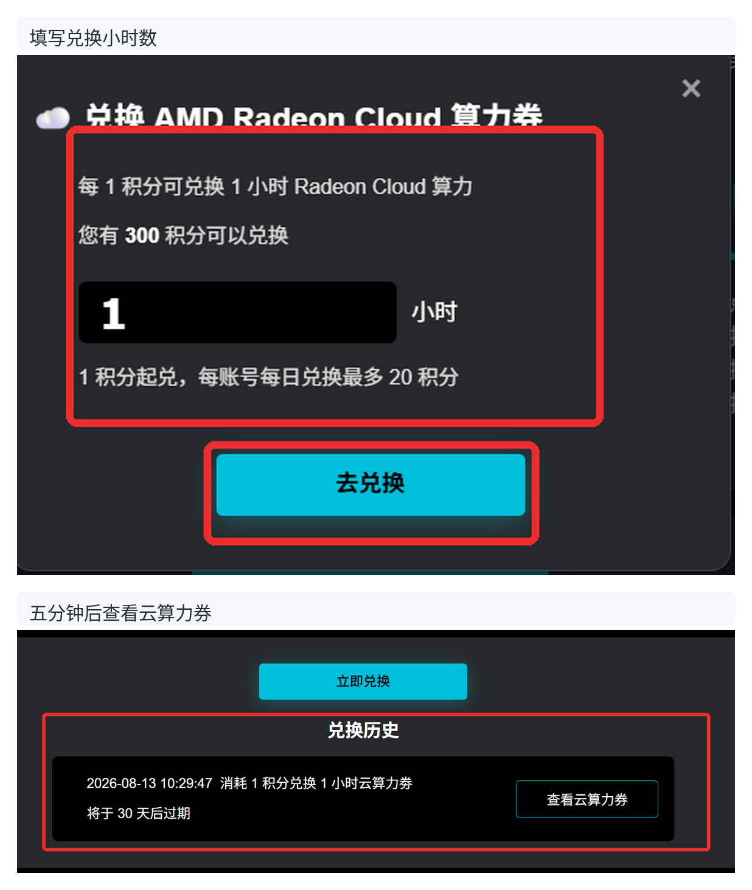
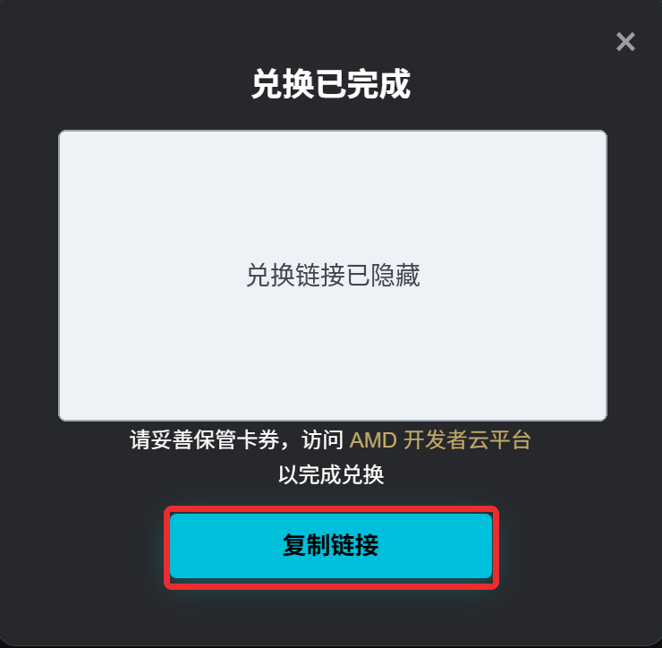
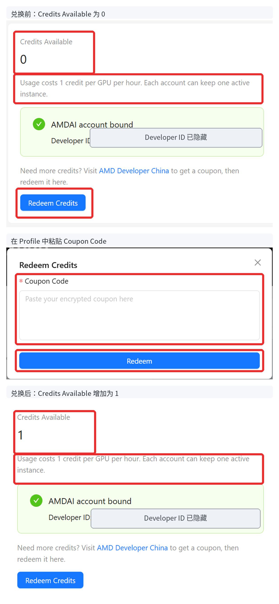
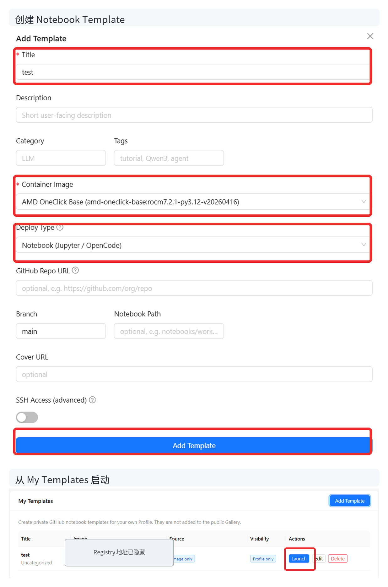
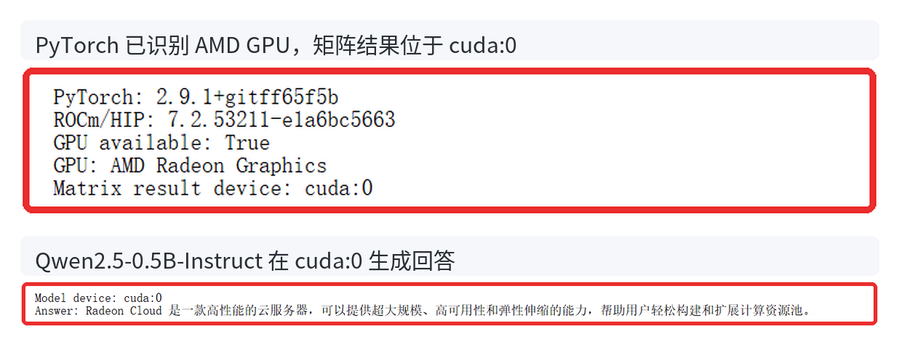

# 没有本地 AMD GPU，也能跑模型：Radeon Cloud 云算力领取与使用指南

<!--
内部状态：
- 平台：知乎
- 状态：review-ready，完成目标读者重写与人工修改，待 Daniel / Annie review
- 实测链路：ADP 经验值 → 云算力券 → Radeon Cloud Credits → My Templates → 单 GPU Notebook → Qwen2.5-0.5B-Instruct → 销毁实例
- 不展开：全球站、SSH、Tunnel、Token Factory
-->

我在知乎上看到很多朋友都想部署开源模型推理服务来玩一玩或者开发一些有趣的东西，包括各种 Agent 、diffusion、LLM、VLM、具身智能之类的，可惜没有可用 GPU算力资源，我猜多数人一开始可能想到的是去网上云平台租用nvidia GPU，但今天我们作为AMD按摩的，给大家力荐我们AMD Radeon Cloud，这是 AMD 提供的云算力平台，我们目前提供的GPU是Radeon Pro W7900专业显卡，48G显存，不要任何money，每个人都可以在云端 AMD Radeon GPU 上运行自己的代码和项目，本文将手把手教你如何baipiao AMD Radeon GPU，后续，我们还将带来更多在AMD Radeon GPU上部署流行大模型（比如minimax H3，miniCPM）的心得以及AMD Radeon Cloud的更多玩法，欢迎大家持续关注哦

AMD Radeon Cloud 中国站的算力入口与 [AMD AI 开发者计划](https://developer.amd.com.cn/)（下文简称 ADP）相连。ADP 负责账号、活动权益和经验值，Radeon Cloud 则使用兑换后的 Credits 启动 GPU 实例。也就是说，第一次使用 Radeon Cloud，需要先从 ADP 取得云算力。

我实际从 ADP 兑换了 1 小时云算力，在 Radeon Cloud 创建 Notebook，确认 PyTorch 已识别 AMD GPU，并用 Qwen2.5-0.5B-Instruct 完成了一次推理。下面把领取、兑换、运行和销毁实例的完整步骤分享出来。

### 先注册 ADP，看看账号里的经验值

打开 ADP 首页完成注册并登录。

登录后的首页会显示当前经验值，旁边注明 1 积分对应 1 经验值。如果你在后续页面里看到积分字样，那么实际上就是 ADP 的经验值了。


此外，参与课程和活动可以积累经验值，点击首页的“升级规则”可以查看当前获取方式。

接下来，要把经验值变成真正可用的 GPU 时间，我们还需要完成两次兑换：先在 ADP 用积分领取云算力券，再到 Radeon Cloud 把云算力券充成 Credits。

### 用 ADP 积分领取云算力券

回到 ADP 首页，进入“我的权益”，可以看到“积分免费兑换云额度”。


点击“领取”会进入[积分兑换页面](https://developer.amd.com.cn/points/redeem)。我们可以看到：1 积分可以兑换 1 小时算力，每个账号每天最多兑换 20 积分。ADP 积分本身不过期，但兑换后的云算力券只有 30 天有效期。


下面以兑换 1 小时为例。填写 1 小时后，页面会扣除 1 积分。确认兑换后，历史记录先提示“算力券将在 5 分钟内到账”；大约 5 分钟后，右侧出现“查看云算力券”。



点击“查看云算力券”，页面会显示一段很长的兑换链接。点击“复制链接”保存它，下一步要用这段链接给 Radeon Cloud 充值。



截图中隐藏了完整链接。实际页面会显示完整的云算力券，下一步在 Radeon Cloud 中把它作为 `Coupon Code` 使用。

### 把云算力券兑换成 Radeon Cloud Credits

直接点击链接打开 [Radeon Cloud 中国站](https://developer.amd.com.cn/radeon/)，点击右上角 `Login`，选择 `Login with AMDAI`。完成账号绑定后，点击头像进入 `Profile`。

可以看到：兑换前，我的 `Credits Available` 为 0。点击 `Redeem Credits`，把刚才复制的云算力券粘贴到 `Coupon Code` 输入框，再点击 `Redeem`。页面提示兑换成功后，余额增加为 1 Credit。充值后的 Credits 有效期为 90 天。



### 创建一个最简单的 Notebook Template

在同一 Profile 页面的 `My Templates` 区域可以看到 `Add Template` 按钮。点击后可以选择容器镜像和环境类型，例如 Notebook、App 或模型推理服务。

这次演示创建一个可以使用 Terminal 和 Python 的空白 Notebook。

点击 `Add Template` 后，依次填写三个位置：

- `Title`：填写一个方便自己识别的名称；
- `Container Image`：这次使用当前提供的 `AMD OneClick Base`；
- `Deploy Type`：选择 `Notebook (Jupyter / OpenCode)`。

其余 GitHub Repo、Notebook Path 和 SSH 等字段可以留空。

点击 `Add Template` 后，新模板会出现在 `My Templates`，此时可以看到 `Launch` 按钮。



### 启动实例前，先看 Credits 怎样扣除

停一下，先不要点击 `Launch`。这里有一条计费规则需要先说明：

Profile 写明：每块 GPU 每小时消耗 1 Credit，每个账号只能保留一个活动实例。启动实例时，系统会先扣除 Credit，不是等实例运行满一小时后再扣款。

我启动的单 GPU 实例只运行了约 4 分钟，页面已经显示 `Credits Consumed` 为 1；提前销毁后，剩余时间不会退回。

实际操作时，先在本地准备好要进入环境运行的命令，可以避免前期的 Credits 空耗。

### 回到 Template，启动实例

点击 `Launch` 后，页面会先进行图像人机验证，再向 ADP 账号邮箱发送一次性 6 位验证码。验证完成后，平台开始准备工作空间；进度到达 Ready 后，点击 `Open Notebook` 进入 JupyterLab。

### 先确认 GPU，再运行模型

进入 JupyterLab 后打开 Terminal。不要急着下载模型，先用下面的命令确认 PyTorch 是否真的看到了 AMD GPU：

```bash
python - <<'PY'
import torch

available = torch.cuda.is_available()
print("PyTorch:", torch.__version__)
print("ROCm/HIP:", torch.version.hip)
print("GPU available:", available)
print("GPU:", torch.cuda.get_device_name(0) if available else "not available")

if available:
    x = torch.randn((1024, 1024), device="cuda")
    print("Matrix result device:", (x @ x).device)
PY
```

本次环境返回 PyTorch 2.9.1、ROCm/HIP 7.2，`GPU available` 为 `True`，矩阵结果位于 `cuda:0`。这说明当前容器中的 PyTorch 已经可以发现并调用云端 AMD GPU backend。

GPU 确认可用后，再安装 Transformers，并运行 Qwen2.5-0.5B-Instruct：

```bash
python -m pip install -q transformers accelerate
```

```bash
python - <<'PY'
import torch
from transformers import pipeline

pipe = pipeline(
    "text-generation",
    model="Qwen/Qwen2.5-0.5B-Instruct",
    dtype=torch.float16,
    device="cuda",
)

out = pipe(
    [{"role": "user", "content": "用一句话说明 Radeon Cloud 可以做什么。"}],
    max_new_tokens=64,
    do_sample=False,
)

print("Model device:", pipe.model.device)
print("Answer:", out[0]["generated_text"][-1]["content"])
PY
```

输出中的 `Model device` 为 `cuda:0`，模型也正常返回了回答。至此模型已经在 Radeon Cloud 的 AMD GPU 上跑通，但云端实例仍处于活动状态，还在占用 Credits。



### 完成任务后，记得销毁实例

关闭 JupyterLab 标签页或退出浏览器不会停止云端实例。使用结束后，先保存需要保留的代码和输出，再回到 Profile 点击 `Destroy Instance`。页面显示 `No active instance` 后，这次使用才真正结束。


好了，AMD Radeon cloud就是这样子使用滴，你学会了吗？欢迎评论区讨论交流你遇到的问题

#AMD #RadeonCloud #ROCm #PyTorch #云算力 #GPU #大模型 #人工智能
