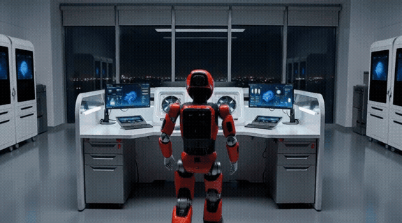

# 在 AMD Radeon PRO W7900 上跑通 MiniMax H3：ComfyUI 音视频生成实测

ComfyUI 是目前常用的本地 AI 生成工具之一。它把模型加载、提示词理解、内容生成和文件保存做成一个个可以连线的节点。使用者不必把所有操作写成代码，只要打开工作流，就能看到数据怎样从一个节点流向下一个节点。

不过，模型开放权重不等于所有显卡都能直接运行。现有的 ComfyUI 教程和社区优化大多先围绕 CUDA 环境展开，新模型到了 AMD GPU 上，模型格式、工作流节点和显存占用都要重新对上。

这次要运行的 MiniMax H3，正是这样一个刚进入 ComfyUI 的模型。它不只生成连续画面，还会在同一次生成中给出与画面对应的声音。我们想确认的事情很直接：一张 48GB 的 AMD Radeon PRO W7900，能不能把这条音视频生成链路完整跑下来？

答案是可以。W7900 用 276.93 秒生成了一段 5.17 秒的视频：一台红黑色机器人站在计算实验室的工作站前，设备灯光亮起，机器人随后转身看向镜头。输出为 864×480、24 FPS，并带有 32kHz 双声道音频。画面和声音来自同一条本地工作流，不是先生成视频，再调用其他服务补上一条音轨。

整个过程跑下来，最大的感受是：AMD 的 AI 软件栈现在真的很 YES 了。ROCm 让 AMD GPU 承担模型计算，PyTorch 负责执行模型，ComfyUI 再把各个步骤连成工作流。三层串起来以后，在 AMD GPU 上运行一个刚开放的音视频模型，已经没有想象中那么难。

### 一条工作流怎样把文字变成视频和声音

如果把这条工作流看成一条生产线，提示词进入以后，需要经过三段处理。

第一段是文本编码器。它像一个翻译器，把人写下的场景、动作和声音要求，转换成 H3 能够继续处理的数字表示。

第二段是 MiniMax H3 的扩散模型。它从噪声出发，按照文本编码器给出的条件，逐步形成包含画面和声音信息的中间结果。这一步是真正进行生成的地方，也是整条工作流中计算量最大的一段。

第三段是解码。H3 分别使用视频解码器和音频解码器，把中间结果还原成一帧帧画面和可以播放的声音。这两个解码器通常被称为 VAE。最后，ComfyUI 再把画面和声音封装成一个 MP4 文件。

ComfyUI 里的节点连线，实际对应的是一条很直观的过程：

**理解文字 → 生成画面和声音 → 还原并保存文件。**

MiniMax H3 开放后，[ComfyUI 已经加入了对应的原生节点](https://github.com/Comfy-Org/ComfyUI/pull/15224)。这次实测使用 ComfyUI 0.32.0 和 PyTorch 2.9.1，工作流由团队同事 Kaihui 搭建，在官方节点的基础上换入一套更适合单卡运行的社区配置。

H3 的核心模型使用已经合并 Turbo 加速的 Q4_K_M 量化版本。这里的 FL2VA 是 H3 中负责文本、首帧或尾帧生成音视频的模型，pruned 表示体积更小的精简版本。

Turbo 可以理解成一条经过训练的生成捷径：普通扩散模型要经过较多步骤逐渐去除噪声，LightX2V Turbo LoRA 则让模型学会用更少的步骤接近最终结果。LoRA 原本是一份运行时附加到模型上的轻量权重；ChrisColeTech 发布的版本已经提前把 8-step Turbo LoRA 融合进 FL2VA-pruned 模型，所以运行时不需要再加载一份 LoRA。

融合后的模型又被量化为 Q4_K_M，并保存成 GGUF 格式，把核心权重压缩到约 11.4GB。GGUF 是一种便于保存和加载量化模型的文件格式。Q4 用更低精度保存权重，减少显存占用，也可能牺牲一部分细节。Turbo 解决生成步数，Q4 解决模型体积，两者作用并不相同。

官方工作流默认使用 32B 文本编码器，也就是约 320 亿参数。这里换成约 40 亿参数的 Qwen3-VL-4B，再通过实验性的 ClipProj 投影层，把它的输出转换成 H3 需要的格式。视频与音频解码器继续使用 MiniMax 发布的权重。

这些调整共同解决了一个实际问题：让文本编码、音视频生成与解码所需的模型，能够在一张 48GB W7900 上完成运行。

本次工作流实际使用了下面五个文件：

- [H3 FL2VA Turbo Q4_K_M 核心模型](https://huggingface.co/ChrisColeTech/minimax-h3-turbo-GGUF/resolve/main/split/diffusion_models/minimax_h3_fl2va_turbo_Q4_K_M.gguf)
- [Qwen3-VL-4B FP8 文本编码器](https://huggingface.co/ChrisColeTech/minimax-h3-turbo-GGUF/resolve/main/split/text_encoders/qwen3vl_4b_fp8_scaled.safetensors)
- [4B ClipProj 投影模型](https://huggingface.co/NicoLab28/ClipProj-MiniMax-H3/blob/main/mmh3-4b-ClipProj-celeb-mlp.safetensors)
- [MiniMax H3 视频 VAE](https://huggingface.co/ChrisColeTech/minimax-h3-turbo-GGUF/resolve/main/split/vae/minimax_h3_video_vae_fp16.safetensors)
- [MiniMax H3 音频 VAE](https://huggingface.co/ChrisColeTech/minimax-h3-turbo-GGUF/resolve/main/split/vae/minimax_h3_audio_vae_fp32.safetensors)

ComfyUI 中的节点顺序也对应前面的生成过程：加载 Q4 核心模型 → 用 4B 编码器和 ClipProj 理解提示词 → 创建 124 帧音视频空间 → 完成 8 步采样 → 分别解码视频和音频 → 合成为 MP4。GGUF 模型需要使用更新后的 [ComfyUI-GGUF-Loader](https://github.com/ChrisColeTech/ComfyUI-GGUF-Loader) 加载。

### 给 H3 一个五秒镜头任务

这次使用纯文本生成模式，没有提供参考图片、视频或音频。画面、动作和声音都从同一段提示词开始。

提示词把任务限制在一个连续镜头里：一台红黑色机器人走进计算实验室，按下工作站电源，再转身看向镜头。声音部分则要求加入伺服电机、脚步、按钮和风扇启动的音效。没有场景切换，也没有字幕和 Logo，目的是让模型在五秒钟内集中完成一件事。

本次实际提交的完整提示词如下：

```text
Photorealistic cinematic video, one continuous shot with no cuts. Inside a clean
futuristic computing laboratory at night, a compact red-and-black service robot
walks toward a glowing workstation, raises one hand and presses the power button.
Cooling fans spin up, soft red light travels through the machine, and the robot
turns toward the camera with a small confident nod. The camera slowly dollies from
a medium-wide shot to a closer view. Stable robot design, realistic brushed metal,
natural reflections, precise mechanical movement, cinematic lighting, no people,
no text, no logo, no watermark. Audio: soft servo movements, metal footsteps, a
clear button click, cooling fans gradually spinning up, and a restrained electronic
ambience. No dialogue.
```

工作流使用 864×480 分辨率和 124 帧输出。按照 24 FPS 播放，最终时长为 5.17 秒。社区 Turbo 模型使用 8 个采样步。

CFG 设为 1.0，用来控制提示词对生成结果的约束强度；`res_multistep` 采样器负责让模型从噪声逐步得到最终结果。本次固定随机种子 seed 为 `2026081801`，便于在相同环境下复现。

确认提示词和参数后，点击 ComfyUI 右上角的 `Run`，任务就会沿着前面的节点依次执行：先理解文字，再生成音视频，最后解码并保存。

### 四分半钟后，W7900 交出了什么

从任务开始执行到 MP4 文件保存完成，整条链路用了 276.93 秒，也就是 4 分 37 秒。

先看画面。视频开头，机器人已经背对镜头站在工作站前；随后它转过身，镜头也同步向前推进。实验室灯光、机器人的红黑配色和背景设备，在这段运动中保持了连续，没有出现明显闪烁或主体突然变形。



[点击这里查看完整生成视频（含音频）](amd-w7900-minimax-h3.mp4)。

再听声音。音轨中可以听到持续的机械伺服声、逐渐增强的风扇声，以及机器人转身时的轻微机械响动，整体节奏和画面能够对应起来。

提示词中的转身和镜头推进表现得比较明确，但模型没有呈现“走进实验室”的过程，按下电源按钮的动作也不清楚。脚步与按钮声同样没有明确出现。至少在这次结果里，持续的动作和环境声，完成得比短促的动作细节更好。

这组结果给出了一条明确的单卡基线：一张 48GB W7900 可以在不到五分钟内，本地生成一段五秒钟、画面与声音基本连贯的视频。

这个结果的意义也不只是一段机器人视频。模型权重、提示词和输出都留在本地环境，不需要把素材发送到在线视频生成服务。对于创意预览、镜头草稿和提示词验证，这套工作流已经具备实际使用价值。更高分辨率、更长时长和更复杂的参考素材，则可以从这条已经跑通的链路继续向前尝试。

### 跑通以后，问题从“能不能用”变成“怎样用得更好”

在 AMD GPU 上运行一个刚开放的音视频模型，过去首先要问兼容性：框架能不能识别显卡，模型能不能装下，节点能不能执行。这次 W7900 实测把这些问题连成了一条可以完成的链路。

接下来的问题已经发生了变化：社区量化怎样在速度与质量之间取舍，提示词怎样让短促动作和声音更准确，高分辨率与长视频又需要多少等待时间。这些才是模型真正进入使用阶段后值得继续测试的事情。下一次测试不必再从兼容性猜测开始，而可以直接比较质量、速度和控制力。

#AMD #ROCm #MiniMaxH3 #ComfyUI #视频生成 #人工智能

参考资料：

- [MiniMax H3 官方模型](https://huggingface.co/MiniMaxAI/MiniMax-H3)
- [ComfyUI 格式的 H3 模型与 VAE](https://huggingface.co/Comfy-Org/MiniMax-H3)
- [ComfyUI MiniMax H3 原生节点](https://github.com/Comfy-Org/ComfyUI/pull/15224)
- [ChrisColeTech MiniMax H3 Turbo Q4 模型页](https://huggingface.co/ChrisColeTech/minimax-h3-turbo-GGUF)
