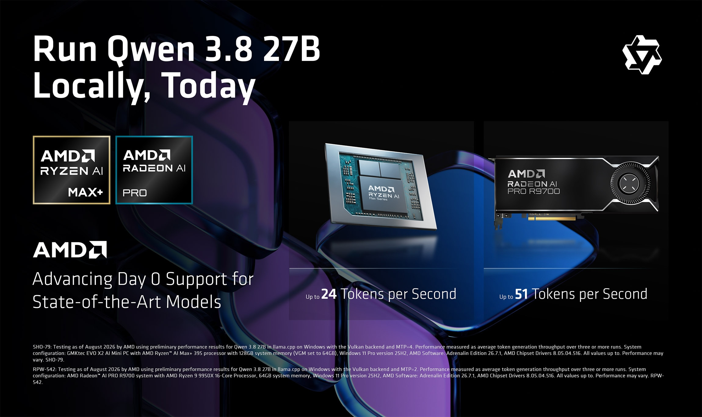
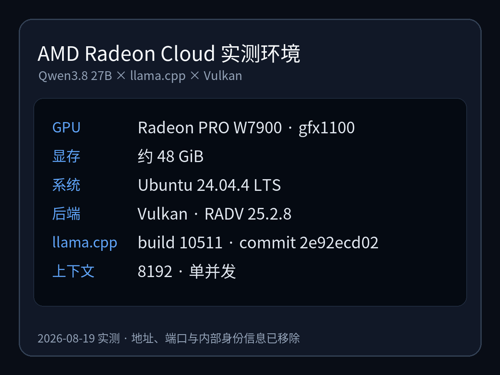
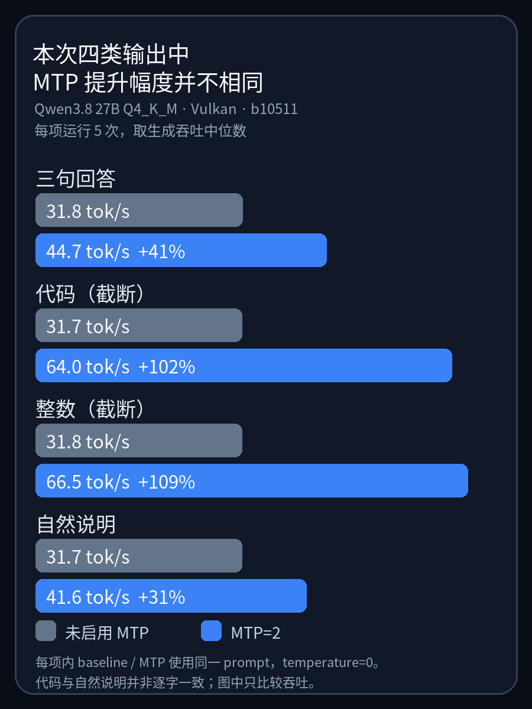

# Qwen3.8 27B 开源了：一张大显存 A 卡如何用 llama.cpp 跑起来？

A 卡玩家等本地大模型等太久了吧。N 卡那边 CUDA 生态随便跑，咱们这边折腾半天还得看兼容性脸色。但这次情况不一样——Qwen3.8 27B 放出来了，AMD 官方 Day 0 就给了支持了！llama.cpp 直接能用。

而且这模型本身就离谱：SWE-bench Pro 编码能力测试打了 61.7 分，Anthropic 的 Claude Opus 4.6 Max 才 53.4。一个开源的、能在你桌上跑的 270 亿参数模型，编码跑分把闭源顶尖模型给超了。

---

好，正式进入正题。

Qwen3.8 27B 是阿里 Qwen 团队 8 月 14 日发布的开放权重模型，Apache 2.0 协议，商用免费。它能处理文字、图片和视频输入，原生支持 26 万 token 上下文（大约相当于一整本小说的长度）。编码、长流程自动化任务、多模态理解都是它的强项。

AMD 这边，模型发布当天就宣布支持。官方已经验证 Ryzen AI Max+ 395 和 Radeon AI PRO R9700 两款硬件都能通过 llama.cpp 直接跑 Qwen3.8 27B。对我们 A 卡用户来说，问题就三个：我的卡能不能跑？该下哪个版本的模型？怎么把它变成一个本地 API 服务让别的工具调用？

我在 AMD Radeon Cloud 的一张 Radeon PRO W7900（48GB 显存）上把整套流程跑通了。模型所有计算层全部放进了显卡，推理计算全部在显卡上完成。跑起来之后的速度：普通对话大约每秒生成 32 个 token，体感是即时响应。开启加速功能后，普通对话到了每秒 42 个 token，写代码时还能接近再翻一倍。



*上图是 AMD 官方初步测试数据。两组数字分别来自 Ryzen AI Max+ 395（每秒 24 token）和 Radeon AI PRO R9700（每秒 51 token），Windows + Vulkan 环境多次运行取平均。本文实测用的是 W7900，硬件不同，速度数字也不同。*

### 一张 W7900，能不能把模型全装下？

先交代硬件。我用的是 AMD Radeon Cloud 上的一张 Radeon PRO W7900，48GB 显存，系统是 Ubuntu 24.04 LTS。

可能有人会问：为什么用 Vulkan 而不是 ROCm？

简单说：llama.cpp 支持两种方式调用 AMD 显卡——ROCm 和 Vulkan。ROCm 是 AMD 自家的计算框架，功能强大但安装链路比较重，而且有一份官方硬件支持列表，不在列表上的卡可能遇到各种问题。Vulkan 则是一个通用图形/计算接口，几乎所有现代显卡都支持，安装只需要一行 `apt install libvulkan-dev`。

关键是：在 RDNA3 架构（也就是 W7900 所属的这一代）上，多个独立测试显示 Vulkan 后端的 llama.cpp 推理速度和 ROCm 持平甚至更快。AMD 官方给 Qwen3.8 27B 做的 Day 0 测试，用的也是 Vulkan。所以这里没有"退而求其次"——Vulkan 就是当前 A 卡跑 llama.cpp 的正解之一。

#### 模型文件怎么选

Qwen3.8 27B 原始权重是 BF16，直接加载需要约 55.6GB 显存，超出 W7900 的 48GB。所以我们需要用量化版本。

我选的是社区制作的 GGUF 格式文件，量化等级 Q4_K_M。拆开说：

- **GGUF** 是 llama.cpp 专用的模型封装格式，一个文件搞定，下载即用，不需要转换。
- **Q4_K_M** 的意思是"大部分参数压缩到 4-bit，但关键层保留更高精度"。这是社区公认的速度和质量平衡点——比 Q4_0 质量好，比 Q5 跑得快。

主模型文件大约 19GB。

#### 多花 1.68GB，MTP 能换来什么？

除了主模型，我还额外加载了一份 1.68GB 的小文件，用来开启 MTP。

MTP 全称 Multi-Token Prediction。正常情况下，模型每一步只输出一个 token（可以粗略理解为一个字或半个词）。MTP 让模型在每一步同时"草拟"后面几个 token，如果猜对了就直接跳过那几步的计算。猜错也没关系，丢掉重来就行。

这个机制是 Qwen3.8 原生支持的——模型训练时就考虑了这个能力，不是后期外挂。那份 1.68GB 的小文件就是负责"草拟"的辅助组件。

#### 显存实际占了多少

这是大家最关心的数字：

- 不加载 MTP → 实际占用约 **17.8 GiB**
- 加载 MTP（设为 2）→ 约 **19.2 GiB**，多出 1.3 GiB 左右

也就是说，哪怕开启 MTP，总共也只用了 48GB 里的不到一半。如果你的显卡有 24GB 以上显存，也有概率装得下这个模型。

启动时 llama.cpp 的日志会打印一行 `offloaded 65/65 layers to GPU`——意思是模型一共 65 层计算，全部交给显卡执行了。如果你的显存不够，这个数字会变小，比如 `offloaded 40/65 layers`，剩下的层会退回 CPU 算，速度会明显下降。所以看到 65/65，就说明显存充裕、全速运行。

有一小块数据（约 680MB 的 embedding 表——可以理解为模型内部的"字典索引"）留在系统内存里，这是正常行为，不影响速度。

#### 这次先测什么

纯文本输入，上下文窗口 8192 token（大约 6000 字的对话长度），单用户。Qwen3.8 27B 原生支持 26 万 token 上下文和视觉输入，这些是后续可以单独验证的方向——这篇文章先解决"跑起来、确认能用、测出速度"。

我在 Radeon Cloud 上操作，但下面的步骤，对任何 RDNA3 架构、24GB+ 显存的 A 卡都可以作为参考。遇到 Radeon Cloud 特有的环境限制时，我会单独标出来——如果你在自己的机器上跑，跳过那些部分就行。



*实测环境速查：Radeon PRO W7900 (gfx1100) · 48 GiB 显存 · Ubuntu 24.04.4 LTS · Vulkan (RADV 25.2.8) · llama.cpp build 10511 · 上下文 8192 · 单并发 · 2026-08-19 测试*

### 编译 llama.cpp（Vulkan 后端）

这一步的目标：拿到一份支持 Vulkan 的 llama.cpp，能调用你的 AMD 显卡做推理。

#### 获取源码

我固定使用 commit `2e92ecd02`（build 10511）。Qwen3.8 27B 刚发布几天，llama.cpp 对新模型的支持往往是"某个版本开始能跑，后续版本可能更快但也可能引入新 bug"。锁版本是为了让本文的命令、模型文件和速度数字三者对得上。

如果你在自己的机器上操作，直接克隆即可：

```bash
mkdir -p ~/qwen38
cd ~/qwen38

git clone https://github.com/ggml-org/llama.cpp.git
cd llama.cpp
git checkout 2e92ecd0247d25f09797f8fdb044a166522fc05d
```

> **Radeon Cloud 用户注意：** 当前实例的网络环境对 `git clone` 的证书链验证有问题。不要关闭证书校验来绕过——正确的做法是从 GitHub 的 codeload 域名下载源码归档，这个域名的 TLS 验证正常：
>
> ```bash
> set -euo pipefail
> mkdir -p ~/qwen38 && cd ~/qwen38
>
> curl -fL --retry 3 \
>   "https://codeload.github.com/ggml-org/llama.cpp/tar.gz/2e92ecd0247d25f09797f8fdb044a166522fc05d" \
>   -o llama.cpp-2e92ecd.tar.gz
>
> echo "5767518d018f3a18ca8e7a6d1fcf928c61eecc665c002c919c4e6eefc43d8135  llama.cpp-2e92ecd.tar.gz" \
>   | sha256sum -c -
>
> tar -xzf llama.cpp-2e92ecd.tar.gz
> mv llama.cpp-2e92ecd0247d25f09797f8fdb044a166522fc05d llama.cpp
> cd llama.cpp
> ```

#### 安装 Vulkan 构建依赖

```bash
sudo apt update
sudo apt install -y \
  cmake build-essential ccache \
  libvulkan-dev vulkan-tools mesa-vulkan-drivers \
  glslc glslang-tools libshaderc-dev \
  spirv-tools spirv-headers
```

这些包的作用：
- `libvulkan-dev` 提供 Vulkan 头文件和链接库；
- `glslc` / `glslang-tools` / `libshaderc-dev` 用来把 GPU 着色器代码编译成 SPIR-V 格式；
- `mesa-vulkan-drivers` 是开源 Vulkan 驱动（RADV），W7900 就靠它工作。

#### 编译

```bash
cmake -S . -B build-vulkan \
  -DGGML_VULKAN=ON \
  -DCMAKE_BUILD_TYPE=Release \
  -DLLAMA_BUILD_NUMBER=10511 \
  -DLLAMA_BUILD_COMMIT=2e92ecd0247d25f09797f8fdb044a166522fc05d \
  -DLLAMA_CURL=OFF \
  -DLLAMA_BUILD_UI=OFF \
  -DLLAMA_USE_PREBUILT_UI=OFF \
  -DCMAKE_C_COMPILER_LAUNCHER=ccache \
  -DCMAKE_CXX_COMPILER_LAUNCHER=ccache

cmake --build build-vulkan --config Release -j$(nproc) \
  --target llama-cli llama-server llama-bench
```

几个开关的含义：

- `-DGGML_VULKAN=ON`：启用 Vulkan 后端，这是整个编译的核心目的。
- `-DLLAMA_BUILD_UI=OFF`：关掉内嵌 Web 界面。llama-server 默认会在编译时从网上拉一份前端资源，如果你的网络环境拉不到就会报错。关掉之后命令行和 API 完全不受影响，需要界面时用任何 OpenAI 兼容的客户端连就行。
- `ccache`：加速重复编译，首次编译也不影响结果。

#### 编译完，先看显卡有没有真跑起来

编译完成后，先做一件事——确认 llama.cpp 看到的是你的独立显卡，而不是 CPU 软件渲染。

```bash
export GGML_VK_VISIBLE_DEVICES=0

./build-vulkan/bin/llama-cli --list-devices
./build-vulkan/bin/llama-cli --version
```

正确的输出应该只有你的目标卡：

```text
Vulkan0: AMD Radeon Graphics (RADV NAVI31) (49136 MiB, 49109 MiB free)
version: 0.1.2-dev (build 10511, commit 2e92ecd02)
```

看到这个，编译就完成了。下一步是下载模型。

### 下载模型文件

我用的是 ggml-org 从 Qwen 官方权重转出的 GGUF，量化等级 Q4_K_M，单文件约 19GB。

如果你能直接访问 Hugging Face：

```bash
cd ~/qwen38
mkdir -p models && cd models

# 直接从 Hugging Face 下载
curl -fL --retry 8 -C - \
  "https://huggingface.co/ggml-org/Qwen3.8-27B-GGUF/resolve/0669b98607d47046c7c2b3f801011d54a08cfccf/Qwen3.8-27B-Q4_K_M.gguf" \
  -o Qwen3.8-27B-Q4_K_M.gguf.part &&

echo "31629f53165ab6a7dad8c9847dcfd1fdf55829dac1e6e748f4a68581b0033d34  Qwen3.8-27B-Q4_K_M.gguf.part" \
  | sha256sum -c - &&

mv Qwen3.8-27B-Q4_K_M.gguf.part Qwen3.8-27B-Q4_K_M.gguf
```

> **国内网络 / Radeon Cloud 用户：** HF 直连可能超时，把 URL 中的 `huggingface.co` 替换为 `hf-mirror.com` 即可，SHA-256 保持不变。

#### 先让模型说句话

模型下载完，先跑一条最简单的命令确认整条链路通了：

```bash
cd ~/qwen38/llama.cpp

# 本文 W7900 在 vulkaninfo 中是 GPU0；其他机器替换为实际序号
export GGML_VK_VISIBLE_DEVICES=0

./build-vulkan/bin/llama-cli \
  -m ../models/Qwen3.8-27B-Q4_K_M.gguf \
  -ngl all \
  -c 4096 \
  -n 160 \
  --temp 0 \
  --jinja \
  --chat-template-kwargs '{"enable_thinking":false,"preserve_thinking":false}' \
  -cnv -st \
  -p "请只用一句中文确认：Qwen3.8 27B 已经在这张 AMD GPU 上成功运行。"
```

返回：

> Qwen3.8 27B 已经在这张 AMD GPU 上成功运行。

能走到这一步，说明模型文件完好、Vulkan 后端正常、模型的对话模板也正确解析了。接下来把它变成一个持久运行的 API 服务。

---

### 把模型接进自己的工具

命令行里能聊天只是验证手段。要让其他工具——Python 脚本、Agent 框架、前端应用——调用这个模型，需要启动 `llama-server`，它会暴露一个 OpenAI 兼容的 HTTP 接口。

同时，我们把 MTP 也加上。前面讲过，MTP 让模型一次草拟多个 token、猜对就跳过计算。这里需要额外下载一份 1.68GB 的 draft 辅助文件：

```bash
cd ~/qwen38/models

curl -fL --retry 8 -C - \
  "https://huggingface.co/ggml-org/Qwen3.8-27B-GGUF/resolve/0669b98607d47046c7c2b3f801011d54a08cfccf/mtp-Qwen3.8-27B-Q4_0.gguf" \
  -o mtp-Qwen3.8-27B-Q4_0.gguf.part &&

echo "051a1764cff8c4f3ee6ae8b00593a0364c7539c67fa50ffc58f3f96509fca38e  mtp-Qwen3.8-27B-Q4_0.gguf.part" \
  | sha256sum -c - &&

mv mtp-Qwen3.8-27B-Q4_0.gguf.part mtp-Qwen3.8-27B-Q4_0.gguf
```

> 同上，国内网络把域名换成 `hf-mirror.com`，其余命令不变。

启动服务：

```bash
cd ~/qwen38/llama.cpp

# 本文 W7900 在 vulkaninfo 中是 GPU0；其他机器替换为实际序号
export GGML_VK_VISIBLE_DEVICES=0

./build-vulkan/bin/llama-server \
  -m ../models/Qwen3.8-27B-Q4_K_M.gguf \
  -md ../models/mtp-Qwen3.8-27B-Q4_0.gguf \
  --spec-type draft-mtp \
  --spec-draft-n-max 2 \
  -ngl all \
  -ngld all \
  --alias Qwen3.8-27B \
  -c 8192 \
  -np 1 \
  --jinja \
  --host 127.0.0.1 \
  --port 8080
```

几个关键参数：

- `-md` + `--spec-type draft-mtp` + `--spec-draft-n-max 2`：加载 MTP draft 文件，每步最多草拟 2 个 token。AMD 官方测试独显时也用的 MTP=2。
- `-ngl all` / `-ngld all`：主模型和 draft 模型的所有层都放进 GPU。
- `--host 127.0.0.1`：只监听本机。如果你需要远程访问，建议通过 SSH 隧道转发，而不是直接改成 `0.0.0.0`（这个服务没有内置认证）。

> **想先跑不带 MTP 的 baseline？** 去掉 `-md`、`--spec-type`、`--spec-draft-n-max` 和 `-ngld all` 四项就行，其余不变。

如果服务运行在 Radeon Cloud，而客户端在你自己的电脑上，先在本地终端建立 SSH 隧道：

```bash
ssh -L 8080:127.0.0.1:8080 root@YOUR_RC_HOST -p YOUR_SSH_PORT
```

隧道保持连接后，本地客户端才能通过 `http://127.0.0.1:8080/v1` 访问远端服务。

#### 发第一条请求

另开终端：

```bash
curl http://127.0.0.1:8080/v1/chat/completions \
  -H "Content-Type: application/json" \
  -d '{
    "model": "Qwen3.8-27B",
    "messages": [{
      "role": "user",
      "content": "请用三句话回答：一个只有一张大显存 AMD GPU 的开发者，为什么会选择在本地运行 27B 大模型？不要使用标题或列表。"
    }],
    "temperature": 0,
    "top_p": 1,
    "seed": 20260819,
    "max_tokens": 256,
    "chat_template_kwargs": {
      "enable_thinking": false,
      "preserve_thinking": false
    }
  }'
```

这个请求连续跑了 5 次，回复逐字相同（因为 temperature=0），生成速度中位数 **44.7 tok/s**。

到这里，Qwen3.8 27B 已经是一个 OpenAI 兼容 API 了。同一台机器上的脚本可以直接访问；远端客户端通过上面的 SSH 隧道连接后，再把 `base_url` 指向 `http://127.0.0.1:8080/v1`。

---

### MTP 到底快了多少？看内容类型

在本次四类测试里，不开 MTP 时的生成速度都在 31.7–31.8 tok/s。

开启 MTP=2 之后，速度开始和"输出内容的可预测性"强相关：

| 任务类型 | 不开 MTP（tok/s） | MTP=2（tok/s） | 提升 |
|---------|---------|-------|------|
| 三句回答 | 31.8 | 44.7 | +41% |
| 自然说明 | 31.7 | 41.6 | +31% |
| 代码生成（900 token 截断） | 31.7 | 64.0 | +102% |
| 连续整数（512 token 截断） | 31.8 | 66.5 | +109% |



*四类输出的 MTP 加速对比。每一项内部使用相同 prompt，分别运行 5 次取中位数，temperature=0。*

为什么差距这么大？回忆 MTP 的原理：模型草拟后续 token，猜对就跳过计算。代码和数字序列的"下一步"高度可预测（写完 `for i in range(` 后面大概率是数字和 `)`），所以草拟命中率极高——连续整数的命中率达到 100%，代码约 94%。自然语言就没这么好猜了，命中率只有 44% 左右，加速也相应收窄。

一句话总结：**MTP 不是"开了就固定翻倍"；在本次测试中，输出越规律，收益越大。**

#### 开关 MTP，答案会变吗？

MTP 会影响输出内容吗？我对比了开/关 MTP 的输出：三句回答和连续整数完全逐字相同；自然说明方向一致，但措辞不同；代码对照两边都在 900 token 处截断，不用于判断完整结果是否等价。如果你的场景对输出确定性要求高，建议用自己的 prompt 实际对比。

#### 多占 1.3GiB，值不值？

MTP=2 的额外显存开销约 1.3 GiB（从 17.8 GiB 升到 19.2 GiB）。对 48GB 的 W7900 来说完全无压力，24GB 显存的卡也装得下。代价很小，建议默认开启。

### 跑得快，但能不能干活？

速度测出来了，最后验证一件事：面对一个真实的编码任务，它的输出能不能直接用。

我给了它一个中等复杂度的 prompt：写一个 Python 函数，输入是一批 API 请求日志（包含正常记录和损坏数据），要求忽略坏数据，按模型名分组统计请求数、平均延迟和 P95 延迟，最后附带断言测试。

第一次我把所有需求塞在一个 prompt 里（文件读取、解析容错、命令行接口、统计逻辑、示例数据），模型两次都写到一半撞了输出长度限制。把需求收窄到核心统计函数后，1243 个 token，约 20 秒写完，生成速度 64.9 tok/s。

代码拿去执行：正常输入、损坏记录、空输入、全无效输入——四组断言全部通过。

### 最后

一张 48GB 显存的 A 卡，一份 19GB 的量化模型，llama.cpp 加 Vulkan 后端——从零到能用的本地 API，整个流程走下来不到一小时。MTP 开了之后写代码能到 64 tok/s，普通对话 42 tok/s，体感就是没有等待。

所有命令、模型链接和配置都在上文里，参考资料放在最后面。如果你有一张 24GB 以上显存的 RDNA3 卡，换掉 GPU 型号这一个变量，其余步骤原样走一遍就行。

你手上是哪张 A 卡？如果也跑了 Qwen3.8 27B，欢迎把显卡型号和速度留在评论区，看看不同 A 卡之间能差多少。

---

#AMD #Qwen3.8 #llamacpp #Radeon #本地大模型 #人工智能

**参考资料：**

- [Qwen3.8 27B 官方模型页](https://huggingface.co/Qwen/Qwen3.8-27B)
- [ggml-org Qwen3.8 27B GGUF](https://huggingface.co/ggml-org/Qwen3.8-27B-GGUF)
- [AMD Qwen3.8 27B Day 0 博客](https://www.amd.com/en/blogs/2026/run-qwen-3-8-27b-on-amd-ryzen-ai-max-and-radeon-graphics-cards-day-0.html)
- [llama.cpp MTP 支持 PR #22673](https://github.com/ggml-org/llama.cpp/pull/22673)
- [llama.cpp GitHub](https://github.com/ggml-org/llama.cpp)
