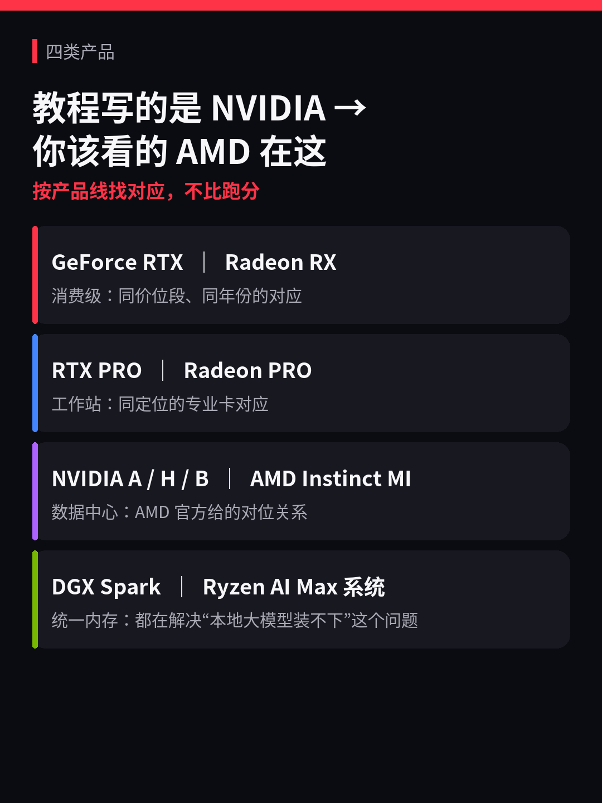
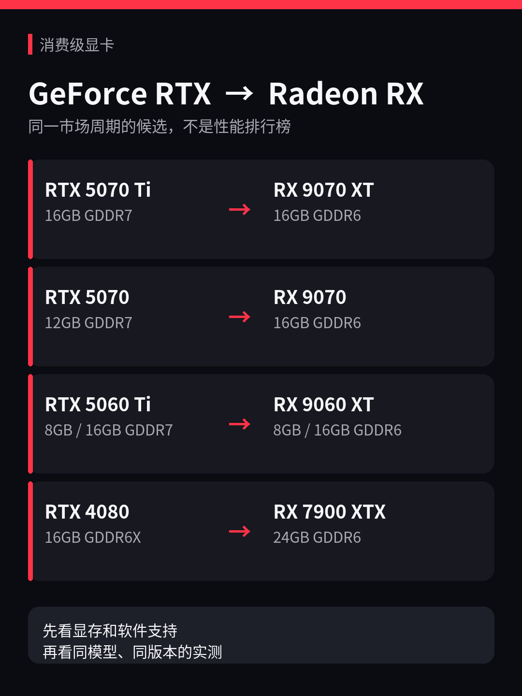
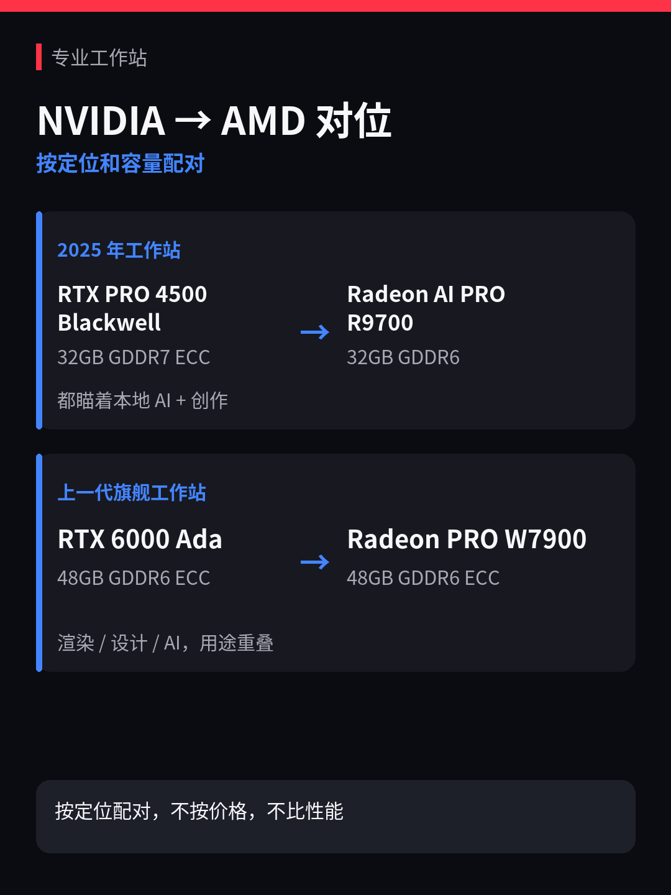
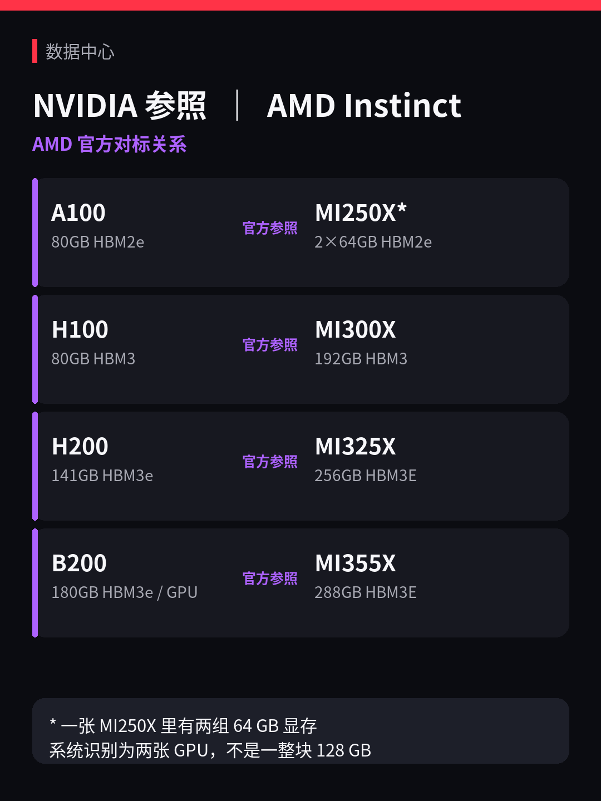
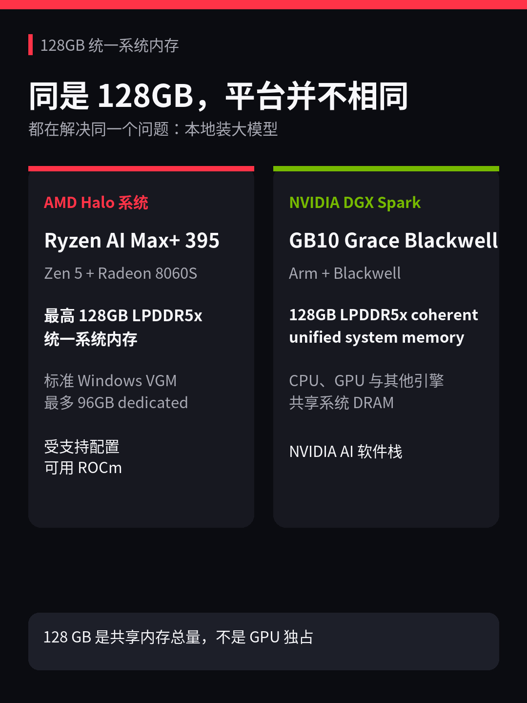

# AI 教程配置全是NVIDIA，AMD 怎么办？AMD该看哪张？从 5070 Ti 到 H100 逐一对位

本地跑模型的教程，硬件建议基本都是 NVIDIA 型号：5070 Ti 够用、4090 稳定、训练上 H100。A 卡用户看这些等于白看：我手上这张 RX 9070 XT，该参考哪个级别？

本篇文章帮你对上。从消费级 GeForce 到数据中心 H100，NVIDIA 那边每个位置，都能在 AMD 这边找到对应的卡。不比性能，只解决一个问题：教程提到某张 N 卡的时候，你该去看谁。

---

## 消费级显卡：N卡和A卡，谁对标谁

直接上表。同一行的两张卡，就是**市场位置接近**——年份、价位段、定位差不多，聊到其中一张的时候，另一张就是你的参照。

| NVIDIA 这边 | 显存 | AMD 对位 | 显存 | 放一起的理由 |
|---|---:|---|---:|---|
| RTX 5070 Ti | 16 GB GDDR7 | RX 9070 XT | 16 GB GDDR6 | 2025 高端，容量相同，N 卡贵 $150 |
| RTX 5070 | 12 GB GDDR7 | RX 9070 | 16 GB GDDR6 | 同周上市，起售都是 $549 |
| RTX 5060 Ti | 8 / 16 GB GDDR7 | RX 9060 XT | 8 / 16 GB GDDR6 | 2025 主流段，都分 8 GB 和 16 GB 两版 |
| RTX 4080 | 16 GB GDDR6X | RX 7900 XTX | 24 GB GDDR6 | 2022 高端 4K；但 XTX 是 AMD 旗舰，4080 是 NVIDIA 次旗舰 |

有个容易忽略的事：RTX 5070 只有 12 GB，但对面 RX 9070 有 16 GB。同一个价位，A 卡多了 4 GB——有时候跑大模型的时候这 4 GB 决定你能不能多装一个尺寸。另外， 9060 XT 和 5060 Ti 都有 8 GB / 16 GB 两个版本，买卡和看别人的经验时记得看容量，型号一样不代表显存一样。

> 别看 RX 7900 XTX 比 RTX 4080 多了 8 GB 显存就以为它更快——显存大 = 装得下更大的模型， ≠ 跑得快。速度要看算力和带宽。

还有一件事得提前说清楚：找到对位卡只是起点。大模型推理、图像绘制、训练的工具链，绝大多数默认走 CUDA——也就是 NVIDIA 专属。拿 A 卡去跑，不是换个型号就完事的，得确认你用的那个具体工具（llama.cpp、ComfyUI、Stable Diffusion、PyTorch……）在 AMD 这边有没有能走的路——ROCm、Vulkan、或者工具自己做的适配。

这件事很重要，但本篇不展开。我们在其他文章里已经提到了哪些能跑、怎么跑、坑在哪。可参考：[一文讲清 AMD GPU 显卡型号及其代号 gfx](https://zhuanlan.zhihu.com/p/2067663713826612548)、[AMD ROCm 与 PyTorch 安装指南](https://zhuanlan.zhihu.com/p/2068740074364260377)、[AMD GPU/APU AI 架构入门：CU、Vector Core 和 Shared Memory 怎么工作](https://zhuanlan.zhihu.com/p/2068399264997315488)。
这里你只需要记住：**卡对上了不代表软件就通了。**

消费卡只是四条产品线里的底端。往上还有工作站卡和数据中心 GPU——如果你关心的是 32 GB 以上的大容量方案，接着往下看。

## 工作站卡：32 GB 和 48 GB 这个级别

工作站卡和游戏卡是两条产品线。RTX PRO 对面是 Radeon PRO / AI PRO，不要拿 RX 去套。

| NVIDIA 这边 | 显存 | AMD 对位 | 显存 | 放一起的理由 |
|---|---:|---|---:|---|
| RTX PRO 4500 (Blackwell) | 32 GB GDDR7 ECC | Radeon AI PRO R9700 | 32 GB GDDR6 | 都是 2025 年专业卡，都瞄着"本地 AI + 创作"这个交叉点 |
| RTX 6000 Ada | 48 GB GDDR6 ECC | Radeon PRO W7900 | 48 GB GDDR6 ECC | 同代旗舰工作站卡，容量相同，用途重叠（渲染 / 设计 / AI） |

这两张卡我都实际跑过。一些热门模型：

R9700（32 GB）：单卡跑通了 Qwen3.6-35B-A3B 的 Q4 量化版，也跑过小模型 Qwen2.5-0.5B 的全精度推理。32 GB 装一个 35B Q4 模型绰绰有余。

W7900（48 GB）：单卡跑通了 Qwen3.8-27B 的 Q4 量化版，实际占了约 19 GB 显存，模型所有层都在 GPU 上跑——没有任何东西需要退回 CPU。48 GB 卡跑 27B Q4 属于非常宽裕。

给你一个容量直觉：

- **30B 级模型 Q4 量化** ≈ 20 GB 权重。放进 32 GB 卡后还剩 10+ GB 给上下文和运行开销——够用。
- **70B 级模型 Q4 量化** ≈ 40–45 GB 权重。塞进 48 GB 卡后余量只剩几个 GB，上下文稍长就可能爆显存。

这就是为什么 32 GB 和 48 GB 是工作站卡的两个关键台阶。

R9700 支持多卡配置，但别以为插四张 32 GB 就等于有了 128 GB 显存——不是那样工作的。多卡要真正合力跑一个大模型，需要专门的并行方案和卡间高速互联，配置复杂度完全不是"多插几张"能概括的。这部分水很深，本篇不展开。

---

## 数据中心：A100、H100、B200 对面是谁

这一段跟你买什么卡没关系——但你会在各种地方看到这些型号，知道它们的对位关系能帮你建立全局画面。

下面四组是 AMD 官方自己对标的，不是我配的：

| NVIDIA | 显存 | AMD Instinct | 显存 | 备注 |
|---|---:|---|---:|---|
| A100 | 80 GB HBM2e | MI250X | 2×64 GB HBM2e | 上一代对位 |
| H100 | 80 GB HBM3 | MI300X | 192 GB HBM3 | 当前主力对位 |
| H200 | 141 GB HBM3e | MI325X | 256 GB HBM3e | H100 大容量升级 vs MI300X 大容量升级 |
| B200 | 180 GB HBM3e | MI355X | 288 GB HBM3e | 两边最新一代 |

数据中心 GPU 的选型维度远比消费卡复杂——容量、算力、带宽、卡间互联、软件生态全都是变量。这里只帮你建立"N卡和A卡谁对谁"的基本画面。

> **关于 MI250X 的显存：** 表里写的 2×64 GB 不是笔误。MI250X 物理上是两个 64 GB 芯片封在一起，系统会把它们当成两张独立 GPU 来用——不是一整块 128 GB。这个设计在实际使用中有影响。

## 统一内存：都是 128 GB，但完全不是一回事

独显的显存就那么大，16 GB、24 GB、48 GB 封顶。有没有别的办法？有——让 CPU 和 GPU 共享一整块大内存，不再区分"显存"和"内存"。这就是统一内存方案，AMD 和 NVIDIA 各出了一个：

**AMD 这边：Ryzen AI Max+ 395 系统**

CPU 是 Zen 5，GPU 是集成的 Radeon 8060S，共享最高 128 GB LPDDR5x 统一内存。
关键数字：96 GB。Windows 下最多可以把其中 96 GB 分给 GPU 用。

**NVIDIA 那边：DGX Spark（GB10 Grace Blackwell）**

Arm CPU + Blackwell GPU，同样 128 GB LPDDR5x 统一内存，CPU 和 GPU 共享整块物理内存。预装 NVIDIA 全家桶。

两个方案解决的是同一个问题：让本地设备装得下 70B 甚至更大的模型——普通独显做不到这一点。

但"装得下"不等于"跑得一样快"，架构不同、软件生态不同，实际推理速度可能差很多。

---

## 找到对位卡之后

知道该看谁，只是第一步。接下来判断"能不能用"，我建议这个顺序：

1. **容量够不够。** 你要跑的模型 + 上下文 + 运行开销，装不装得进这张卡的显存（或统一内存）。前面给的容量直觉可以直接套用。
2. **软件通不通。** 你具体要用的工具——llama.cpp、ComfyUI、PyTorch、Stable Diffusion——在这张 AMD 卡上有没有能跑的后端。这是 A 卡最大的不确定性，也是后面几篇的重点。
3. **速度行不行。** 同一个模型、同一个量化、同一个软件版本，实测对比才有意义。别拿不同条件的数字互相比。

更完整的场景、显存和软件栈选择，可以继续看：[AMD GPU 到底能不能跑大模型？训练和推理该用什么来跑？](https://zhuanlan.zhihu.com/p/2070243270706435814)。

---

## 看看你的

**你手上是哪张 A 卡？打算拿来跑什么？** 评论区说一下型号和想跑的任务，后面实测篇可以优先覆盖被提到最多的组合。

## 参考资料

- 消费级：[AMD Radeon RX 9000 Series 发布资料](https://www.amd.com/en/newsroom/press-releases/2025-2-28-amd-unveils-next-generation-amd-rdna-4-architectu.html)、[NVIDIA RTX 50 Series 发布资料](https://nvidianews.nvidia.com/news/nvidia-blackwell-geforce-rtx-50-series-opens-new-world-of-ai-computer-graphics)、[RTX 5070 上市资料](https://www.nvidia.com/en-us/geforce/news/rtx-5070-out-now/)、[RTX 5070 Family 规格](https://www.nvidia.com/en-us/geforce/graphics-cards/50-series/rtx-5070-family/)、[RX 9060 XT 发布资料](https://www.amd.com/en/newsroom/press-releases/2025-5-20-amd-introduces-new-radeon-graphics-cards-and-ryzen.html)、[RTX 5060 Ti 发布资料](https://nvidianews.nvidia.com/news/nvidia-blackwell-geforce-rtx-arrives-for-every-gamer-starting-at-299)、[RX 7900 XTX 规格](https://www.amd.com/en/products/graphics/desktops/radeon/7000-series/amd-radeon-rx-7900xtx.html)、[RTX 4080 规格](https://www.nvidia.com/en-us/geforce/graphics-cards/40-series/rtx-4080-family/)
- 工作站：[AMD Radeon AI PRO R9700](https://www.amd.com/en/products/graphics/workstations/radeon-ai-pro/ai-9000-series/amd-radeon-ai-pro-r9700.html)、[NVIDIA RTX PRO 4500 Blackwell Workstation Edition](https://www.nvidia.com/en-us/products/workstations/professional-desktop-gpus/rtx-pro-4500/)、[AMD Radeon PRO W7900](https://www.amd.com/en/products/graphics/workstations/radeon-pro/w7900.html)、[NVIDIA RTX 6000 Ada Generation](https://www.nvidia.com/en-us/design-visualization/rtx-6000/)、[本项目 R9700 PyTorch / Transformers 实测](https://github.com/AMD-AIM/zhihu_rednote_articles/tree/main/zhihu/01-huggingface-on-amd)、[本项目 R9700 llama.cpp 记录](https://github.com/AMD-AIM/zhihu_rednote_articles/tree/main/zhihu/03-amd-workload-rocm-stack)、[本项目 W7900 实测](https://github.com/AMD-AIM/zhihu_rednote_articles/tree/main/zhihu/07-qwen3.8-27b-llamacpp)、[多卡并行策略](https://docs.nvidia.com/nemo-framework/user-guide/24.12/nemotoolkit/features/parallelisms.html)
- 数据中心：[AMD MI200](https://www.amd.com/en/products/accelerators/instinct/mi200.html)、[NVIDIA A100](https://www.nvidia.com/en-us/data-center/a100/)、[AMD MI300X](https://www.amd.com/en/products/accelerators/instinct/mi300/mi300x.html)、[NVIDIA H100](https://www.nvidia.com/en-us/data-center/h100/)、[AMD MI325X](https://www.amd.com/en/products/accelerators/instinct/mi300/mi325x.html)、[NVIDIA H200](https://www.nvidia.com/en-us/data-center/h200/)、[AMD MI355X](https://www.amd.com/en/products/accelerators/instinct/mi350/mi355x.html)、[NVIDIA Blackwell](https://www.nvidia.com/en-us/data-center/technologies/blackwell-architecture/)
- 统一内存：[AMD Ryzen AI Max+ 395](https://www.amd.com/en/products/processors/laptop/ryzen/ai-300-series/amd-ryzen-ai-max-plus-395.html)、[AMD Variable Graphics Memory FAQ](https://www.amd.com/en/blogs/2025/faqs-amd-variable-graphics-memory-vram-ai-model-sizes-quantization-mcp-more.html)、[AMD Qwen3.8 Windows + Vulkan 路径](https://www.amd.com/en/blogs/2026/run-qwen-3-8-27b-on-amd-ryzen-ai-max-and-radeon-graphics-cards-day-0.html)、[NVIDIA DGX Spark](https://www.nvidia.com/en-us/products/workstations/dgx-spark/)

#AMD #NVIDIA #显卡 #ROCm #CUDA #本地大模型 #人工智能

