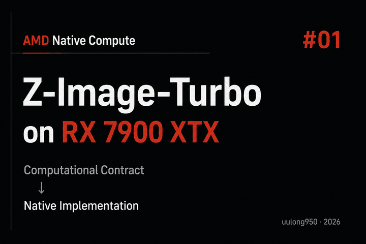

# RX 7900 XTX 原生运行 Z-Image-Turbo：不用 Python，纯 HIP/C++ 如何做到 23 秒出图

在 Radeon 上运行 Z-Image-Turbo，常见路线是 PyTorch、Diffusers 加 ROCm。[qingming-z-image-turbo](https://github.com/uulong950/qingming-z-image-turbo) 选择了另一条路：针对 RX 7900 XTX 的 gfx1100 架构，从头实现一套纯 HIP/C++ 推理程序，不依赖 PyTorch、Diffusers、ComfyUI 或 Python 运行时。

在 Ubuntu 24.04、ROCm 7.2.4 和 RX 7900 XTX 24GB 环境中，项目使用 Q6_K 量化生成一张 1024×1024 图片需要 23.27 秒，显存工作区占用约 16.17 GiB。这个结果来自一套高度专用的执行路径：固定模型、固定分辨率，再围绕硬件指令、数据搬运、算子融合和 GPU 调度逐层优化。

这篇文章不讨论如何安装和运行项目，而是回答四个问题：原生实现要解决什么问题，为什么 Z-Image-Turbo 适合做这次实验，项目具体优化了什么，以及最终得到了怎样的结果。

## 问题：模型能跑起来以后，通用执行栈还有多少可以省

PyTorch、Diffusers 和 ComfyUI 的目标是让不同模型、分辨率和硬件都能工作。为了保留这种通用性，框架通常会把推理拆成许多独立算子：一个算子结束后写回显存，下一个算子再读取结果；CPU 负责按顺序发起任务，GPU 逐个执行。

这套方式适合通用场景，但 Z-Image-Turbo 在 RX 7900 XTX 上的推理条件相对固定：

- 模型结构和权重不变
- 采样流程不变
- 目标分辨率只有几种
- 每一步矩阵运算的形状可以提前确定
- 整条 DiT 加 VAE 链路可以完整放入 24GB 显存

当这些条件都已知时，很多为动态场景准备的边界便不再必要。相邻计算可以融合，中间结果可以尽量留在片上，GPU 任务也可以提前编排。

因此，这个项目关注的不是把现有 CUDA 实现逐行迁移到 HIP，而是从模型计算图和 gfx1100 硬件能力出发，重新设计一条专用推理路径。

这里需要先说明边界：项目仓库没有给出与 PyTorch 加 ROCm 的同条件性能对照，所以本文不会得出原生实现一定快于通用框架的结论。它展示的是另一种工程取舍，以及这套取舍在指定硬件上的实测结果。

## 背景：为什么选择 Z-Image-Turbo 和 RX 7900 XTX

### 一条足够完整、又能够固定下来的推理链路

Z-Image-Turbo 是通义万相团队发布的图像生成模型，官方提供了[项目仓库](https://github.com/Tongyi-MAI/Z-Image)和[模型权重](https://huggingface.co/Tongyi-MAI/Z-Image-Turbo)。它的推理包含文本编码、DiT 去噪和 VAE 解码，足以覆盖矩阵乘法、Attention、前馈网络、归一化、残差连接和图调度等关键环节。

同时，它的执行过程又足够确定。模型结构、采样步数和分辨率固定后，每一步的数据形状和依赖关系都可以提前计算：

    Prompt
      │
      ▼
    Text Encoder
      │
      ▼
    Text Condition ───────────────┐
      │                           │
      ▼                           │
    Initial Latent                │
      │                           │
      ▼                           │
    ┌──── Denoising Loop ───────────────┐
    │  RMSNorm                          │
    │    → QKV Projection               │
    │    → QK Norm / RoPE               │
    │    → Attention                    │
    │    → Output Projection            │
    │    → Residual                     │
    │    → FFN / SwiGLU                 │
    │    → Residual                     │
    │    → Latent Update                │
    └───────────────────────────────────┘
      │
      ▼
    VAE Decode
      │
      ▼
    Image

固定计算图的价值在于，程序不必在运行时反复判断数据大小、选择执行路径或临时安排中间缓冲区。实现可以把更多信息写进编译期和初始化阶段。

### gfx1100 已经提供原生 BF16 矩阵能力

RX 7900 XTX 基于 gfx1100 架构，拥有 96 个 CU 和 24GB 显存。根据 [AMD RDNA 3 指令集文档](https://www.amd.com/content/dam/amd/en/documents/radeon-tech-docs/instruction-set-architectures/rdna3-shader-instruction-set-architecture-feb-2023_0.pdf)，该架构提供 BF16 WMMA 矩阵指令。项目直接调用对应的 AMDGCN 内建函数：

    __builtin_amdgcn_wmma_f32_16x16x16_bf16_w32(...)

这意味着核心矩阵运算可以直接映射到硬件指令。不过，调用 WMMA 只是起点。真实效率还取决于数据能否及时从显存进入 LDS，再进入寄存器。如果数据供应跟不上，计算单元依然会空等。

项目因此把重点放在两个问题上：如何减少不必要的数据往返，以及如何让 GPU 连续执行而不是等待 CPU 逐步调度。

### 先固定测试条件，再比较优化结果

性能比较最怕测试条件悄悄变化。项目提供 BF16、Q8_0、Q6_K 和 Q5_K_M 四条路径，覆盖 512×512、576×1024 和 1024×1024 三种分辨率。

本文数据均来自项目仓库公布的同一套环境：

- 操作系统：Ubuntu 24.04
- ROCm：7.2.4
- GPU：AMD Radeon RX 7900 XTX 24GB，gfx1100
- 采样步数：8
- 提示词：A cinematic portrait in the rain
- 随机种子：42

计时分为 Full Graph、DiT 和 VAE。Full Graph 表示从输入提示词到输出图片的完整耗时。仓库中的 Peak VRAM 实际按工作区分配前后的空闲显存差值计算，因此下文称为显存工作区占用，不把它解释成逐时刻采样得到的严格峰值。

## 优化方法：围绕计算、数据和调度逐层压缩开销

这些优化可以归纳为一条主线：既然计算图已经固定，就尽量减少通用抽象带来的中间状态、显存往返和启动开销。

### 直接使用 WMMA，并安排好数据流

Z-Image-Turbo 中的大量时间花在矩阵乘法上。项目没有通过通用数学库间接选择内核，而是为 gfx1100 编写 BF16 WMMA 路径。

实现同时安排显存、LDS 和寄存器之间的数据流。计算当前数据块时，下一块数据提前进入 LDS，尽量用搬运覆盖计算，避免 WMMA 指令等待输入。

这一步解决的不是单纯有没有矩阵指令，而是硬件指令能否持续吃到数据。

### 用持久化 GEMM 减少重复调度

普通 GEMM 调用结束后，相关工作组也随之退出；下一次计算需要重新启动。对于形状固定、会反复出现的矩阵运算，这部分调度可以进一步压缩。

项目采用持久化 GEMM，让计算任务持续占用 96 个 CU，并使用 LDS 双缓冲预取下一批数据。当前数据块计算完成后，执行单元可以继续处理下一块，而不必为每轮计算重新走一遍完整调度流程。

### 融合 QKV，避免重复读取同一输入

Attention 首先要从同一份输入生成 Q、K、V。若分别执行三次投影，输入会被重复读取，中间结果也要多次写入显存。

融合 QKV 后，输入只需读取一次，三组投影在同一条执行路径中完成。项目进一步融合后续 Attention，减少算子边界上的中间数据落盘。

这类融合的收益不只来自减少内核数量，更来自减少显存读写。

### 分块计算 Attention，不生成完整中间矩阵

直接按照公式实现 Attention，需要先生成 Q 与 K 的完整乘积。分辨率提高后，这个中间矩阵会迅速扩大。

项目把计算拆成 Q16×K32 的小块。每个分块算完后立即与 V 继续计算并累加结果，不在显存中物化完整 Attention 矩阵。该路径同样使用 BF16 WMMA 和持久化执行。

这一步同时降低了中间显存需求和数据搬运量。

### 融合 FFN 中的线性层与 SwiGLU

Transformer Block 中的 FFN 包含线性变换、激活和门控。若每一步都是独立算子，中间结果需要反复写回显存。

项目采用 dual SwiGLU fusion。输入读取一次，激活、门控和乘法尽量在片上完成，最后只写出一次结果。它与 QKV 和 Attention 融合采用的是同一个原则：只要中间结果马上会被消费，就尽量不要让它跨越不必要的显存边界。

### 用 HIP Graph 一次提交整条推理

单个内核优化之后，内核之间仍有启动和同步成本。常规执行方式需要 CPU 按顺序发起 GPU 任务，步骤越多，累计调度开销越明显。

HIP Graph 是 ROCm 中对应图执行的机制。项目提前编排整条静态推理链路，通过一次图启动交给 GPU 执行；中间状态保留在 GPU，不在各阶段之间回传 CPU。

能够这样做的前提仍然是静态条件。模型、分辨率、矩阵形状和缓冲区布局都能提前确定，运行时才不需要临时决策。

### 用量化同时降低显存和数据搬运

项目除 BF16 外，还实现了 Q8_0、Q6_K 和 Q5_K_M 三条量化路径。量化首先缩小了权重，也减少了矩阵计算前需要从显存搬运的数据。

因此，它在这个项目中不只是容量优化，也会影响执行时间。不过，量化后的图像质量不能只凭耗时判断，还需要在固定提示词、随机种子和采样步数下比较输出。

## 结果：Q6_K 在 1024×1024 下用时 23.27 秒

下面是项目仓库公布的完整数据。为便于阅读，耗时由毫秒换算为秒，显存由 MiB 换算为 GiB。

| 精度 | 分辨率 | Full Graph | DiT | VAE | 显存工作区 |
| --- | ---: | ---: | ---: | ---: | ---: |
| BF16 | 512×512 | 10.23 秒 | 7.80 秒 | 0.33 秒 | 22.26 GiB |
| BF16 | 576×1024 | 17.72 秒 | 14.44 秒 | 0.76 秒 | 22.45 GiB |
| BF16 | 1024×1024 | 31.49 秒 | 27.59 秒 | 1.60 秒 | 22.74 GiB |
| Q8_0 | 512×512 | 7.41 秒 | 7.02 秒 | 0.31 秒 | 16.85 GiB |
| Q8_0 | 576×1024 | 14.91 秒 | 14.06 秒 | 0.77 秒 | 17.04 GiB |
| Q8_0 | 1024×1024 | 28.32 秒 | 26.63 秒 | 1.61 秒 | 17.34 GiB |
| Q6_K | 512×512 | 5.60 秒 | 5.21 秒 | 0.31 秒 | 15.67 GiB |
| Q6_K | 576×1024 | 11.91 秒 | 11.06 秒 | 0.77 秒 | 15.86 GiB |
| Q6_K | 1024×1024 | 23.27 秒 | 21.58 秒 | 1.62 秒 | 16.17 GiB |
| Q5_K_M | 512×512 | 5.68 秒 | 5.29 秒 | 0.31 秒 | 15.94 GiB |
| Q5_K_M | 576×1024 | 11.91 秒 | 11.06 秒 | 0.77 秒 | 16.13 GiB |
| Q5_K_M | 1024×1024 | 23.46 秒 | 21.77 秒 | 1.62 秒 | 16.44 GiB |

Q6_K 是这组数据中最值得关注的一档：

- 在 1024×1024 下，Full Graph 从 BF16 的 31.49 秒降到 23.27 秒，耗时减少约 26.1%
- 显存工作区从 22.74 GiB 降到 16.17 GiB，减少约 28.9%
- 在 512×512 下，Full Graph 为 5.60 秒，相比 BF16 的 10.23 秒减少约 45.3%

数据也暴露了下一处瓶颈。1024×1024 下，DiT 会随量化明显缩短，但 VAE 始终在 1.60 至 1.62 秒之间。继续优化这套实现时，VAE 会成为更值得单独分析的部分。

需要注意，这张表只能比较该项目内部的四条精度路径。没有相同环境、提示词、随机种子和计时口径下的框架基线，就不能用它证明纯 HIP/C++ 比 PyTorch 或 Diffusers 快多少。

## 图像结果：性能之外，还要确认模型行为

四张图片使用相同提示词、随机种子 42 和 8 步采样生成。

> A cinematic portrait in the rain

### BF16

### Q8_0

### Q6_K

### Q5_K_M

这些图片可以用来做基础的视觉检查，观察量化前后的构图、风格和细节是否出现明显偏移。但肉眼对比不能替代系统的质量评估，项目目前也没有公布 CLIP Score、FID 或逐层误差等量化指标。因此，对图像质量更稳妥的结论是：当前示例没有展示出明显失效，仍需要更多提示词和量化指标验证。

## 这套方法的价值与边界

qingming-z-image-turbo 展示了专用实现的典型思路：先固定模型和运行条件，再根据目标硬件重排计算与数据流。WMMA、持久化 GEMM、算子融合、分块 Attention 和 HIP Graph 并不是彼此孤立的技巧，它们都在减少等待、搬运和调度。

代价也很明确。项目当前面向 RX 7900 XTX 的 gfx1100 架构，并为固定分辨率准备静态路径。它没有通用框架的硬件覆盖和模型灵活性，也不能从现有数据外推到其他 Radeon、APU 或 Instinct GPU。

所以，原生实现与通用框架并不是互相替代的关系。通用框架解决的是先让更多模型在更多设备上运行；专用实现则提供一个观察窗口，帮助我们理解当模型、分辨率和硬件都固定后，执行路径还能被压缩到什么程度。

项目仓库：[uulong950/qingming-z-image-turbo](https://github.com/uulong950/qingming-z-image-turbo)

---

> 本文改编自 [中张子闲](https://www.zhihu.com/people/zhang-xiao-long-78-72) 的 [原文](https://zhuanlan.zhihu.com/p/2075858682018001225)，已获授权。
>
> 文中讨论的 qingming-z-image-turbo 为个人社区开源项目，与 AMD、通义万相团队及其关联方无隶属或合作关系。
