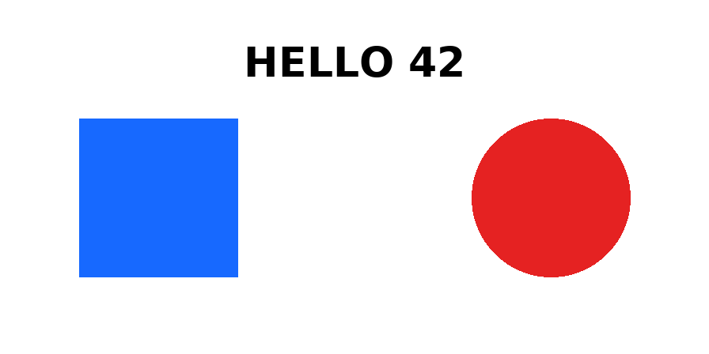
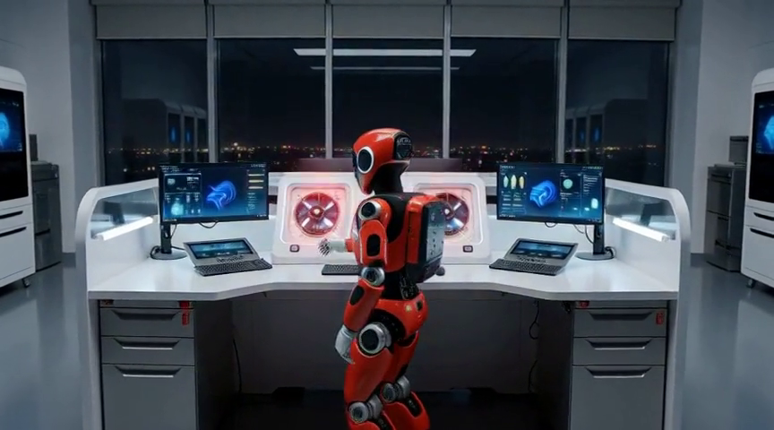

# 320B 的 GLM-5.3-Flash，我用四张 R9700 跑通了文本和图片

先说结论。截至本文测试时，四张 Radeon AI PRO R9700 可以通过 Vulkan layer split 加载 UD-Q2_K_XL 量化的 GLM-5.3-Flash，完成短文本、7266-token 检索和静态图片理解。视觉模块还有部分算子回退到 CPU，GLM5Next 分支也尚未接通模型专属的原生视频处理。

智谱在 8 月 26 日发布了 GLM-5.3-Flash。它是 GLM-5 系列第一个原生多模态模型，共有 320B 参数，MoE 架构下每个 token 激活 18B，权重采用 MIT 协议开放。发布前，它曾以 Ox Alpha 的代号在 OpenRouter 上匿名测试。

权重开放了，软件支持仍处于早期。llama.cpp 主线当时还没有合入 GLM-5.3-Flash，需要使用 GLM5Next 分支。Unsloth 提供的 UD-Q2_K_XL 量化权重包含四个分片，合计约 108.7GB，再加上 1.13GB 的 F16 视觉投影器，正好适合验证四张 32GB 显存的 R9700 能走到哪一步。

本文覆盖版本固定、Vulkan 构建、最小文本验证、长文本检索和静态图片测试。模型性能排名、其他 Radeon 配置以及本地原生视频输入不在本次结论范围内。

## 先检查容量和空闲设备

本次环境如下。

- GPU 四张 Radeon AI PRO R9700，每张 32GB
- 系统内存约 502GiB
- 推理后端 Vulkan RADV
- 模型使用 layer split 分到四张卡
- CPU 线程 32
- Flash Attention 和 MTP 均关闭

四张卡的物理显存合计约 119.4GiB。权重和投影器约 110GB，账面上能够容纳，KV cache 和中间结果还会继续占用显存，所以余量并不宽裕。

下载前先检查磁盘，加载前再看 GPU 进程和显存。

    df -h ./models
    rocm-smi --showmeminfo vram --showpidgpus

建议给模型目录预留至少 120GB。计划使用的四张卡需要接近空载，而且不能有其他进程占用 DRM 设备。

偶尔会看到使用 0 个 DRM 设备的瞬时 KFD 条目。这类条目不等于显卡正在执行任务，还要结合实际设备编号和显存占用判断。已经有人使用的卡不要强行抢占，等现有任务结束后再加载模型。

## 固定权重和源码版本

GLM5Next 分支和模型仓库仍在更新。先固定模型 revision 和源码 commit，后面才能确认自己复现的是同一套环境。

先创建模型目录。

    mkdir -p ./models/GLM-5.3-Flash-GGUF

下载 UD-Q2_K_XL 四个分片。

    hf download unsloth/GLM-5.3-Flash-GGUF \
      --revision 2975ab414d30340466d8c51533c6e91f0cca64c1 \
      --include 'UD-Q2_K_XL/*' \
      --local-dir ./models/GLM-5.3-Flash-GGUF \
      --max-workers 2

再下载 F16 视觉投影器。

    hf download unsloth/GLM-5.3-Flash-GGUF \
      mmproj-F16.gguf \
      --revision 2975ab414d30340466d8c51533c6e91f0cca64c1 \
      --local-dir ./models/GLM-5.3-Flash-GGUF

下载完成后，UD-Q2_K_XL 目录中应有四个带编号的 GGUF 分片，模型根目录还应有 mmproj-F16.gguf。文件不完整时不要开始加载。

源码使用 Unsloth 的 glm5next/upstream 分支。

    git clone --single-branch \
      --branch glm5next/upstream \
      https://github.com/unslothai/llama.cpp.git

    cd llama.cpp
    git checkout --detach 949f7efb097eb20ef36fecdb1afaebff9a4ae7ed
    git rev-parse HEAD

最后一条命令应输出同一个 commit。后续如果分支合并或更新，需要重新核对模型格式和运行参数。

## 构建 Vulkan 版本

本次构建在 Ubuntu 24.04 容器内完成，源码目录挂载回宿主机。下面的安装命令需要容器内 root 权限，不要直接在不明确用途的生产环境执行。

先安装 Vulkan 构建依赖。

    apt-get update
    apt-get install -y \
      cmake build-essential ccache libvulkan-dev vulkan-tools \
      glslc glslang-tools libshaderc-dev spirv-tools spirv-headers

接着生成 Vulkan 构建目录。

    cmake -S . -B build-vulkan \
      -DGGML_VULKAN=ON \
      -DGGML_NATIVE=OFF \
      -DCMAKE_BUILD_TYPE=Release \
      -DLLAMA_CURL=OFF

只编译本次需要的三个目标。

    cmake --build build-vulkan \
      --config Release \
      -j32 \
      --target llama-cli llama-server llama-mtmd-cli

完成后，build-vulkan/bin 下应出现 llama-cli、llama-server 和 llama-mtmd-cli。

这些二进制依赖同目录里的共享库。若直接启动时报找不到 libllama-cli-impl.so，先设置动态库路径，再列出设备。

    export LD_LIBRARY_PATH=$PWD/build-vulkan/bin${LD_LIBRARY_PATH:+:$LD_LIBRARY_PATH}
    ./build-vulkan/bin/llama-cli --list-devices

成功时可以看到 Vulkan0 到 Vulkan3，名称均为 AMD Radeon AI PRO R9700。后面的模型命令按照这个顺序指定设备。

## 跑一个最小文本任务

先用短上下文和单轮提示验证模型能否加载、分到四张卡并生成最终答案。

    ./build-vulkan/bin/llama-cli \
      -m ../models/GLM-5.3-Flash-GGUF/UD-Q2_K_XL/GLM-5.3-Flash-UD-Q2_K_XL-00001-of-00004.gguf \
      -dev Vulkan0,Vulkan1,Vulkan2,Vulkan3 \
      -sm layer \
      -ngl auto \
      -fit on \
      -fitt 2048 \
      -c 4096 \
      -t 32 \
      -tb 32 \
      -fa off \
      -n 512 \
      --temp 0 \
      --seed 0 \
      --reasoning-effort low \
      --reasoning-budget 256 \
      --single-turn \
      --no-mmproj \
      -p '请只用一句中文回答，本地 GLM-5.3-Flash 文本推理已经运行。'

模型返回了下面这句话。

    本地GLM-5.3-Flash文本推理已成功运行。

看到最终答案并且程序正常退出，才算最小文本任务通过。只看到思考过程，不能算完整成功。

## 再检查一次长文本检索

短回答只覆盖模型加载和基础解码。我又生成了 240 条结构相近的记录，把验证码分别放在第 17 条和第 233 条，再要求模型只返回这两项。

输入经过 tokenizer 后共有 7266 tokens，模型返回如下。

    017=LANTERN-17017；233=ORBIT-99233

两项与预设内容完全一致，truncated 为 0，也没有出现重复 token 或乱码。这只能证明当前固定任务通过，不能外推为长上下文已经普遍稳定。

## 加载视觉投影器测试静态图片

文本通过以后，再加入 mmproj-F16.gguf。测试图顶部是 HELLO 42，左侧是蓝色正方形，右侧是红色圆形。

将图片保存为 vision-probe.png，并放到当前 llama.cpp 目录，再运行 llama-mtmd-cli。

    ./build-vulkan/bin/llama-mtmd-cli \
      -m ../models/GLM-5.3-Flash-GGUF/UD-Q2_K_XL/GLM-5.3-Flash-UD-Q2_K_XL-00001-of-00004.gguf \
      -mm ../models/GLM-5.3-Flash-GGUF/mmproj-F16.gguf \
      --image ./vision-probe.png \
      -mmdev Vulkan0 \
      -dev Vulkan0,Vulkan1,Vulkan2,Vulkan3 \
      -sm layer \
      -ngl auto \
      -fit on \
      -fitt 2048 \
      -c 8192 \
      -t 32 \
      -tb 32 \
      -fa off \
      -n 512 \
      --temp 0 \
      --seed 0 \
      --jinja \
      -p '请读取图片，只用一句中文准确回答顶部文字、左侧形状及颜色、右侧形状及颜色。'

模型返回如下。

    顶部文字为 HELLO 42，左侧是一个蓝色正方形，右侧是一个红色圆形。

文字、形状和颜色全部正确，静态图片功能通过。运行日志也显示，视觉模块中的部分 F32 MUL_MAT 和 SOFT_MAX 算子不受当前 Vulkan 后端支持，会回退到 CPU。这里验证的是功能可用，不能写成纯 GPU 视觉推理。

## 用已发布视频中的真实画面复测

合成探针结构很简单，我又换了一张真实画面。8 月 18 日，我们在知乎发布了[《手把手教你在 AMD Radeon PRO W7900 上丝滑运行 MiniMax H3+ComfyUI 音视频生成》](https://zhuanlan.zhihu.com/p/2073092993117073920)，其中展示了一张 W7900 本地生成的 5.17 秒音视频。

[先看上一篇中公开的完整视频](minimax-h3-w7900.mp4)

我从 1.458 秒处抽出第 36 帧作为静态图片输入。画面里，红黑机器人正在夜间实验室的工作站前转身，中央圆形部件刚亮起红光。

模型识别出一只手臂伸向中央面板，也判断圆形部件已经发出红光。这两部分与连续帧一致。

它同时写下手指已经触及中央控制面板。把手臂区域逐帧放大后，只能确认远侧手臂从低位抬起并靠近面板。画面里没有清晰的按钮轮廓，也没有足够的遮挡、形变或位移证明接触。

模型发现了低分辨率人工复核漏掉的抬手动作，也把靠近直接当成了接触。抬起、前伸、靠近、接触和按压是五个不同阶段，当前画面证据只支持前三步。

## 验证结果

本次结果可以收敛为四点。

- 四张 R9700 可以通过 Vulkan layer split 加载 UD-Q2_K_XL
- 短文本和 7266-token 固定检索任务均返回正确结果
- F16 视觉投影器可以处理静态图片，但部分视觉算子回退到 CPU
- GLM5Next 原生视频处理尚未接入，本文没有验证通用拆帧路径

这些结果只对应本文固定的模型 revision、源码 commit、四卡环境和测试输入。

## 常见问题

### 有思考输出却没有最终回答

现象是程序正常退出，输出文件中只有思考内容。

原因通常是总输出上限和思考预算相同，token 在思考阶段已经耗尽。

处理方式是让 n-predict 大于 reasoning-budget，给最终答案单独留出空间。成功标志是思考结束后还能看到完整回答。

### llama-mtmd-cli 不接受 reasoning 参数

现象是工具在模型加载前报告 reasoning-effort 参数无效。

原因是实验性的 llama-mtmd-cli 与 llama-cli 支持的参数并不完全一致。

处理方式是删除 reasoning-effort、reasoning-budget 和 reasoning-format，只保留 llama-mtmd-cli --help 中明确列出的参数。

### 帮助中有 --video，能否直接处理原生视频

固定源码中有下面这句说明。

    glm5next spells video with its own token pair, but video is not supported here

GLM5Next 模型专属的视频 token 和预处理尚未接入。当前构建中的 --video 属于通用媒体入口，可能把视频解码成图片帧，但本文没有验证这条路径，也不能把它称为 GLM-5.3-Flash 原生视频处理。

## 小结

这次用四张 R9700 跑通了 Q2 量化 GLM-5.3-Flash 的文本和静态图片路径。最小回答、7266-token 检索和两张图片都获得了可检查的结果，视觉模块的 CPU 回退和原生视频缺口也已经明确记录。

后续如果 GLM5Next 分支更新或合入主线，需要重新核对模型格式、视觉算子和视频预处理，不能直接沿用本文结论。

如果你也在其他 Radeon 配置上运行过这个模型，可以在评论区留下显卡数量、量化版本和后端，方便继续核对兼容范围。

## 参考资料

- [GLM-5.3-Flash 官方模型卡](https://huggingface.co/zai-org/GLM-5.3-Flash)
- [Unsloth GLM-5.3-Flash GGUF](https://huggingface.co/unsloth/GLM-5.3-Flash-GGUF)
- [llama.cpp GLM5Next 支持 PR](https://github.com/ggml-org/llama.cpp/pull/27754)
- [GLM5Next 视频限制源码](https://github.com/unslothai/llama.cpp/blob/949f7efb097eb20ef36fecdb1afaebff9a4ae7ed/tools/mtmd/mtmd.cpp#L863-L869)
