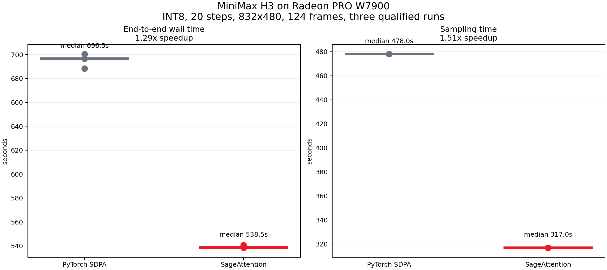
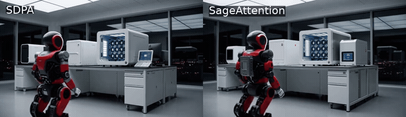
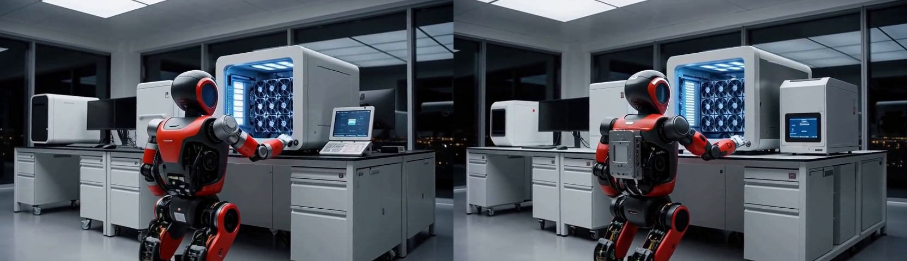
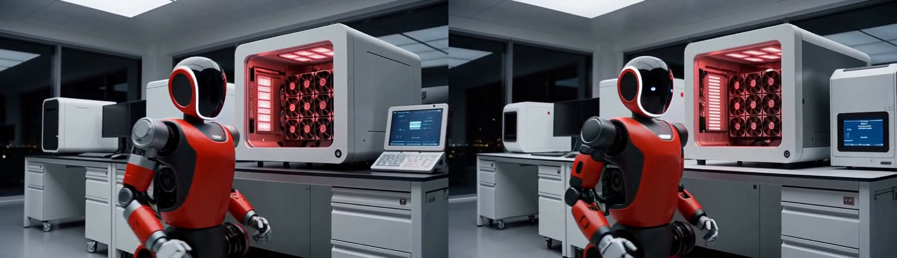
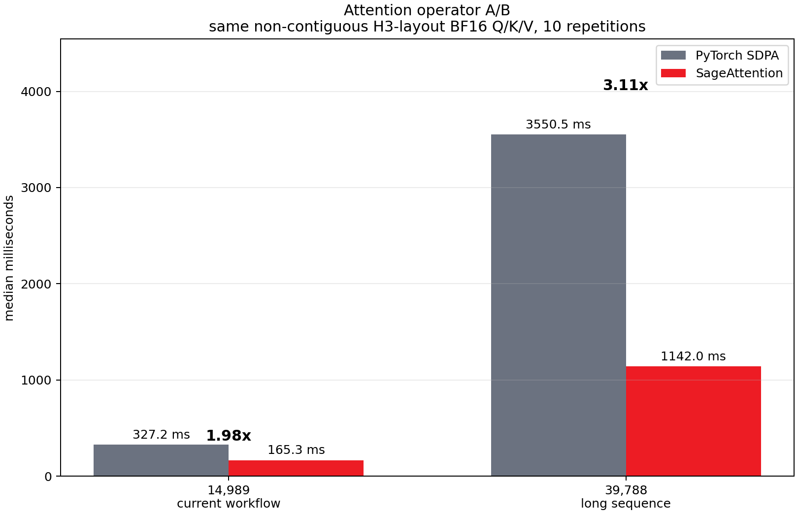
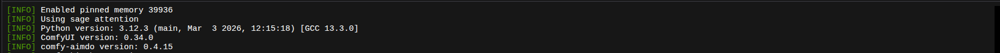
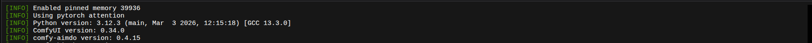

# MiniMax H3 换用 SageAttention，W7900 出片从 11 分半降到 9 分钟

在[上一篇](https://zhuanlan.zhihu.com/p/2073092993117073920)介绍MiniMax H3的文章中，我用W7900初步跑通了它。上一篇里用的是Q4 Turbo量化。

这里复盘下Q4 Turbo：是指权重压缩到4-bit，来让48G显存能放下。Turbo则将扩散模型需要迭代的次数从20-30步降低为8步。
最后得到一段5秒的机器人实验室视频，生成过程4分30秒，480p。
这个效果还是不够好，上篇文章的评论区也有人直接说，起码720p、15秒才算初步可用。

所以，本文我们就继续来看优化方法。

大家应该还记得上一篇的一个结论：9成生成时间都花费在扩散采样上。但采样到底慢在哪？

上一篇文章还没有分析过。这次我们就先来分析这个。

首先是一些背景知识：采样阶段里跑的是H3的transformer，每一步做一次完整的forward。forward主要就是attention和FFN。

那么H3的关键就在attention。H3的attention特别重，因为它的序列里同时包含了文本、视频和音频。
以本文采用的工作流为案例，其序列长度接近15000。而又因为attention的计算量和序列长度是平方关系，所以序列越长成本就越大。

H3的主干有50个DiT block。每个block过一遍attention，那么20步采样下来就是大约1000次。在实测中，单次attention约327ms，那么乘以1000次，光是attention操作就花了327s，而整个采样阶段却才478s。因此采样的七成时间花在attention上。

so。第一个优化方向就很明确了，把attention部分换一个更快的实现。

SageAttention就是这样一个替代方案。它对Q和K进行逐块INT8量化，用量化后的矩阵计算QKᵀ，后续 P×V则仍采用FP16。
INT8乘法比BF16快，访存也更少。对于H3这种长attention序列，效果非常好。

为了让测试基于更加通用的基线，这次的测试配置换成了更接近官方工作流模板的配置：INT8精度、20步采样，832×480分辨率，124帧，使用上一篇文章里同一段机器人实验室提示词。

反复跑了三轮，都是稳定结果：SDPA在默认配置上，一段需要用11分36秒，换上SageAttention后，时间降到9分钟，端到端快1.29倍。如果只看采样阶段，那么478秒降到317秒，快1.51倍。



## 生成效果分析

快了两分半，质量怎么样？有没有明显下跌？

说话不如看结果，我直接把两段视频放在一起，左边SDPA，右边SageAttention。



我们能看到，视频的主干内容基本是一致的：机器人走向工作站，抬起手，机箱灯光由蓝转红，随后转向镜头。

不过，一些细节地方还是有不同。可以看到，画面工作站右侧的小显示器是不同的。此外，机器人也有不同，2.5秒那里机器人的背部不一致，4.5秒的时候机器人的面部也多了似乎是眼睛的灯光。





我觉得从结果来说，SageAttention不错，差异是因为prompt约束不严格，以及模型本身的随机性导致的。毕竟就算是同一套配置，重复三次也会有差异。
不看感觉看算子层面，我比较了attention算子本身，两个后端的输出余弦相似度是0.999908。替代效果不错。

最后，声音也正常。两段的32kHz双声道音轨里，伺服声、风扇声和转身的机械响动都有，听起来都不错。

## INT8量化效果简述

前面提到，SageAttention将 Q和K量化为INT8，以加速注意力计算。为什么这样做更快？关键就在INT8精度。

我们知道，attention里最重的操作是QKᵀ之间的矩阵乘法，它同时需要消耗算力和显存带宽。
INT8的作用就在这里，INT8比BF16少一半位宽，同样一组QK，搬运量直接减半，矩阵乘的吞吐也更高。而且序列越长，省得越多。



图里的14989是当前工作流的实际序列长度，SageAttention快1.98倍。39788是另做的长序列压力测试，差距拉到3.11倍。

对于MiniMax H3这种端到端多模态模型，当你需求更大的分辨率、更长的时长时，输入序列会显著变长，自然SageAttention能节省的也会越来越多。

## 安装和启用

SageAttention的ROCm支持目前在[贡献者fork的PR #381](https://github.com/thu-ml/SageAttention/pull/381)里，还没有merge进上游。安装需要从这个fork拉。

```bash
git clone --branch rocm-triton-support \
  https://github.com/Scorp1o117/SageAttention.git
cd SageAttention
git checkout 6aa2622f0fdad0b3cbccbfc30d6f5954f8c29020
```

PS：更加基础的操作教程参考本文开头提到的上一篇文章。此外，本次测试环境是ComfyUI 0.34.0、PyTorch 2.9.1+gitff65f5b、ROCm 7.2.1、Triton 3.5.1。

接着，安装这一步最容易犯小错误。机器上可能同时有系统Python、ROCm venv和ComfyUI自己的环境，pip install成功只能说明装进了其中某一个。一定要用ComfyUI实际跑的那个Python来装。

```bash
# 换成你的ComfyUI实际使用的Python路径
COMFY_PY=/path/to/comfyui/python

"$COMFY_PY" -m pip install -e . --no-build-isolation
"$COMFY_PY" -c "import sageattention; print(sageattention.__file__)"
```

PS：不需要考虑CUDA问题。这里在AMD上走的是Triton kernel，不需要CUDA，安装过程会自动跳过CUDA extension的编译。

装完之后给ComfyUI的启动命令加一个参数（顾名思义，就是让ComfyUI用SageAttention）

```bash
--use-sage-attention
```

完整命令参考

```bash
cd /path/to/ComfyUI
"$COMFY_PY" main.py --use-sage-attention
```

如果你要做A/B对照时，那么基线那边自然换成

```bash
"$COMFY_PY" main.py --use-pytorch-cross-attention
```

启动后看日志，如果成功那么会出现以下字样

```text
Using sage attention
```



如果是A/B，那么基线自然就是PyTorch后端字样。

```text
Using pytorch attention
```



不过，光看到启动成功还不够。如果在ComfyUI的运行中SageAttention抛异常，那么会静默退回PyTorch。此时日志里出现的是

```text
Error running sage attention: ..., using pytorch attention instead.
```

所以，跑完一轮之后需要翻一遍完整日志，确认没有这句，才算启用成功了。

如果出现这句，记得先检查sageattention是不是装进了ComfyUI实际使用的Python里。

## 总结

我认为在一般情况下，大家都可以试试SageAttention。安装也很简单，就是一个fork加一个启动参数。
本次实测的效果也挺好，采样时间少了三分之一，最终出片能少等两分半。序列越长收益越大。如果你以后需要更高的分辨率或者更长的时长，那么你用SageAttention的时间优势自然也会更大。

本次我们推荐的SageAttention优化省的是时间，显存占用没有变化，峰值仍然在27 GiB左右。如果你卡的是显存而不是速度，需要从别的方向想办法。

加速也不止这里（虽然这里是大头），除了attention之外还有加速的空间。例如`torch.compile`对transformer主干的加速，以及VAE分块解码对显存峰值的优化，都是可以继续叠加的策略。后续我们可以再继续深入。

如果你已经在W7900上跑通了H3，但一直嫌每步二十多秒太慢，可以先试试SageAttention。

你的工作流上实际省了多少？你还有哪些优化方法？让我们评论区聊聊。

## 参考

- [ComfyUI 固定测试 commit](https://github.com/Comfy-Org/ComfyUI/commit/0a33ed6c28f926d14536235771c222f9e6d1026b)
- [SageAttention ROCm PR #381](https://github.com/thu-ml/SageAttention/pull/381)
- [SageAttention ROCm 固定 commit](https://github.com/Scorp1o117/SageAttention/commit/6aa2622f0fdad0b3cbccbfc30d6f5954f8c29020)
- [Comfy-Org MiniMax H3](https://huggingface.co/Comfy-Org/MiniMax-H3/tree/4cc1d817b6184899b41293954329f576cb5ae86b)
