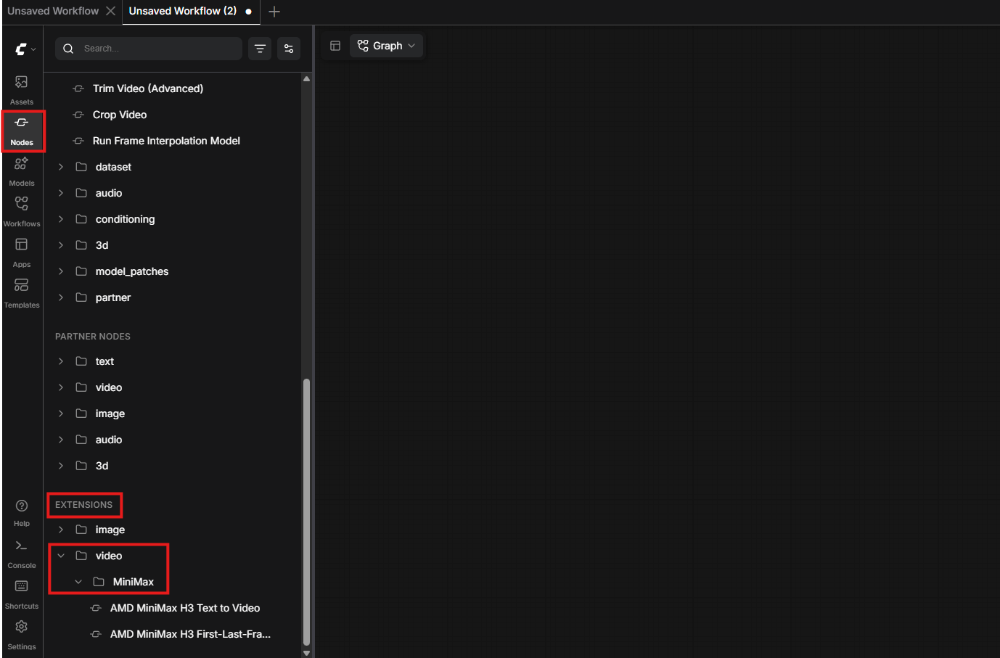
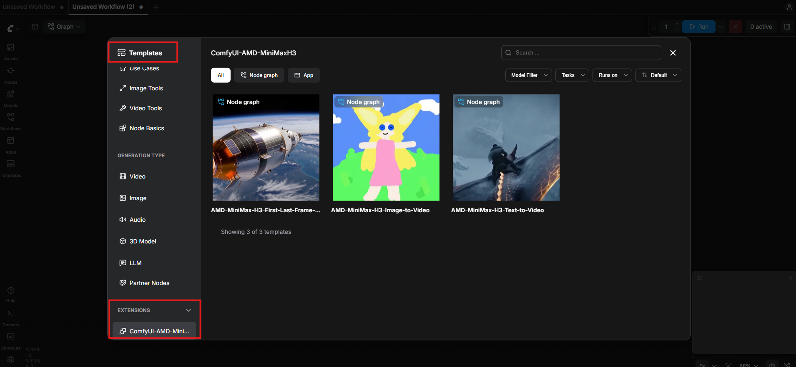

# 本地没有显卡，ComfyUI 还能生成视频吗？接一个 MiniMax H3 节点就行（2026-09 实测）

如果你在 ComfyUI 里想做视频，大概率卡在这几个地方：

本地显存不够，视频模型根本跑不动；
想用云端 API，又不想为了试一下就先充值；
下载的模型动辄几十 G，只是想先看看效果；
连线连了一堆，最后发现缺这个缺那个。

我把 MiniMax H3（海螺）接到了 AMD 的网关上，做成两个 ComfyUI 节点。注册拿一个 key 就能用，渲染在云端完成，本机不需要 GPU。这篇按我自己从零装到出片的顺序写：装节点、配 key、跑通第一条视频。

环境信息按 2026-09-20 复核：ComfyUI 需要 0.30.0 或更高版本，节点本身不引入任何额外 Python 依赖。

## 三步跑通第一条视频

### 第一步：装节点

```bash
cd ComfyUI/custom_nodes
git clone https://github.com/wangxunx/ComfyUI-AMD-MiniMaxH3.git
```

重启 ComfyUI。不需要 pip 装任何东西。

为什么要求 ComfyUI ≥ 0.30.0：节点复用了 ComfyUI 自带的 MiniMax 请求模型和 API 工具层，没有自己再写一遍 HTTP 和轮询，而这些模型从 0.30.0 才有。

### 第二步：拿 key

到 https://h3.oneclickamd.ai 注册，拿到属于你自己的 key。注册即可使用，不需要充值。


### 第三步：配 key

一台机器配一次，之后所有工作流通用。两种方式任选其一：

| 方式 | 怎么做 | 适合什么 | 边界 |
| --- | --- | --- | --- |
| 环境变量 | 设 `H3_GATEWAY_API_KEY` | 服务器、Docker、多人共用机器 | 必须在启动 ComfyUI 的那个 shell 里生效，改完要重启 ComfyUI |
| 文件 | 把 key 存成 `h3_gateway_api_key.txt`，放进 ComfyUI 的 `user` 目录 | 本地单机，图省事 | 文件内容只放 key 本身，别带引号和多余空行 |

节点上没有填 key 的输入框，key 只从上面两个位置读。如果没配，节点会在执行时立刻报错，并把注册地址和该放的文件完整路径打印出来，照着贴就行，不用去翻文档。

另外还有一个 `H3_GATEWAY_BASE_URL`，用于把节点指向另一个网关地址，一般用不到。

这里我们在shell里配置这个key并启动ComfyUI：

```bash
export H3_GATEWAY_API_KEY=xxxxxxxxxxxxxxxxxxx-xxxxxxxxxxxxxxxx
python main.py 
```

## 两个节点，参数都很少

装完后在节点搜索里输 MiniMax，或者在 `video/MiniMax` 分类下找。



| 节点 | 输入 | 说明 |
| --- | --- | --- |
| AMD MiniMax H3 Text to Video | `prompt`、`resolution`、`ratio`、`duration` | 纯文生视频 |
| AMD MiniMax H3 First-Last-Frame to Video | `first_frame`、`prompt`、`resolution`、`duration`，可选 `last_frame` | 图生视频与首尾帧过渡 |

几个取值上的细节：

1. `resolution` 目前只有 768P，网关当前只渲染这一档，短边 768。
2. `ratio` 有 16:9、4:3、1:1、3:4、9:16、21:9 六种，只有文生视频节点才有。
3. `duration` 是 4 到 15 秒，默认 5 秒。
4. 图生视频节点没有 `ratio`，因为输出比例跟随你给的图片。
5. 两个节点都必须写提示词。首尾帧节点即使给了图，也要写一句描述怎么动。

`last_frame` 不连，就是让一张图动起来；连上，就是在首帧和尾帧之间生成过渡。同一个节点覆盖两种用法，不用记两个节点名。

## 不想连线：直接用附带的工作流



包里带了三个示例工作流。在 ComfyUI 左侧栏点 **Templates** 打开模板对话框，在对话框左侧的分类列表里找到 **EXTENSIONS**，展开后选 `ComfyUI-AMD-MiniMaxH3`，右侧就是这三个：

| 工作流 | 做什么 |
| --- | --- |
| AMD MiniMax H3 Text to Video | 只写提示词 |
| AMD MiniMax H3 Image to Video | 让一张图动起来，用 ComfyUI 自带示例图就能直接跑 |
| AMD MiniMax H3 First-Last-Frame to Video | 在你提供的两张图之间生成过渡 |

每个工作流里都放了一个说明节点，写清楚 key 该怎么配。第一次用建议先开 Image to Video，它不改任何参数就能直接点运行。

## 常见问题：先看报错落在哪一层

| 现象 | 更可能的根因 | 最小处理方式 |
| --- | --- | --- |
| 提示 No API key configured | key 没配，或文件放错目录 | 照报错里打印的完整路径放文件，或设环境变量后重启 ComfyUI |
| 环境变量明明设了还是报同样的错 | 变量是在另一个终端设的，或 ComfyUI 先于变量启动 | 在启动 ComfyUI 的同一个 shell 里设好，再重启 ComfyUI |
| 加载工作流提示 missing node | ComfyUI 低于 0.30.0，或装完没重启 | 先升级 ComfyUI，再重启 |
| Templates 的 EXTENSIONS 分类下没有 ComfyUI-AMD-MiniMaxH3 | 仓库没克隆进 `custom_nodes`，或没重启 | 确认目录位置后重启 |
| 任务返回 failed 或 cancelled | 网关侧任务失败 | 换个提示词或稍后重试，这一步不在节点这边 |
| 生成的视频比例和预期不一样 | 用的是首尾帧节点 | 它跟随输入图片的比例，要改比例就改输入图 |
| 队列里等很久 | 云端排队，节点每 2 秒轮询一次状态 | 正常现象，按时长和排队情况等待 |

## 小结

整件事压缩成三句：

1. git clone 进 `custom_nodes`，重启，不装任何依赖。
2. 注册拿 key，用环境变量或 `user` 目录下的文件配一次。
3. 从 Templates 里开 Image to Video，直接点运行。

需要注意的边界：分辨率目前只有 768P，时长 4 到 15 秒，渲染在云端完成，所以出片速度取决于网络和排队，而不是你的显卡。

## 参考资料

- [节点仓库，MIT 协议](https://github.com/wangxunx/ComfyUI-AMD-MiniMaxH3)
- [网关注册地址](https://h3.oneclickamd.ai)
- [ComfyUI 自定义节点发布规范](https://docs.comfy.org/registry/specifications)

## 名词解释

- 首尾帧生成（First-Last-Frame）：给定第一帧和最后一帧，由模型补出中间的过渡画面。只给第一帧时，就退化成常见的图生视频。

### 我会为大家持续更新AMD GPU,ROCm和本地AI相关内容哦~