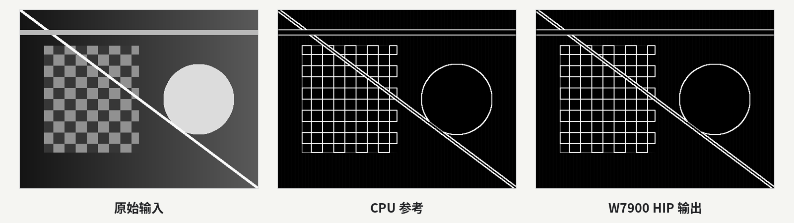
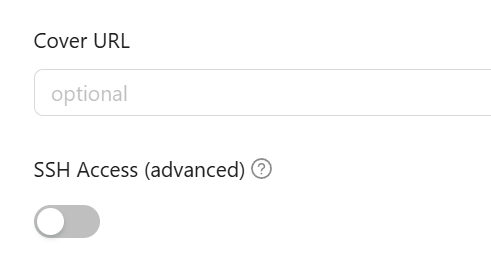
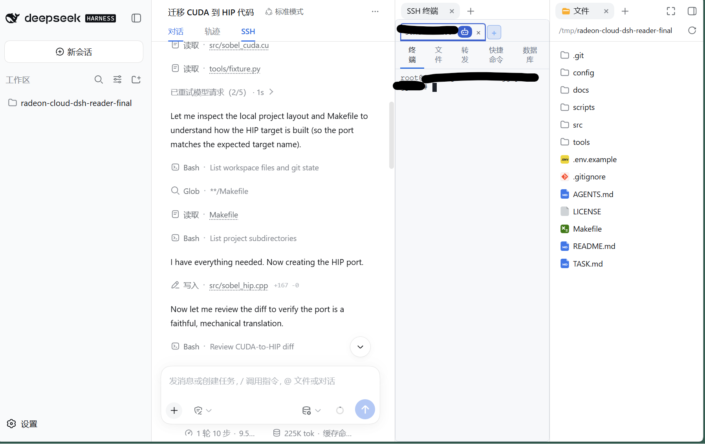
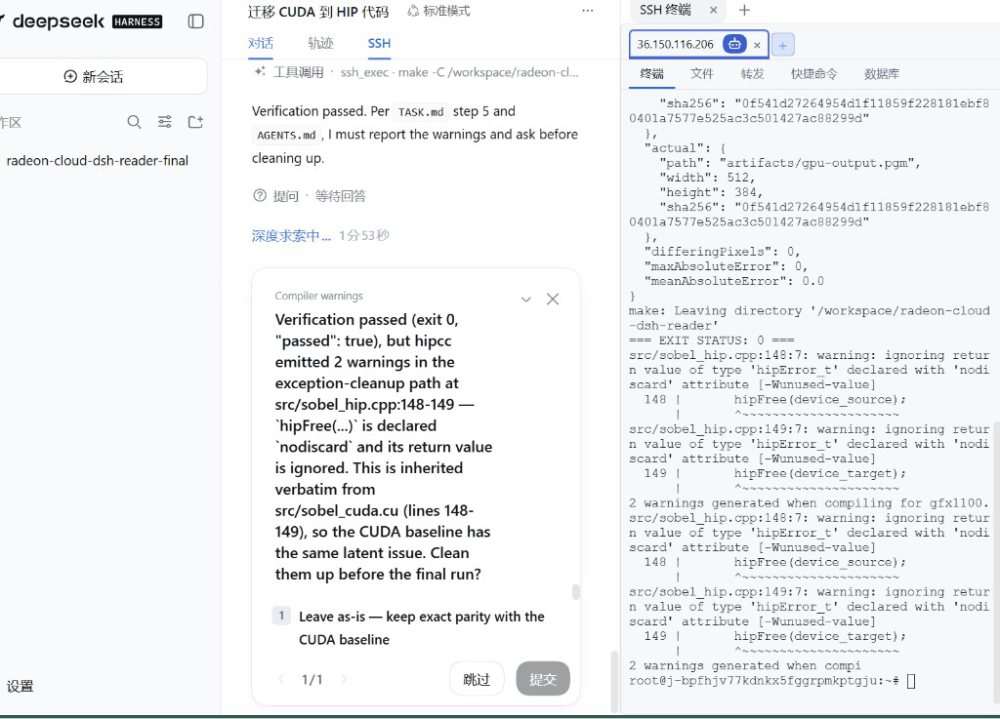
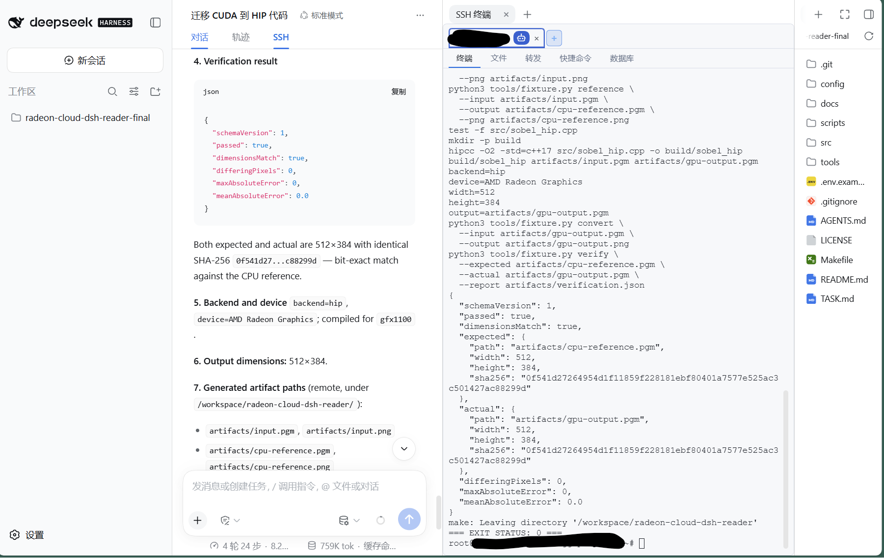

# 免费DeepSeek V4改代码、W7900跑验证：我用DeepSeek Harness连上了Radeon Cloud

现在许多人用Agent写代码，不过GPU相关的测试总是很麻烦：有强大本地GPU的不多。云的话，经常是写完代码要复制到云上编译验证，开个终端跑，然后再把日志复制回来让Agent接着改，这一步就折腾了。模型的会话和GPU的反馈一直隔着几个窗口。

近期出的DeepSeek Harness我体感这方面好点。它能用万物皆插件的设计架构，更加顺滑地把本地agent环境和远端GPU两边接到一起。配合Radeon Cloud的API和云端环境，不需要多个平台去折腾账号和配额。

我挑了个最简单的CUDA项目来试，这个项目是一个Sobel边缘检测小脚本。（PS：Sobel是一种经典的图像处理算法，专门用来检测边缘，效果就是一张图进去、只剩轮廓线条的图出来。）

为了测试Radeon Cloud平台功能一站式的体验，我用Radeon Cloud Token Factory提供的DeepSeek-V4-Flash-0731 API，将CUDA源码改成HIP，然后再接入Radeon Cloud的云W7900编译运行。效果不错，两轮测试下来GPU输出和CPU参考逐像素一致。



## Radeon Cloud资源获取

上面整个流程用到Radeon Cloud上的两样东西。一个是Token Factory提供的免费DeepSeek-V4-Flash-0731 API（你也可以换成其他你喜欢的模型），另一个是一台W7900实例，作为Radeon系的显卡，资源给的相当慷慨。

如果你对Radeon Cloud还没有注册，那么可以先看我们之前的内容，上面讲了Radeon Cloud的基础操作。详见[gpu算力租赁哪个平台值得推荐？ - AMD算力极客社的回答 - 知乎](https://www.zhihu.com/question/539158346/answer/2071287480968536065)

### 免费的DeepSeek-V4-Flash-0731 API

Token Factory是Radeon Cloud近期新出的模型API入口。要访问Token Factory，先按照上一篇的教程创建账号，然后访问[Radeon Cloud主页](https://developer.amd.com.cn/radeon/)， 在正上方你能看到一个Token Factory beta标签，点进去。
（PS：近期Radeon Cloud界面UI进行了大改，我们之前发布内容里的一些截图现在已经过时了，以最新的为准。）


点进去后，可以看到base_url和api_key，右下角有许多模型卡。


点击模型卡可以看到更加具体的配置，还有能够一键复制的调通脚本。下图以DeepSeek-V4-Flash-0731的模型卡为例展示，敏感信息已经打码。


PS: 这个API是当前免费的共享资源，不扣Credits。W7900实例运行时间才扣。

### W7900实例
W7900实例的创建上篇讲过，没操作过的先看之前的入门，虽然页面UI变了，但是大同小异。

基础的创建教程在上一篇文章中，但这次和上一篇有一些不同。

首先，创建Template的时候要勾上SSH，Launch之后页面会给SSH连接信息，后面加入到DSH里。SSH的选项参考下图：



此外，勾选按钮仅仅是打开了SSH权限，不是预装SSH服务。你还要打开Jupyter Notebook，进入Terminal输入：

```bash
sudo apt update
sudo apt install -y openssh-server
mkdir -p /run/sshd
which sshd
/usr/sbin/sshd
```

接着还要把本地的公钥加入到Radeon的Profile里面。

旧UI下参考位置：


新UI下参考位置：


这样才算SSH安装完成。

然后就可以通过SSH命令在本地环境调用。Profile里能看到对应命令，参考图片如下（此处使用旧UI，敏感信息已经打码）：


## 本地DeepSeek Harness配置

Radeon Cloud那边完成后，我们重新回到本地环境。接下来依次装DSH本体、SSH插件，然后填写API Key，并且配置Radeon的SSH连接。

### 安装DSH和SSH插件

DSH目前还在开发者预览阶段，版本迭代很快。本文用0.1.6-alpha.1版本。安装命令如下:

```bash
npx --yes @deepseek-ai/dsh@0.1.6-alpha.1 web
```

装好后，会自动打开一次DSH的Web界面，确认能跑起来以后先关掉。接下来装SSH插件。我们采用社区开发的dsh-ssh-ops插件，命令如下：

```bash
npx --yes @deepseek-ai/dsh@0.1.6-alpha.1 \
  plugin --profile web add dsh-ssh-ops@0.3.6
```

#### 预期报错问题

第一次安装时，pnpm会拒绝执行`cpu-features@0.0.10`和`ssh2@1.17.0`的构建脚本。这是正常的供应链安全检查，确认来源和版本没问题后允许对应的包，再重跑一次就行。具体方法如下：

确认版本没问题后，打开当前Profile的配置文件：

```text
$DSH_HOME/profiles/web/pnpm-workspace.yaml
```

在里面加上allowBuilds：

```yaml
allowBuilds:
  cpu-features: true
  ssh2: true
```

保存后重跑插件安装命令就行。不要为了省这一步关掉全局构建检查。

装完重启DSH：

```bash
npx --yes @deepseek-ai/dsh@0.1.6-alpha.1 web
```

### 接入Radeon Cloud模型

重启之后进入DSH，首先会看到一个DSH的初始首页：


选择Configure later。这个API是DeepSeek官方的，不是我们要用的。

然后点击主页左下方的设置。接着点击设置页左侧的模型，然后点击"添加自定义提供方"，可以看到下列内容：


Provider ID只是方便DeepSeek Harness辨认的，随便起个名字比如radeon-cloud，不影响（建好后不能改）。API协议选openai-completions，Base URL和API Key从Token Factory页面上复制过来。
然后点击"获取可用模型"，会自动导入Radeon Cloud上能用的模型。最后点击"创建提供方"就好。

界面上保存后还要补几行配置。Radeon Cloud的接口和标准OpenAI有些差异，不加的话请求会报错。点设置页顶部"打开配置文件"，找到radeon-cloud这个provider，改成这样：

```yaml
llm-pi-ai:
  providers:
    radeon-cloud:
      api: openai-completions
      baseURL: https://developer.amd.com.cn/radeon/api/v1
      reasoning: off
      compat:
        supportsDeveloperRole: false
        maxTokensField: max_tokens
      models:
        - id: DeepSeek-V4-Flash
```

保存就行，下次请求自动生效，不用重启。

PS: reasoning设成off是因为我一开始试过开启DeepSeek原生的thinking格式，Radeon Cloud返回了400。关掉以后模型和工具调用都正常了。

### 连接W7900


回到DSH设置，点击左侧的SSH资源，右上角能看到新建服务器的按钮。


点击它，然后把Radeon Cloud Launch页面给的SSH连接信息填上去，包括主机IP，端口，用户名。然后认证方式选择PEM/私钥，然后把前文Radeon Cloud里设置的公钥对应的私钥写进去。（建议为Radeon Cloud配置一条独立的密钥）

连上以后，退出设置，返回主界面。DSH的SSH按钮在对话界面顶部，需要先进入一个会话才能看到，所以先在主界面左下角选择模型，然后进行最初对话，来打开对话界面。
这里选择radeon-cloud/DeepSeek-V4-Flash，随便发一条消息比如"test"，就可以打开界面。
然后顶部可以看到SSH，点击它。

点击后右边会出现一个侧边栏。左边可以是Radeon Cloud SSH，右边可以是工作区目录。也可以两边都是Radeon Cloud SSH，一个人用，一个AI用。也可以左边是本地环境，右边是Radeon Cloud SSH。最多同时并排显示两个窗格，但是每个窗格都可以独立切换窗口。如果终端带了蓝色机器人图标，那就是Agent在跑。以下是演示图片。


## 实际效果

配好以后，回到开头那个Sobel边缘检测的小项目。我在DSH里新建了一个会话，让DeepSeek把脚本从CUDA迁到HIP，然后在云W7900上编译验证。



DeepSeek生成了一份HIP版本的源码，主要改动就是把CUDA的API换成HIP对应的，kernel本身不用动。

传到W7900跑了验证脚本，第一轮直接通过了，差异像素为0。不过hipcc报了两处warning，DeepSeek贴出来问我要不要处理。



我让它改，改完重新跑，第二轮零warning，结果依然逐像素一致。



回看一下整个流程。从给任务到迁移验证完成，中间就问了我一次，两轮就结束了。代码和会话历史都留在本地，云端实例用完可以直接销毁。对于想在AMD GPU上跑代码又不想来回搬文件的人来说，这套组合省了不少折腾。API不花钱，W7900的48G显存也很香。

## 还能怎么玩

这次演示的是CUDA转HIP的小项目，但同样的组合也能用在别的场景。比如写Triton或HIP kernel的时候，本地写完直接丢到W7900上跑；或者想测试某个项目的ROCm兼容性，开个实例验一下就行，不用专门买卡。小模型的smoke test也可以这么搞，48G显存够跑不少东西了。

也可以自己跑开源权重放在W7900上面，然后把它对外暴露成API。这样就可以跑任何能放得下的模型，多卡也可以。只是要消耗Credits。

Token Factory上除了DeepSeek-V4-Flash还有其他模型可以选，DSH的插件生态也在持续更新。感兴趣的可以自己组合试试，玩法不止这一种。

你最想拿这套环境跑什么项目？欢迎评论区聊聊。
