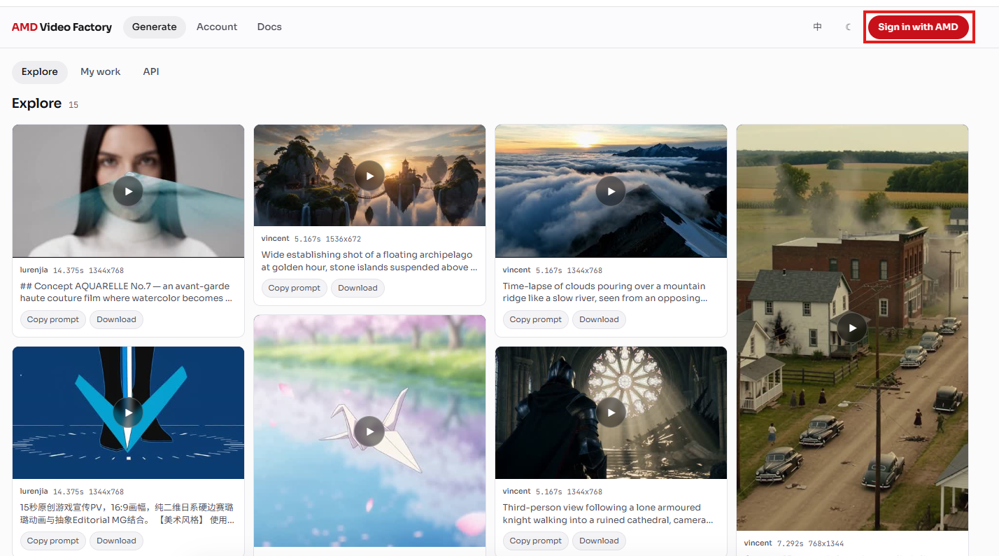

# 想更简单的试试ComfyUI里玩MiniMax H3？AMD平台还能更容易！

之前我们写文章讲过在W7900里开ComfyUI跑H3，大家可以看（[基础篇](https://zhuanlan.zhihu.com/p/2073092993117073920)和[优化篇](https://www.zhihu.com/question/11677093593/answer/2083228458717557058)）。不过下模型配量化这一套下来，还是得折腾一阵。所以，如果就想先快速试试H3出片的效果，有没有更省事的路子？

这几天，我们弄了个更简单的方式，做了一个ComfyUI自定义节点，ComfyUI-AMD-MiniMaxH3。它直接调H3 Gateway的云端API。不用下模型，不用配环境，连云实例都不用自己开，装上节点填个免费的key就能出片。

我从装节点到出片大概花了十来分钟，下面按实际操作的顺序来讲。

## 装节点配key

装节点就一条命令

```bash
cd ComfyUI/custom_nodes
git clone https://github.com/wangxunx/ComfyUI-AMD-MiniMaxH3.git
```

重启ComfyUI就行，不需要pip装任何东西。

PS：ComfyUI版本需要0.30.0或以上。节点复用了ComfyUI自带的MiniMax请求模型和API工具层，低版本没有这些，装了也找不到节点。

接下来配key。去[h3.oneclickamd.ai](https://h3.oneclickamd.ai)用AMD开发者登录，拿到key。然后本地有两种配法，选一种。

- 环境变量：在启动ComfyUI的同一个shell里 `export H3_GATEWAY_API_KEY={替换成你的key}`
- 文件：把key存成 `h3_gateway_api_key.txt`，放进ComfyUI的 `user` 目录

我直接用的环境变量，export好，重启ComfyUI就生效了。

PS：如果key没配对，节点跑的时候，会在报错时顺道把注册地址和文件路径这类trace打印出来，方便你直接发AI问。不用自己查文档了。



## 跑第一条视频

装完key配好，最省事的做法是从Templates里直接开一个现成的工作流。

傻瓜操作：在ComfyUI左侧栏点**Templates**，找到**EXTENSIONS**分类，展开后选ComfyUI-AMD-MiniMaxH3，右边有三个工作流。然后，点开Image to Video，它用ComfyUI自带的示例图。不改任何参数，直接点Run就能跑。


我们实测，点完Run等了几十秒，视频就出来了。768P，5秒，一份图生视频就这么出片了。跟之前本地跑H3要折腾量化和环境比，这边省事多了。

## 这次的节点包里有什么

[ComfyUI-AMD-MiniMaxH3](https://github.com/wangxunx/ComfyUI-AMD-MiniMaxH3)这个包很轻，MIT协议，一共就两个节点，参数不多，另外带了三个现成的工作流模板。


**AMD MiniMax H3 Text to Video**，纯文生视频。写一句prompt，选好比例和时长就行。比例有16:9、4:3、1:1、3:4、9:16、21:9六种，resolution目前只有768P。

**AMD MiniMax H3 First-Last-Frame to Video**，图生视频和首尾帧过渡都靠它。不连last_frame就是单图I2V，连上就是首尾帧FL2V。没有比例选项，输出的成果由输入图片决定。（PS：给不太熟悉这几个缩写的同学说一下。I2V就是Image to Video，喂一张图进去，模型自己决定怎么动。FL2V是First-Last-Frame to Video，你同时给首帧和尾帧，模型负责补中间的过渡。节点参数里的last_frame就是尾帧的输入口，不连它就退化成普通的I2V。）

时长都是4到15秒，默认5秒。两个节点都要写prompt，首尾帧节点即使给了图，也要写一句话描述讲怎么动。

Templates里除了Image to Video，还有Text to Video和First-Last-Frame to Video。每个工作流里有说明节点，写了key怎么配。第一次用建议先开Image to Video上手，直接跑就行。

PS：如果生成的视频比例跟预期不一样，看看用的是不是首尾帧节点，它跟随输入图片的比例，想改比例就改输入图。（PS：任务偶尔会返回failed，换个prompt或者稍后重试就好，这是网关侧的事。排队等久了也不用慌，云端渲染不看本地配置。）

## 跑通之后

这篇是我们H3系列里门槛最低的一篇，装个节点填个key，几分钟就能看到H3出片效果，适合没玩过ComfyUI + MiniMax H3的小伙伴先照着尝尝咸淡。

H3 Gateway的API目前免费，注册即用，不管A卡N卡，反正渲染在云端。

试完觉得效果不错，想在本地跑完整模型拿到更高控制度的话，可以接着看我们的[基础篇](https://zhuanlan.zhihu.com/p/2073092993117073920)和[SageAttention优化篇](https://www.zhihu.com/question/11677093593/answer/2083228458717557058)。

你跑出来了什么效果？或者你有自己的工作流想接H3？欢迎评论区聊聊。

## 参考资料

- [ComfyUI-AMD-MiniMaxH3 节点仓库（MIT协议）](https://github.com/wangxunx/ComfyUI-AMD-MiniMaxH3)
- [H3 Gateway 注册地址](https://h3.oneclickamd.ai)
- [W7900本地跑通H3（基础篇）](https://zhuanlan.zhihu.com/p/2073092993117073920)
- [SageAttention加速（优化篇）](https://www.zhihu.com/question/11677093593/answer/2083228458717557058)
