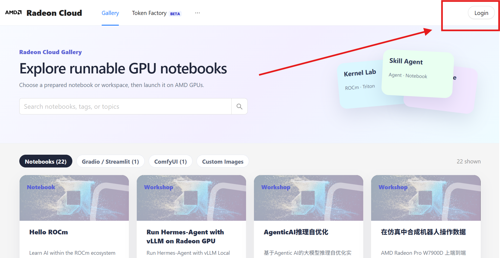
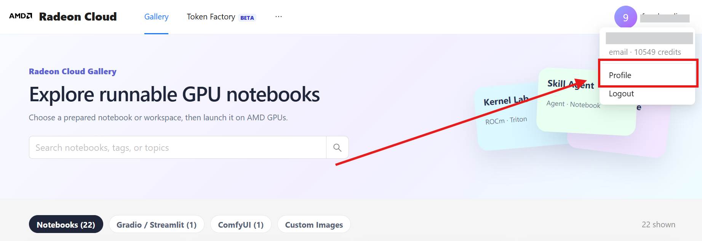
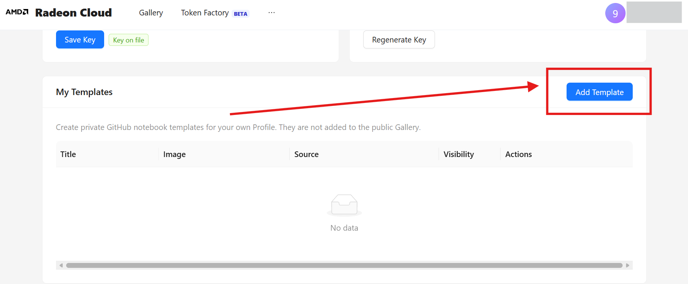
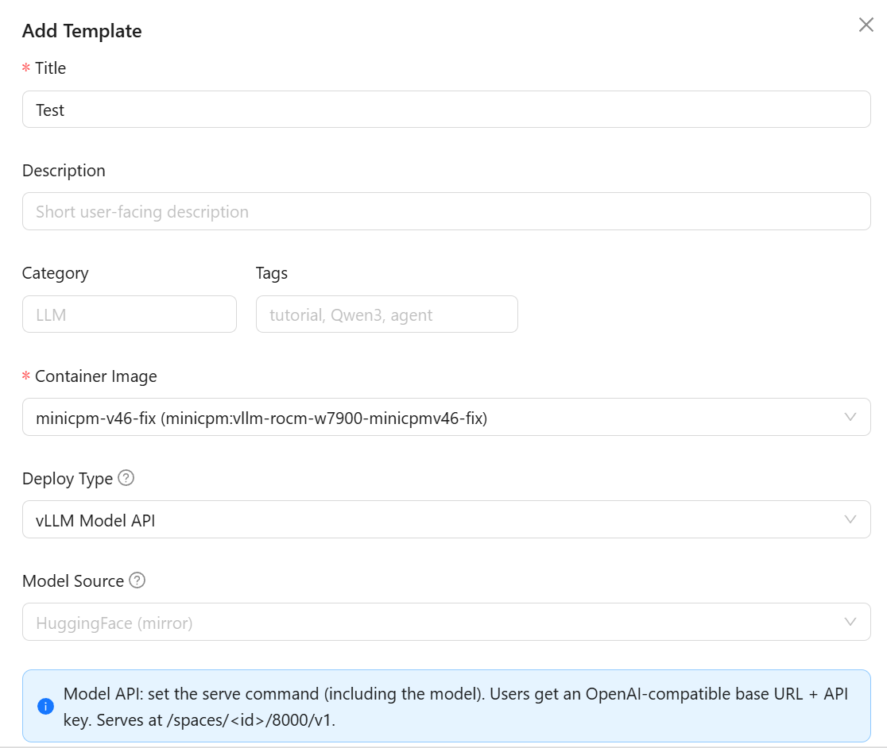
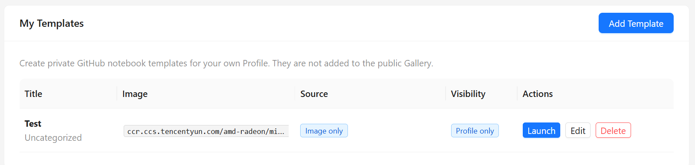
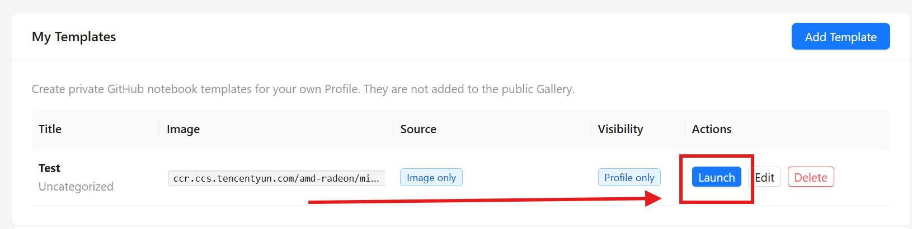
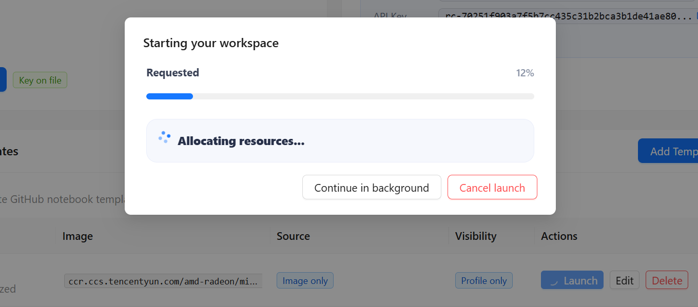
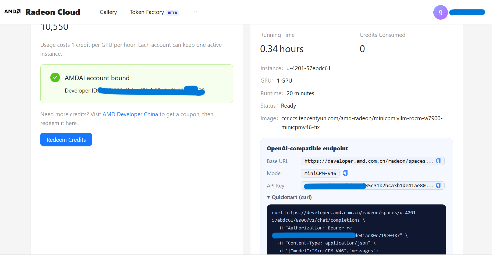
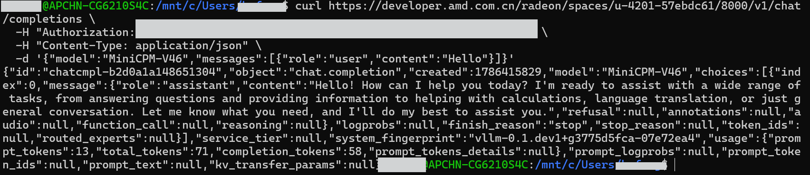

# Radeon Cloud + vLLM + MiniCPM-V，搭一个能看图的API

之前几篇文章里我们介绍过AMD的云GPU平台Radeon Cloud（[介绍和注册看这里](https://www.zhihu.com/question/539158346/answer/2071287480968536065)），上面用云W7900算力，算是不错的性价比。

这次我拿OpenBMB的MiniCPM-V试了一下。MiniCPM-V是一个能同时接收文字和图片做问答的开源模型，底座是Qwen3.5-0.8B加上SigLIP2视觉编码器，总共1B参数，小到能在手机上跑。但别看它小，图片和视频理解都能做，不少benchmark上打得过参数量几倍的模型。

W7900的48G显存跑它绰绰有余。Radeon Cloud上已经有部署MiniCPM-V的现成vLLM镜像，选好镜像填一条启动命令就行，从配好到服务起来大概十来分钟。

下面把操作过程走一遍，命令都可以直接抄。

## 注册和准备

要用Radeon Cloud需要先注册AMD AI Developer Program（ADP）账号，然后开通容器和GPU权限。注册流程我们之前单独写过（[看这篇](https://www.zhihu.com/question/539158346/answer/2071287480968536065)），这里不重复了。



有一个容易踩的坑，容器和GPU权限要提前开通好。没开通的话后面建Template、填参数都不会报错，看起来一切正常，但点Launch的时候实例会一直卡着起不来，页面上也看不出原因。

注册好了以后打开Radeon Cloud登录，进到Profile页面。建Template、启动实例、看QuickStart都从这走。



## 建Template

Radeon Cloud部署模型用的是Template，就是一份存好的启动配置。镜像、部署方式、启动命令都在里面，建好以后每次点Launch就能按这份配置起一个GPU实例，不用重新填。Template本身不占GPU，只有Launch才真正创建实例，可以多存几个不同配置做对比。

在Profile页面点Add Template。



Template名称随便起，自己认得出来就行。Container Image选`minicpm-v46-fix`。Deploy Type选`vLLM`。

Server Command是核心，这条命令决定了模型怎么起来。



```bash
/usr/local/bin/vllm serve openbmb/MiniCPM-V-4.6 \
  --served-model-name MiniCPM-V46 \
  --trust-remote-code \
  --dtype bfloat16 \
  --max-model-len 262144 \
  --max-num-seqs 64 \
  --gpu-memory-utilization 0.9 \
  --host 0.0.0.0 \
  --port 8000
```

`vllm serve openbmb/MiniCPM-V-4.6`从HuggingFace拉模型并启动一个OpenAI兼容的推理服务。`--served-model-name`给了MiniCPM-V46，后面发请求的时候model字段必须写一模一样的，大小写也算。`--trust-remote-code`必须加，MiniCPM-V的仓库里带自定义代码，少了它加载阶段直接报错。`--host 0.0.0.0 --port 8000`监听8000端口，后面QuickStart页面给的访问地址指的就是它。

剩下`--max-model-len`、`--max-num-seqs`、`--gpu-memory-utilization`这三个参数都跟显存相关。跑起来遇到OOM了就从这几个里面调。

| 参数 | 作用 | 什么时候调 |
|---|---|---|
| --max-model-len 262144 | 最大上下文长度 | 显存不足时优先降低 |
| --max-num-seqs 64 | 最大并发请求数 | 降低可以减少显存峰值 |
| --gpu-memory-utilization 0.9 | vLLM可使用的GPU显存比例 | OOM时先降到0.8 |
| --dtype bfloat16 | 推理精度 | W7900保持BF16 |

填完保存就好了。



## 把它跑起来

回到Template列表，找到刚存的那个，点右侧的Launch。



会弹一个确认框，确认一下就行。



然后就是等。多模态模型第一次拉起要走镜像准备、模型加载、服务初始化三个阶段，比后面再启动慢得多。状态变成Ready之前你发请求过去只会拿到连接错误，别急着怀疑配置写错了。

实例Ready以后打开页面上的QuickStart。里面有一条已经把服务地址、模型名和认证信息都填好的curl命令，原样跑一遍就能确认服务是不是正常。



跑通了，这个实例就等于一台已经起好vLLM的远程AMD GPU机器。后面的事情和接任何一个OpenAI兼容服务没有区别。

## 自己发请求

QuickStart跑通了，现在用自己的代码接。Python的话先装一个包。

```bash
python -m pip install openai
```

然后用OpenAI SDK。

```python
from openai import OpenAI

client = OpenAI(
    base_url="http://<服务地址>:8000/v1",
    api_key="EMPTY",
)

resp = client.chat.completions.create(
    model="MiniCPM-V46",
    messages=[
        {
            "role": "user",
            "content": [
                {"type": "text", "text": "图里有什么？"},
                {
                    "type": "image_url",
                    "image_url": {"url": "https://example.com/test.jpg"},
                },
            ],
        }
    ],
    stream=True,
)

for chunk in resp:
    print(chunk.choices[0].delta.content or "", end="")
```

`api_key="EMPTY"`只是为了糊弄OpenAI SDK的参数校验，vLLM默认根本不看这个值。`stream=True`就是流式输出，让模型边生成边返回，在终端里一眼就能分清是已经开始吐字了还是卡在服务端没动静。

图片那项传的是URL，vLLM服务端会自己去拉，不是你本机上传的。除了公网URL也能直接塞Base64。

不装SDK的话curl也行。

```bash
curl http://<服务地址>:8000/v1/chat/completions \
  -H "Content-Type: application/json" \
  -d '{
    "model": "MiniCPM-V46",
    "messages": [{
      "role": "user",
      "content": [
        {"type": "text", "text": "请描述这张图片的主要内容。"},
        {"type": "image_url", "image_url": {"url": "https://example.com/test.jpg"}}
      ]
    }]
  }'
```

跑之前可以先发一条不带图的简单请求确认服务在跑。



服务正常了就可以把图片加进去试，换成你自己的图片URL就行。

## 发不通的时候怎么排查

带图请求同时走三层，实例得在跑，模型名得对，图片还得让服务端拉得到。哪层出了问题都是报错，光看报错不好判断卡在哪。我一般分三步排。

先curl一下模型列表，确认服务还活着

```bash
curl http://<服务地址>:8000/v1/models
```

返回里有`"id": "MiniCPM-V46"`就说明服务在跑，名字也没问题。

然后发一条纯文本请求，把图片因素先排掉

```bash
curl http://<服务地址>:8000/v1/chat/completions \
  -H "Content-Type: application/json" \
  -d '{"model":"MiniCPM-V46","messages":[{"role":"user","content":"你好"}]}'
```

这步也正常回了的话，问题就锁在图片这层了。URL能不能被服务端拉到、图片大小和上下文长度有没有超限，拿一张小图配一个短问题试一次就知道。

另外有几个坑是踩过才知道的。

**模型名大小写**

MiniCPM-V46写成minicpm-v46就直接返回模型不存在。vLLM匹配模型名区分大小写，觉得"名字没错啊"的时候先对一下大小写。

**首次请求特别慢**

第一次推理带着warmup开销，比后续请求慢不少。等了很久不用慌，再发一次看看稳定表现就好。

**图片是服务端去拉的**

前面说过图片URL是vLLM服务端自己去下载的，所以内网地址、需要登录才能访问的链接它都拉不到。遇到这种图只能转Base64塞进请求体。

**OOM了先砍上下文长度**

显存不够的时候调参有个优先级，max-model-len影响最大，其次max-num-seqs，最后gpu-memory-utilization。先把上下文长度压下来，不够再降并发数。

**api_key不能留空**

api_key传空字符串的话OpenAI SDK直接报错。随便填个非空值就好，前面用的EMPTY就行。

## 用完记得关

跑完了去实例管理页面把实例停掉或者删掉就行，实例只要还在Running就一直占着GPU配额。Template本身不占资源，留着下次直接Launch。想调参数的话另存一个新Template，原来那个也还在，方便对着改。

链路稳了以后能折腾的东西不少，往上压`--max-num-seqs`看并发上限、拉高`--max-model-len`看长上下文表现、换量化权重降显存压力，都在同一个Template基础上改。后面有实测数据我会单独发，欢迎关注AMD算力极客社。

MiniCPM-V才1B，48G显存其实只占了个零头。换更大的多模态模型空间很充裕，原生的视觉语言模型也好，文本模型外接视觉编码器拼出来的也好，部署流程都是一样的。

你最想拿这套环境跑什么呢？评论区聊聊。

参考资料：

- [AMD AI Developer Program](https://www.amd.com/en/developer/resources/ai-development.html)
- [vLLM OpenAI-Compatible Server](https://docs.vllm.ai/en/latest/serving/openai_compatible_server.html)
- [vLLM Multimodal Inputs](https://docs.vllm.ai/en/latest/features/multimodal_inputs.html)
- [MiniCPM-V-4.6 模型页](https://huggingface.co/openbmb/MiniCPM-V-4_6)
