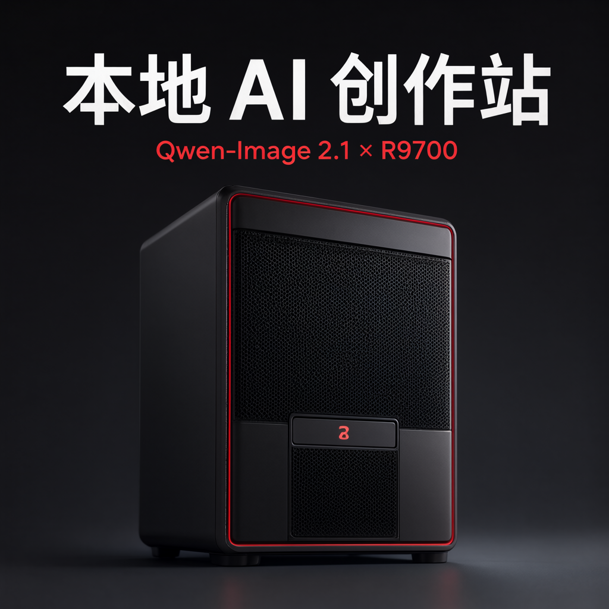
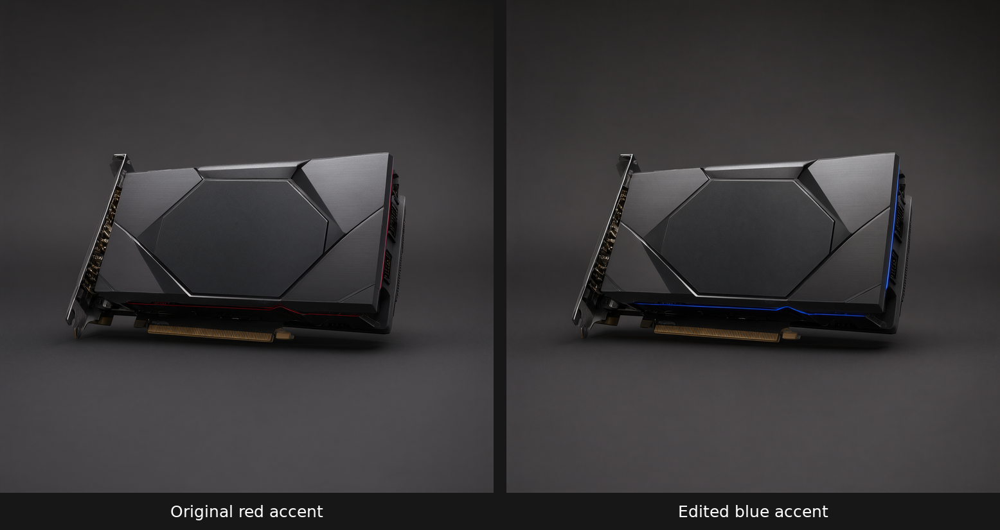
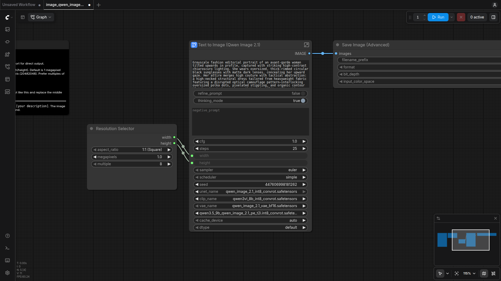
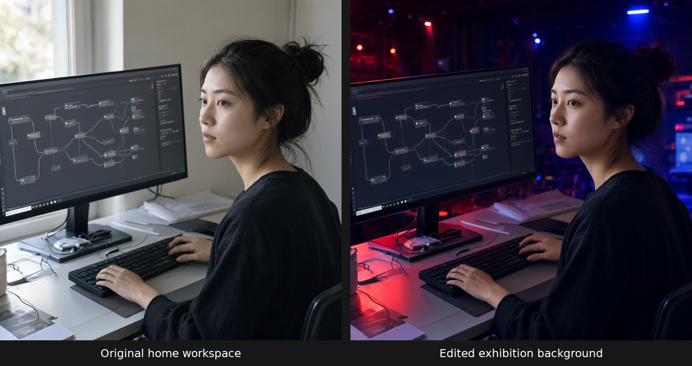
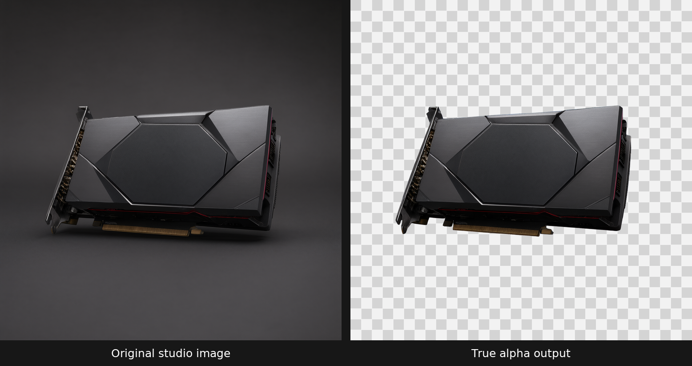
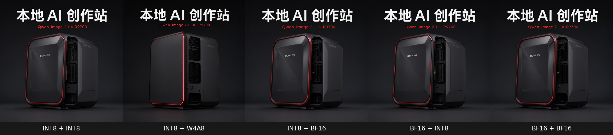
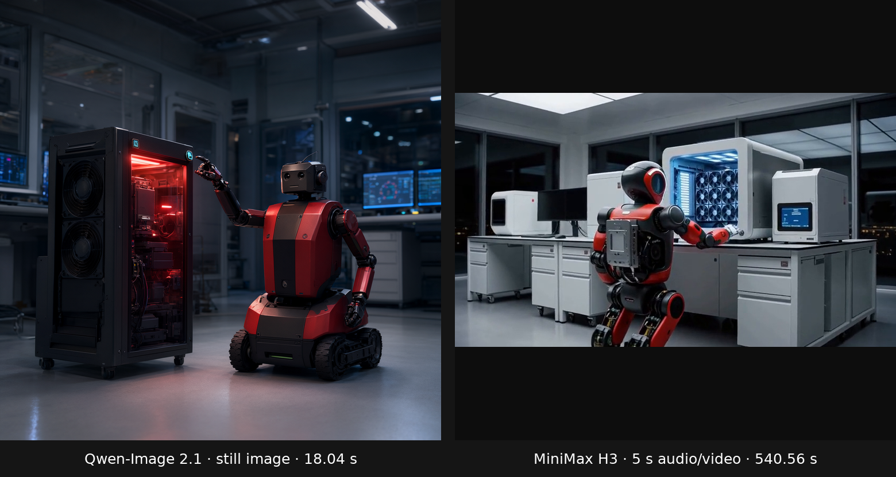

# Qwen-Image 2.1刚开源，我用一张R9700在ComfyUI里跑起来

千问最近开源了Qwen-Image-2.1，一个图像生成和编辑一体的模型。视觉生成部分只有7B参数，但文生图、局部编辑、透明背景、多参考图合成全在一个模型里，中文文字渲染效果也不错。

ComfyUI已经有原生节点和官方工作流了，不需要自己写什么适配，我拿一张R9700试了一下。

先看效果：



暖机以后17秒出一张。雷霆大中文是我在prompt里指定的，指令遵循没问题。

图片编辑也能做。这个测试里，我只让模型把卡面的细红线改成蓝线。看效果。



图片主体几乎没动，就改了指定的那一处。

## 装ComfyUI和下模型

跑Qwen-Image-2.1需要ComfyUI v0.37.0的环境（这版本原生支持了）、三份模型权重和一个官方工作流模板。我整理成了脚本，装环境、下模型、启动服务各一条命令。

我用的环境是Ubuntu 24.04 + R9700（gfx1201），跑在公开的ROCm基础镜像上。

```text
rocm/pytorch:rocm7.2.4_ubuntu24.04_py3.12_pytorch_release_2.10.0
```

PS：这条路径在R9700上跑通了，其他AMD显卡架构可能需要不同的镜像或驱动版本。

先装环境。clone ComfyUI v0.37.0，然后装依赖：

```bash
git clone --branch v0.37.0 --depth 1 https://github.com/Comfy-Org/ComfyUI.git
cd ComfyUI && pip install -r requirements.txt
```

下模型。从Comfy-Org的HuggingFace仓库拉三份权重：

```bash
huggingface-cli download Comfy-Org/Qwen-Image-2.1 \
  --include "diffusion_models/qwen_image_2.1_int8_convrot.safetensors" \
  --include "text_encoders/qwen3vl_8b_int8_convrot.safetensors" \
  --include "vae/qwen_image_2.1_vae_bf16.safetensors" \
  --local-dir ./models
```

启动服务。

```bash
python main.py --listen 0.0.0.0 --port 8188
```

这样就完成了，能看到页面。

（PS：如果是多卡机器，得先确认`ROCR_VISIBLE_DEVICES`和物理显卡的映射关系，避免跑到错的卡上。）

## 出第一张图

ComfyUI启动以后，在模板里找到Qwen-Image-2.1的工作流，选T2I那个。（T2I就是Text to Image，文生图的意思）



默认参数已经设好了，1024×1024、25步、Euler/simple、CFG 1。模型选INT8 diffusion + INT8 Qwen3-VL + BF16 VAE。这个组合在R9700的32GB显存上最省心，默认就能跑通，出来的图质量也够好。

点Queue Prompt，然后稍微等一会儿。我测试冷启动的话，第一张要24秒左右，暖机以后中位数17秒出一张。

到这里，从空白环境到出图就搞定了。

## 不止文生图

前面展示了文生图和编辑，这个模型还能做人物换背景、透明背景和多参考图合成，都试了一遍。

人物换背景。把居家工作台换成了红蓝灯光的展览现场。



脸、发型、服装、手势都保持住了，连屏幕上的节点图都没变。

透明背景。输出的PNG是真的RGBA透明，不是棋盘格假透明。



两参考图合成。输入一张人物和一张显卡，模型把同一人物和同一外形的显卡合到了一起，端到端跑了大概两分钟。


## 速度和显存

1024分辨率的体验前面已经看到了，暖机状态17秒出一张。把分辨率拉到2048×2048就是另一回事了。


像素翻了四倍，这一张等了4分44秒，显存贴到了30GB，占物理显存的94%。2K能跑完不OOM，但每张都2K起步不太现实。

```text
1024 暖机     17 秒       峰值 23.72 GB
2K            4分44秒     峰值 30.13 GB（物理的94%）
```

## 避坑和精度选择

前面出图用的也是INT8+INT8（INT8 diffusion + INT8 Qwen3-VL + BF16 VAE），32GB上最省心，推荐直接用这个。

想省显存可以试W4A8，峰值只有17.75GB，但固定seed的画面变化比其他组合大。想用BF16的话，把CLIPLoader的device设成cpu，不然采样跑完了最后VAE解码还要再申请约2.5GB，很可能放不下。



PS：还有两个容易踩的坑。
一个是连续切换过不同精度的模型以后，旧模型可能还驻留在显存里，换上小模型反而OOM了。这种情况重启ComfyUI就好。
另一个是Prompt Enhancer的工作流，官方PE工作流面向的是比v0.37.0更新的前端版本，直接加载会把模型的思考过程也送进图像编码器。用v0.37.0跑PE需要手动把thinking部分剥掉。

## 和MiniMax H3的简单对比。

同一个ComfyUI里，做静态图已经是按秒等了。做完整的音视频就是另一个量级。我们之前的文章里用MiniMax H3在W7900上跑过，同一段prompt，一段5秒含音频的视频差不多要9分钟。

```text
Qwen-Image-2.1       R9700     1024×1024 静态图          18 秒
MiniMax H3            W7900     832×480 124帧含音频视频    9 分钟
```



硬件不同、输出不同、分辨率和步数也不同，不是同任务benchmark。但对创作者来说，"这一轮做图还是做视频"确实是很真实的时间选择。MiniMax H3我们之前写过[跑通篇](https://zhuanlan.zhihu.com/p/2073092993117073920)和[SageAttention加速篇](https://www.zhihu.com/question/11677093593/answer/2083228458717557058)，感兴趣可以回看。

如果你手边有AMD显卡想试Qwen-Image-2.1，ComfyUI原生就能跑，不用额外装节点。你最想用它生成什么中文海报文字？或者你想试哪两张参考图的组合？可以评论你的经历。

还希望看到我们在ComfyUI × AMD消费卡上做什么样的探索？评论区点菜，我们来试。

## 参考资料

- [Qwen-Image-2.1 模型页](https://huggingface.co/Qwen/Qwen-Image-2.1)
- [Qwen-Image-2.1 GitHub](https://github.com/QwenLM/Qwen-Image-2.1)
- [ComfyUI 官方 Qwen-Image-2.1 支持说明](https://blog.comfy.org/p/qwen-image-21-in-comfyui-open-weight)
- [Comfy-Org 权重包](https://huggingface.co/Comfy-Org/Qwen-Image-2.1)
- [ComfyUI v0.37.0](https://github.com/Comfy-Org/ComfyUI/tree/v0.37.0)
- [W7900本地跑通MiniMax H3（基础篇）](https://zhuanlan.zhihu.com/p/2073092993117073920)
- [MiniMax H3 SageAttention加速（优化篇）](https://www.zhihu.com/question/11677093593/answer/2083228458717557058)
